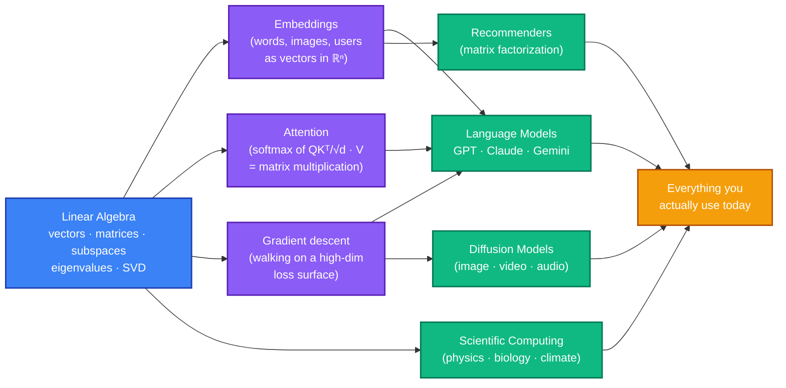
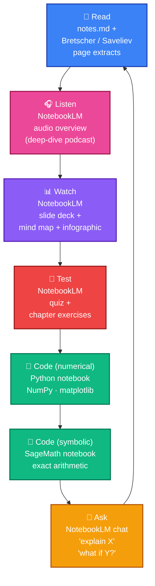
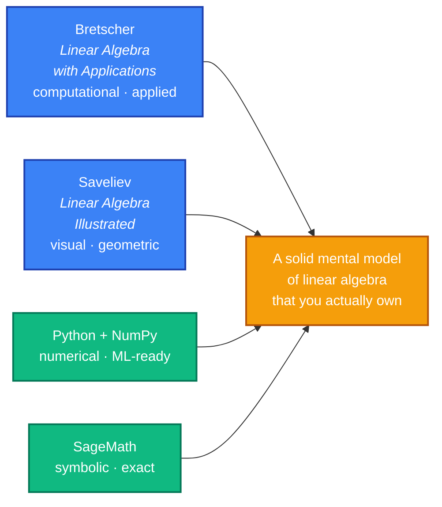

# Learn Linear Algebra

> **A new way to learn linear algebra** — built around how humans actually learn in 2026: read, listen, watch, drill, code, and *talk back to* the material.

A self-study curriculum in 10 chapters, anchored on two textbooks. Each chapter ships with notes, worked examples, exercises, **two Jupyter notebooks** (NumPy for numerics, SageMath for exact symbolics — runnable free in [CoCalc](https://cocalc.com/)), and a **pre-built [NotebookLM](https://notebooklm.google.com/) notebook** with audio overview (podcast), quiz, mind map, slide deck, and infographic.

## 🎧 Start here

You don't need to clone anything. **[Open the NotebookLM index →](notebooks.md)**

Each public NotebookLM gives you the chapter's notes + textbook page extracts + AI-generated audio overview, quiz, mind map, slides, and infographic — and you can chat with the sources. Click *"Make a copy"* in NotebookLM to clone it to your own account and customize.

---

## Why linear algebra, in the age of language models?

Because language models *are* linear algebra at scale.

The frontier moves fast. The math underneath does not. **Embeddings, attention, fine-tuning, RAG, retrieval — every LLM technique you read about lives or dies on linear-algebra fluency.** Without it, you're a black-box prompt user. With it, you understand *why* models work, *when* they fail, *how* to extend them — and you can read papers without bouncing off the notation.

A few specific reasons it matters more, not less, in the LLM era:

- **You ask better questions.** "Why does retrieval over cosine similarity miss this query?" requires you to know what cosine similarity *is* — a normalized dot product on embeddings.
- **You debug better.** "Why did fine-tuning blow up the loss?" requires you to think in terms of gradients, conditioning, rank.
- **You compose better.** Combining LLMs with classical ML, search, and reasoning systems means moving fluently between linear maps, projections, and decompositions.
- **You stay free.** Tools change every year. The math is the same math Gauss did. Investing here compounds for a lifetime.

> *"Mathematics is not yet ready for such problems. Yet, the mathematics is the same mathematics that you can study today."* — paraphrasing John von Neumann, who knew a thing or two about both math and machines.

---

## How you'll learn here

This isn't a textbook PDF. It's a **multimodal learning loop**, where each chapter gives you several different ways into the same ideas — and you cycle through whichever ones stick best for *your* brain.

No single mode is "the right one." You don't have to do all of them. The point is that when one explanation doesn't click, **you have five other angles to try** — and one of them will land. That's how mastery actually happens, and it's only really possible now that AI tools can generate audio, slides, quizzes, and conversations on demand.

### Two perspectives, two languages, one curriculum

- **Bretscher** drives the chapter ordering and gives you computational power and applications.
- **Saveliev** gives you the geometric pictures that make the algebra *make sense*.
- **Python/NumPy** is the language of every ML library on Earth — what you'll use at work.
- **SageMath** is the language of pure math — exact, symbolic, perfect for *proving* what numerics only suggest.

Together they give you the same idea from four directions. That redundancy is the feature, not a bug.

---

## Chapter map

| # | Chapter | Sources (Bretscher · Saveliev) | NotebookLM 🎧 | 🐍 Python | 🧮 SageMath |
|---|---|---|---|---|---|
| 1 | Foundations: sets, functions, linearity, ℝⁿ | App. A · Ch. 1, 2, 4.1–4.5 | [open ↗](https://notebooklm.google.com/notebook/d52edb24-e2e2-43b6-840d-a2c5d7a47519) | [view](chapters/01-foundations/code/python/01_foundations.ipynb) | [view](chapters/01-foundations/code/sage/01_foundations.ipynb) |
| 2 | Vectors & vector geometry (dot product, projections) | App. A · 4.6–4.11 | _soon_ | _soon_ | _soon_ |
| 3 | Linear systems & Gauss–Jordan elimination | Ch. 1 · §1.1 | _soon_ | _soon_ | _soon_ |
| 4 | Linear transformations & matrix algebra | Ch. 2 · §3.4, 5.1–5.4, 5.10–5.11 | _soon_ | _soon_ | _soon_ |
| 5 | Subspaces, image/kernel, basis, dimension, coordinates | Ch. 3 · §5.8 | _soon_ | _soon_ | _soon_ |
| 6 | Abstract linear (vector) spaces | Ch. 4 · — | _soon_ | _soon_ | _soon_ |
| 7 | Orthogonality, projections, Gram–Schmidt, QR, least squares | Ch. 5 · §4.10–4.11 | _soon_ | _soon_ | _soon_ |
| 8 | Determinants — algebra and geometry | Ch. 6 · §5.5 | _soon_ | _soon_ | _soon_ |
| 9 | Eigenvalues, eigenvectors, diagonalization, dynamical systems | Ch. 7 · §5.6–5.7, 5.9 | _soon_ | _soon_ | _soon_ |
| 10 | Symmetric matrices, quadratic forms, SVD, applications | Ch. 8, 9 · (Ch. 6 as bonus) | _soon_ | _soon_ | _soon_ |

**Running the notebooks**

- 🐍 **Python** — `uv sync && uv run jupyter lab` from the repo root, then open the file. (See [CONTRIBUTING.md](CONTRIBUTING.md) for setup.)
- 🧮 **SageMath** — easiest path: open [CoCalc](https://cocalc.com/), create a project, *Files → New → From URL*, paste the raw GitHub URL of the `.ipynb`. CoCalc has SageMath pre-installed and runs free in the browser. Or install Sage locally (`brew install --cask sage` on macOS) and run `sage -n jupyter`.

Every chapter's text also lives in this repo under [`chapters/`](chapters/) — read it directly on GitHub.

## Audience and depth

Self-study, undergraduate level. Intuition first, proofs sketched (not belabored). Geometric pictures wherever possible. Every concept has at least one worked example and one exercise. No prerequisites beyond high-school algebra and a willingness to be confused for a few hours before things click.

## Source texts

This curriculum is anchored on (and respects the copyrights of) two excellent textbooks. The page extracts in the NotebookLM notebooks fall under fair-use educational commentary; the books themselves are not redistributed.

- **Otto Bretscher — *Linear Algebra with Applications*, 5th ed.** (Pearson, 2013, ISBN 978-0-321-79697-4) — the computational and applications-focused spine.
- **Peter Saveliev — *Linear Algebra Illustrated*** — the visual, foundations-up companion. Available from the author at https://calculus123.com/.

If you want a deeper read, get your own copies of these books — they're worth it.

## License

Tutorial material (notes, worked examples, exercises, code, scripts) is licensed under the MIT License — see [LICENSE](LICENSE).

## Contributing

Want to improve an explanation, add a worked example, fix an exercise, or contribute a translation? See [CONTRIBUTING.md](CONTRIBUTING.md) for the dev setup (uv, PDF extraction, NotebookLM publishing pipeline) and how to send a PR.
