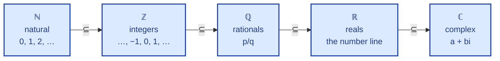
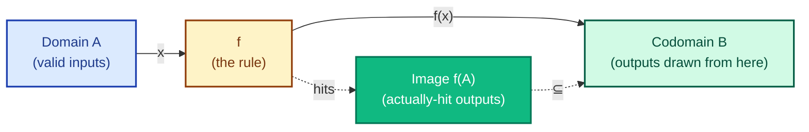
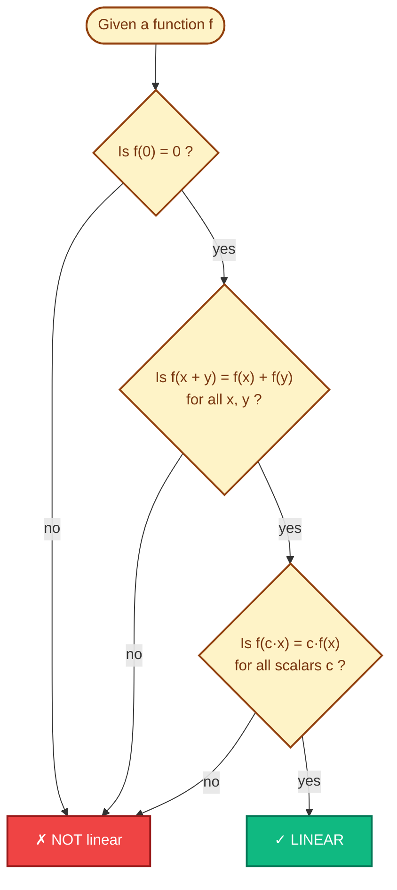
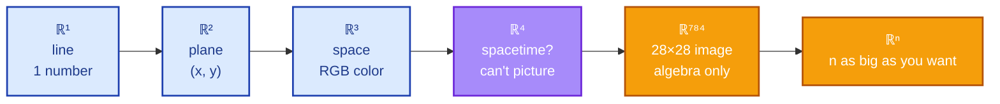
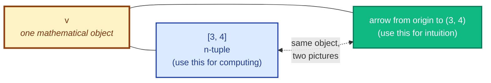
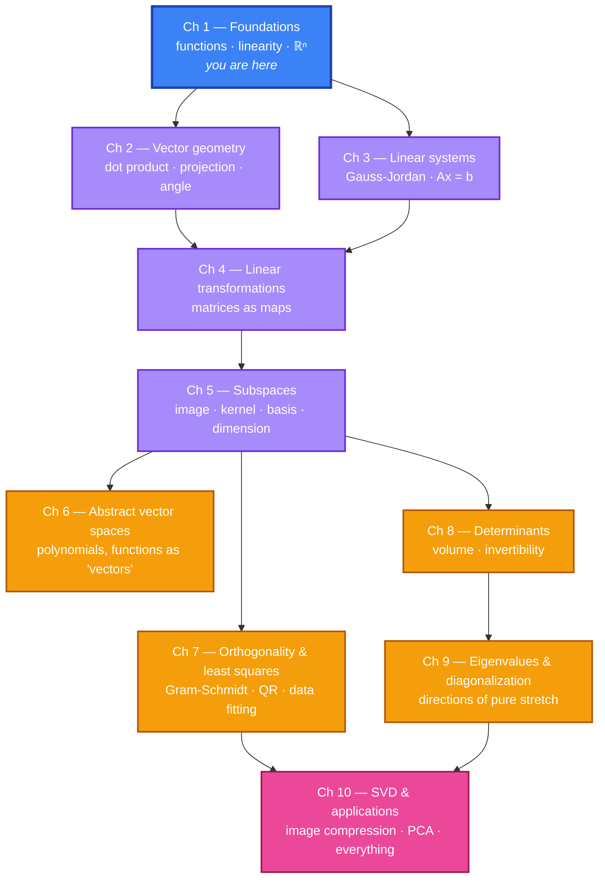

# Chapter 1 — Foundations: Sets, Functions, Linearity, ℝⁿ

> *"It is mathematics, and not just (as Bismarck claimed) politics, that consists in 'the art of the possible.'"* — Bretscher, Preface

## 1.0 A problem to anchor everything else

Before any abstraction, here's a concrete question (borrowed from Saveliev §1.1):

> *You sell a coffee blend. Kenyan beans cost \$2/lb. Colombian beans cost \$3/lb. You want to make 6 pounds of blend that sells for \$14 total. How many pounds of each?*

Let `x` = pounds of Kenyan, `y` = pounds of Colombian. The two facts about the blend become two equations:

```
  x +  y =  6      (total weight)
 2x + 3y = 14      (total price)
```

This is a **system of two linear equations in two unknowns**. You can solve it three ways, and all three will reappear later in disguise:

1. **Algebraically.** From the first, `y = 6 − x`. Substitute: `2x + 3(6 − x) = 14`, so `−x = −4`, giving `x = 4`, `y = 2`.
2. **Geometrically.** Each equation is a line in the xy-plane. The solution is the point where they cross. Try sketching it.
3. **By matrix machinery** (which we'll build over Chapters 3–4): write the system as `A**x** = **b**` and solve with Gauss–Jordan.

Now scale the same idea up. A coffee shop has 30 beans. A portfolio has 500 stocks. A neural network has 10⁹ weights. The *kind* of problem doesn't change — we just need a language that doesn't choke on the size. **That language is linear algebra.**

This chapter builds the foundations of that language: sets, functions, the precise meaning of "linear," and the leap from ℝ to ℝⁿ.

**Why we start here, not at matrices.** Most linear algebra books open with matrix notation and Gaussian elimination. We deliberately step back one level — to **sets**, **functions**, and the precise meaning of the word **linear**. Three reasons:

1. Every theorem in linear algebra is a statement about a particular kind of function (a "linear transformation"). If the word *function* feels fuzzy, the rest of the course will feel fuzzy too.
2. The leap from ℝ² (the xy-plane you've drawn since high school) to ℝⁿ for n > 3 is not a leap of *visualization* — you can't picture ℝ⁴ — but a leap of **language**. Sets and functions are that language.
3. Linear algebra is the study of one specific property of functions: **linearity**. We need to know exactly what we're looking for before we go hunting.

By the end of this chapter you should be able to look at a function and answer two questions instantly: *what's its domain?* and *is it linear?*

---

## 1.1 Sets — just enough

A **set** is a collection of objects. The objects are called its **elements**. That's the whole definition; it's deliberately loose.

We write `x ∈ S` to mean "x is an element of S" and `x ∉ S` for "x is not an element of S."

**Two ways to specify a set:**

- **By listing**: `S = {1, 2, 3, 4}`. Order and repetition don't matter: `{1, 2, 3, 4} = {4, 1, 2, 3, 1}`.
- **By a condition** (set-builder notation): `S = {n ∈ ℤ : n is even}`. Read it as *"the set of integers n such that n is even."*

**Sets you'll meet constantly:**

| Symbol | Meaning |
|---|---|
| ℕ | Natural numbers: {0, 1, 2, 3, …} (sometimes starting at 1) |
| ℤ | Integers: {…, −2, −1, 0, 1, 2, …} |
| ℚ | Rationals: fractions p/q with p, q ∈ ℤ, q ≠ 0 |
| ℝ | Real numbers: the entire number line |
| ℂ | Complex numbers: a + bi with a, b ∈ ℝ |

**Subset.** `A ⊆ B` means every element of A is also in B. So `{1, 2} ⊆ {1, 2, 3}` and `ℕ ⊆ ℤ ⊆ ℚ ⊆ ℝ ⊆ ℂ`.



**Cartesian product.** Given sets A and B, the set of all *ordered pairs* `(a, b)` with `a ∈ A` and `b ∈ B` is written `A × B`. The familiar **xy-plane** is `ℝ × ℝ`, written `ℝ²`. The points `(2, 3)` and `(3, 2)` are different — order matters in a Cartesian product, unlike in a set.

> **Ordered pair vs. set — this trips people up.** The notation `(a, b)` denotes an *ordered pair* (or *tuple*), where order matters: `(2, 3) ≠ (3, 2)`. The notation `{a, b}` denotes a *set*, where order doesn't: `{2, 3} = {3, 2}`. Same brackets in everyday speech, completely different objects in math.

> **Saveliev pp. 12–17, 30–34** has many pictures of these ideas: marbles in a bag (a set is unordered), the xy-plane as ℝ × ℝ.

---

## 1.2 Logic essentials: implication, equivalence, quantifiers

Every definition and theorem in this course uses a few small logical building blocks. They take five minutes to learn and save you years.

| Symbol | Reads as | Means |
|---|---|---|
| `⟹` | "implies" or "then" | If the left side is true, the right side is true too. (The reverse may or may not hold.) |
| `⟺` | "if and only if" / "iff" | Both directions hold: each side is true exactly when the other is. |
| `∀` | "for all" / "for every" | The statement holds for every choice. |
| `∃` | "there exists" / "for some" | At least one example makes it true. |

A few examples to anchor:

- `x = 2 ⟹ x² = 4` is true. The reverse `x² = 4 ⟹ x = 2` is **false** (because `x = −2` also gives `x² = 4`).
- `x is even ⟺ x is divisible by 2` is true — both directions.
- "`f` is linear" really means: `∀ x, y, c : f(c·x + y) = c·f(x) + f(y)`. The "for all" is silent in everyday writing but always there.
- "`A` is invertible" really means: `∃ B such that A·B = I`. The "there exists" is the existence of an inverse.

When a definition includes a "for all" or a "there exists," **the whole game is checking it for the right number of cases** — sometimes one (a counterexample disproves "for all"), sometimes infinitely many (you need an algebraic argument).

---

## 1.3 Notation we'll use throughout

These conventions hold for the whole course unless noted:

| Notation | Meaning |
|---|---|
| `x, y, z, t` | Real-valued variables (unknowns or generic inputs). |
| `a, b, c, k, m, n` | Real-valued constants (often integers). |
| `i, j` | Index variables (positive integers). |
| `**v**, **u**, **w**` (or just `v`, `u`, `w`) | Vectors. We'll usually skip the bold and rely on context. |
| `A, B, M` | Matrices (or sometimes sets — context will tell). |
| `xᵢ` | The *i*-th component of vector `x`. |
| `ℝⁿ` | The set of all n-tuples of real numbers (n-dimensional Euclidean space). |
| `:=` | "is defined as." We'll use plain `=` most of the time. |
| `∑ᵢ xᵢ` | The sum `x₁ + x₂ + … + xₙ`. |

Vectors are *columns* by default: `v = [v₁; v₂; …; vₙ]ᵀ`. We'll write them flat as `(v₁, v₂, …, vₙ)` when typesetting columns is awkward, but mentally treat them as columns.

---

## 1.4 Functions — the main character of the course

A **function** `f: A → B` is a rule that assigns to each element of A *exactly one* element of B.

- `A` is the **domain** — the set of valid inputs.
- `B` is the **codomain** — the set the outputs are drawn from.
- The **image** (or **range**) is the actual set of outputs `{f(a) : a ∈ A}`. The image is a subset of the codomain, possibly smaller.



**Three crucial properties** a function may or may not have:

| Property | Plain English | Test |
|---|---|---|
| **Injective** (one-to-one) | Different inputs give different outputs | `f(a₁) = f(a₂)` ⟹ `a₁ = a₂` |
| **Surjective** (onto) | Every element of the codomain is hit by some input | image = codomain |
| **Bijective** | Both | A perfect pairing of A and B |

A bijective function has an **inverse** `f⁻¹: B → A`. This will matter a lot when we ask: *can a linear transformation be undone?*

**Composition.** If `f: A → B` and `g: B → C`, then `(g ∘ f)(a) = g(f(a))` is a function from A to C. We will see (in Chapter 4) that **matrix multiplication is just composition of linear transformations**. So compositions deserve respect from day one.

> **Saveliev Chapter 2** is the visual reference here. Pictures of one-to-one and onto functions, and the inverse as a "flipped" function.

---

## 1.5 What does "linear" actually mean?

Forget for a moment everything you've heard about matrices. Look at a single-variable function `f: ℝ → ℝ`. We say `f` is **linear** if it satisfies two rules:

1. **Additivity:** `f(x + y) = f(x) + f(y)` for all x, y ∈ ℝ.
2. **Homogeneity:** `f(c · x) = c · f(x)` for all x ∈ ℝ and all scalars c ∈ ℝ.

> **What's a "scalar"?** In this course it just means a real number. We use the word *scalar* (rather than "number") to flag the role: it's the **multiplier** acting on a vector, not the vector itself. When we write `c · v`, `c` is the scalar and `v` is the vector. Both happen to be real-valued; the word distinguishes their jobs.

Equivalently (and this single equation is the most useful form to remember):

> **Definition.** A function `f` is **linear** if `f(c₁ x₁ + c₂ x₂) = c₁ f(x₁) + c₂ f(x₂)` for all inputs and all scalars.

Read it as: *"f respects linear combinations."* Whatever combination you build out of inputs, applying f and combining gives the same answer as combining first and applying f. This is the entire game of linear algebra in one sentence.

**Example.** `f(x) = 3x` is linear: `f(x + y) = 3(x + y) = 3x + 3y = f(x) + f(y)`. ✓

**Counterexample.** `f(x) = 3x + 1` is **not** linear, even though its graph is a straight line! Check: `f(1 + 1) = f(2) = 7`, but `f(1) + f(1) = 4 + 4 = 8`. They differ. (Mathematicians call `3x + 1` an *affine* function — a linear function plus a constant shift.)

**The linearity test as a flowchart:**



> **Trap:** in high school, "linear" meant *"its graph is a line"*, which includes `y = mx + b`. In linear algebra, "linear" is stricter — the graph must pass through the origin. A linear function always sends 0 to 0, because `f(0) = f(0 + 0) = f(0) + f(0)` ⟹ `f(0) = 0`.

**The only linear functions ℝ → ℝ are `f(x) = mx`** for some constant m. (Try to convince yourself why no other shape works.)

> **Saveliev §1.9 and §1.11** have side-by-side pictures: the linear `y = mx` versus the affine `y = mx + b`, and why the distinction matters.

---

## 1.6 The leap from ℝ to ℝⁿ

### 1.6.1 Pictures you already know: ℝ¹, ℝ², ℝ³

Before we generalize, let's name what you've already drawn:

- **ℝ¹** is the **real number line**: a horizontal line with `0` in the middle, positive numbers to the right, negative to the left. Each point on the line *is* a single real number. So `ℝ¹` and `ℝ` are the same object.
- **ℝ²** is the **xy-plane** (Cartesian coordinates): two perpendicular axes meeting at the **origin** `(0, 0)`. Each point is an ordered pair `(x, y)`. The plane has four **quadrants**, and you've drawn lines, parabolas, and circles on it since middle school.
- **ℝ³** is **3D space**: three mutually perpendicular axes (x, y, z) meeting at the origin. Each point is an ordered triple `(x, y, z)`. Think of the corner of a room: floor-edges as x and y axes, vertical edge as z axis.

These three you can *see*. They're the warm-up. Linear algebra's superpower is what happens next.

### 1.6.2 Why we need ℝⁿ

So far our inputs and outputs were single real numbers. But the real reason linear algebra exists is that real-world quantities come in **bundles**:

- A point in 3D space has 3 coordinates.
- An RGB color has 3 components.
- A grayscale 28×28 image has 784 pixels.
- A monthly stock portfolio has hundreds of holdings.
- A neural network's hidden layer has thousands of activations.



We bundle these into ordered tuples and call the set of all such tuples **ℝⁿ**:

```
ℝⁿ = { (x₁, x₂, …, xₙ) : each xᵢ ∈ ℝ }
```

For n = 1, 2, 3 you can picture ℝⁿ — it's the line, the plane, ordinary space. For n ≥ 4 you cannot. **That's fine.** You don't need to picture it; you reason about it using the same algebra that worked in low dimensions.

This is the central liberation of the course: once you trust the algebra, you can do geometry in dimensions your eyes can't see.

> **Saveliev §4.1–4.5 (pp. 239–281)** spends a whole chapter on exactly this leap. Read it slowly — especially **§4.4 *Where vectors come from*** (pp. 264–273), which makes the philosophical case for ℝⁿ better than I can.

---

## 1.7 Vectors: arrows and tuples (and why both views matter)

A **vector** in ℝⁿ is an element of ℝⁿ — that is, an n-tuple of real numbers. We typically write it as a column:

```
     ⎡ x₁ ⎤
v =  ⎢ x₂ ⎥
     ⎢ ⋮  ⎥
     ⎣ xₙ ⎦
```



But this same object has **two equally valid mental pictures**:

| Picture | Where it lives | When it's helpful |
|---|---|---|
| **Tuple of numbers** | A list, an array | Computing, programming, large n |
| **Arrow from origin** | ℝ², ℝ³ | Geometry, intuition, small n |

In Python, vectors are NumPy arrays:

```python
import numpy as np
v = np.array([3.0, 4.0])  # a vector in ℝ²
```

Geometrically the same vector is the arrow from `(0, 0)` to `(3, 4)`.

**The two operations that make ℝⁿ a vector space:**

1. **Addition** (component by component):
   `(x₁, …, xₙ) + (y₁, …, yₙ) = (x₁ + y₁, …, xₙ + yₙ)`.

   Geometrically: place the tail of the second arrow at the tip of the first; the sum is the arrow from origin to the new tip. (The "parallelogram rule.")

2. **Scalar multiplication**:
   `c · (x₁, …, xₙ) = (c·x₁, …, c·xₙ)`.

   Geometrically: scale the arrow's length by c (and flip if c is negative).

That's it. From these two operations everything else in the course will follow.

> **Read this side-by-side.** Saveliev §4.5–4.6 (pp. 274–289) gives the visual story; Bretscher Appendix A (pp. 457–466) gives the compact algebraic story. The two views reinforce each other.

---

## 1.8 The big picture: where we're heading

Linear algebra studies functions `T : ℝⁿ → ℝᵐ` that are **linear**:

> `T(c₁ v₁ + c₂ v₂) = c₁ T(v₁) + c₂ T(v₂)`.

The miracle — and the reason the subject is so beautiful — is that **every such function can be represented by a single rectangular block of numbers (a matrix)**. So the entire study of linear functions in any dimension reduces to the study of matrices, which we can compute with by hand or by computer.

The next nine chapters unpack this miracle:



You're standing at the trailhead. Let's go.

---

## Summary checklist

After this chapter you should be able to, without hesitation:

- [ ] Distinguish a set's domain, codomain, and image when given a function.
- [ ] State whether a function is injective, surjective, or bijective.
- [ ] Write down the test for linearity in one equation.
- [ ] Explain why `f(x) = 3x + 1` is **not** linear.
- [ ] Add two vectors in ℝⁿ and scale a vector by a real number, both algebraically and (for n ≤ 3) geometrically.
- [ ] Argue that `f(0) = 0` for any linear function.

If any of these are shaky, re-read the corresponding section before moving on. Then work through `worked-examples.md` and `exercises.md`.
