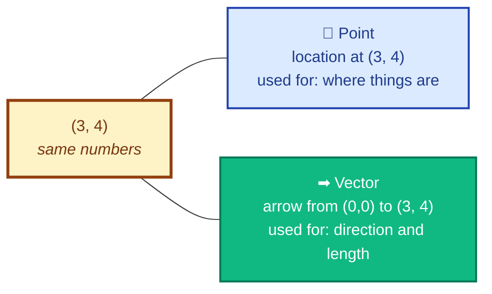
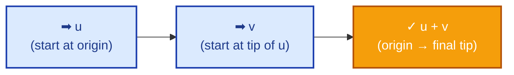
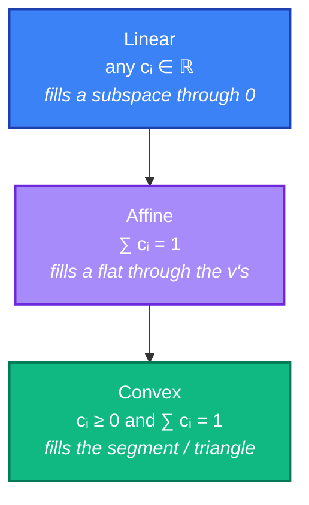
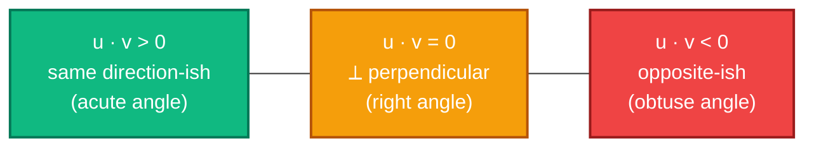
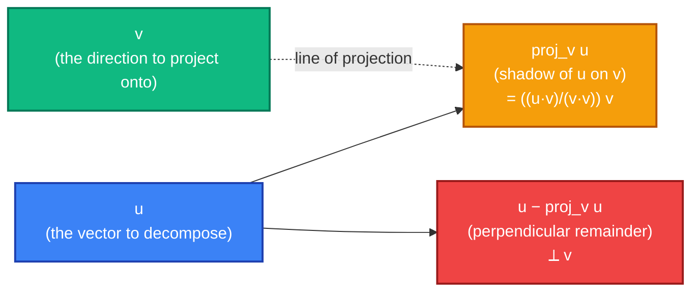
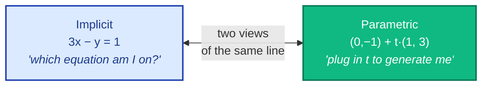
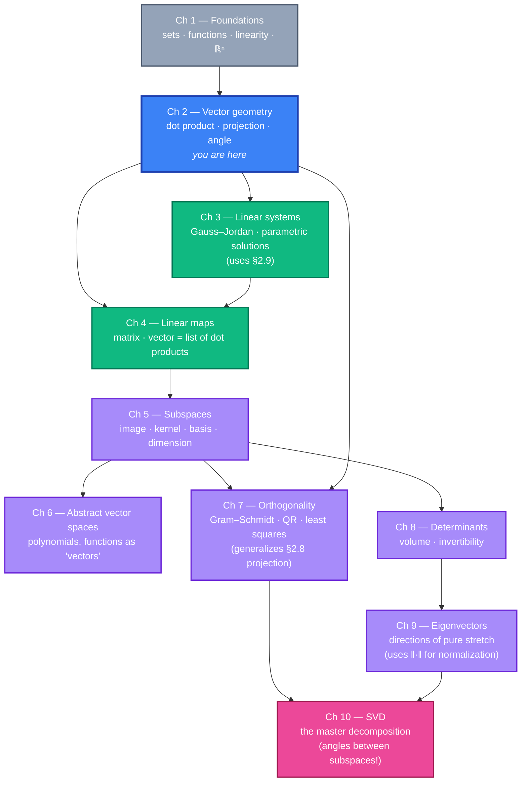

# Chapter 2 — Vectors and Vector Geometry

> *"The dot product is the bridge between algebra and geometry."* — anonymous, but felt by every student the moment it clicks.

## 2.0 A problem to anchor everything else

Before any formulas, here's a concrete question (loosely adapted from Saveliev §4.10):

> *You are walking from your apartment at point `A = (1, 2)` to a coffee shop at point `B = (5, 5)`. A friend is on a path heading from `A` in the direction `(3, 1)`. How much of your walk is "in the same direction" as your friend's path? At what angle do the two paths diverge?*

Two physical questions:

1. **How much overlap?** — How much of vector `**AB**` points along `(3, 1)`?
2. **What angle?** — What is the angle between `**AB**` and `(3, 1)`?

Both questions have a single algebraic answer, and that answer is the **dot product**:

```
   u · v  =  u₁ v₁ + u₂ v₂ + … + uₙ vₙ
```

A short formula that, almost magically, encodes:

- the **angle** between two vectors (`cos θ = u·v / (‖u‖·‖v‖)`),
- the **length** of any single vector (`‖v‖ = √(v·v)`),
- the **projection** of one vector onto another (the "shadow" of u on v),
- the **test for perpendicularity** (`u · v = 0`),
- and — looking ahead — the geometry of **least squares**, **embeddings**, and **attention** in modern ML.

This chapter builds the dot product from scratch, anchors it in pictures in ℝ² and ℝ³, then trusts the algebra to carry the same meaning into ℝⁿ for any n.

**Why this chapter, right after foundations?** Chapter 1 told us *what* a vector is (a tuple, an arrow). Chapter 2 tells us **how to measure it** — length, angle, perpendicularity, "shadow." Without these measurements, ℝⁿ is just a set of tuples. With them, it becomes a *geometric* space we can do real work in.

---

## 2.1 Quick recap and notation

From Chapter 1, recall:

- A **vector** in ℝⁿ is an n-tuple `v = (v₁, v₂, …, vₙ)`, mentally a column.
- **Addition** is component-wise: `(u₁, u₂) + (v₁, v₂) = (u₁+v₁, u₂+v₂)`.
- **Scalar multiplication** is component-wise: `c · (v₁, v₂) = (c·v₁, c·v₂)`.
- A **scalar** is a real number used as a multiplier on a vector.

New notation for this chapter:

| Notation | Meaning |
|---|---|
| `u · v` (or `⟨u, v⟩`) | **Dot product** — a *number* (scalar) built from two vectors. |
| `‖v‖` | **Magnitude** (length, norm) of vector v — a non-negative real number. |
| `θ` (theta) | An angle, measured in radians unless noted. |
| `**AB**` | The vector from point A to point B: `**AB** = B − A`. |
| `**u** ⟂ **v**` | "u is perpendicular to v" (also called *orthogonal*). |
| `proj_v u` | The **projection** of u onto v — a vector. |

> **Logic primer reminder.** When we write *"for all u, v ∈ ℝⁿ, u · v = v · u,"* the silent `∀` (for all) is doing work — it means the identity holds for *every* choice of u and v, no exceptions.

---

## 2.2 Points vs. vectors — a clarification

Look at the pair of numbers `(3, 4)`. Is it a **point** or a **vector**?

The honest answer: *it's both, and which one you mean depends on the question you're asking.*

| Picture | Meaning of `(3, 4)` | Used for |
|---|---|---|
| **Point** | A *location* in the plane | "where am I?" — geometry, position |
| **Vector** | An *arrow*, usually drawn from origin | "which way and how far?" — displacement, velocity, force |



**The bridge: subtracting two points gives a vector.**

If `A = (1, 2)` and `B = (5, 5)` are points, then

```
   **AB**  =  B − A  =  (5 − 1,  5 − 2)  =  (4, 3)
```

is the **displacement vector** from A to B — the arrow you'd draw with tail at A and tip at B. Translated to start at the origin, it's the same arrow as the vector `(4, 3)`.

> **Why this matters.** Once you can convert "two points" into "one vector," every geometric question (distance, angle, midpoint, line) becomes an algebra question on vectors.

> **Saveliev §4.6 (pp. 282–289)** has many pictures of this point ↔ vector duality.

---

## 2.3 Adding and scaling vectors — geometry of the algebra

The two operations we already defined algebraically have beautiful pictures.

### 2.3.1 Addition: the parallelogram (or tip-to-tail) rule

To add `u + v`:

- Place the tail of `v` at the tip of `u`. The sum is the arrow from the original tail of `u` to the new tip of `v`. (Tip-to-tail.)
- *Equivalently:* draw `u` and `v` from the same origin; complete the parallelogram; the diagonal from origin is `u + v`. (Parallelogram rule.)

Both pictures give the same vector. They're two ways of seeing the algebraic fact `(u₁+v₁, u₂+v₂)`.



### 2.3.2 Scalar multiplication: stretching and flipping

For a scalar `c ∈ ℝ`:

- `c · v` is `v` scaled by factor `c`. The arrow stays on the same line through origin.
- If `c > 1`: longer, same direction.
- If `0 < c < 1`: shorter, same direction.
- If `c < 0`: flipped to the opposite direction (and stretched/shrunk by `|c|`).
- If `c = 0`: collapses to the **zero vector** `0 = (0, 0, …, 0)`.

### 2.3.3 Subtraction is just addition + flip

`u − v = u + (−1)·v`. Geometrically: flip v, then add tip-to-tail.

This gives a useful identity:

> **`**AB** = B − A`** — the vector from point A to point B is "tip minus tail."

Worth memorizing. It's the operation you'll do most often in this chapter.

---

## 2.4 Linear combinations — the key concept

The single most important operation built from `+` and `·` is the **linear combination**:

> Given vectors `v₁, v₂, …, vₖ` and scalars `c₁, c₂, …, cₖ`, the vector
>
> ```
>    c₁ v₁  +  c₂ v₂  +  …  +  cₖ vₖ
> ```
>
> is called a **linear combination** of the v's with coefficients c's.

Almost every theorem and definition for the rest of the course is a statement about linear combinations. Worth saying out loud once or twice.

### 2.4.1 Three special cases — convex, affine, linear

The same algebraic shape, with different *constraints* on the coefficients, gives three different geometric objects:

| Type | Constraint on coefficients | Geometry |
|---|---|---|
| **Linear combination** | none | The whole *span* (line, plane, …, all of ℝⁿ) |
| **Affine combination** | `c₁ + c₂ + … + cₖ = 1` | A *line* (k=2), *plane* (k=3), etc. — passes through all the v's, doesn't have to contain origin |
| **Convex combination** | `cᵢ ≥ 0` for all i, AND `∑ cᵢ = 1` | The *line segment*, *triangle*, *tetrahedron* — the "filled-in" hull |



**Two-vector examples.** Let `u = (1, 0)` and `v = (0, 1)`.

- `2u + 3v = (2, 3)`. A linear combination — anything in ℝ² is reachable.
- `0.4 u + 0.6 v = (0.4, 0.6)`. Convex combination (coefficients ≥ 0 summing to 1) — lies *on the segment* from u to v.
- `−1 u + 2 v = (−1, 2)`. Affine but not convex (coefficients sum to 1 but one is negative) — lies *on the line through* u and v, but outside the segment.

**Why this matters later:** convex combinations show up everywhere from optimization to probability ("a probability distribution is a convex combination of point masses"). Affine combinations describe lines, planes, and *affine subspaces* — the natural setting for solutions of `Ax = b` (Chapter 3).

> **Saveliev §4.7 (pp. 290–295)** has the cleanest pictures of these three combinations side-by-side.

---

## 2.5 Magnitude — measuring length

How long is the arrow from origin to `(3, 4)`? Pythagoras gave us the answer in 6th grade:

```
   length  =  √(3² + 4²)  =  √25  =  5
```

Generalize: for any `v = (v₁, v₂, …, vₙ) ∈ ℝⁿ`, the **magnitude** (also called **length** or **Euclidean norm**) is

> ```
>    ‖v‖  =  √( v₁² + v₂² + … + vₙ² )
> ```

For n = 2 or 3 this *is* Pythagoras, applied once or twice. For n ≥ 4 we **define** it this way — extending the formula by analogy. The definition turns out to behave exactly like geometric length should.

**Properties** (worth verifying for yourself, easy):

- `‖v‖ ≥ 0`, with `‖v‖ = 0 ⟺ v = 0` (the zero vector).
- `‖c · v‖ = |c| · ‖v‖` (scaling by c stretches length by |c|).
- `‖u + v‖ ≤ ‖u‖ + ‖v‖` — the **triangle inequality**: the direct path is no longer than going around.


### 2.5.1 Unit vectors and normalization

A vector with magnitude 1 is called a **unit vector**. To turn any nonzero `v` into a unit vector pointing the same direction:

> ```
>    v̂  =  v / ‖v‖
> ```

We say we **normalize** v. The hat-notation `v̂` means "v with length 1." Unit vectors strip away "how long" so we can talk purely about "which direction."

**Standard unit vectors in ℝⁿ:**

```
   e₁ = (1, 0, 0, …, 0)
   e₂ = (0, 1, 0, …, 0)
       ⋮
   eₙ = (0, 0, …, 0, 1)
```

Any `v = (v₁, …, vₙ)` is the linear combination `v₁ e₁ + v₂ e₂ + … + vₙ eₙ`. The components *are* the coefficients in the standard basis. (We'll formalize "basis" in Chapter 5; for now, just notice that ℝⁿ comes with a natural set of n perpendicular unit vectors.)

### 2.5.2 Distance between two points

The **distance** from point A to point B is the magnitude of the displacement vector:

```
   d(A, B)  =  ‖B − A‖  =  √( (b₁−a₁)² + (b₂−a₂)² + … )
```

Same formula in ℝ², ℝ³, or ℝ¹⁰⁰. This is the *Euclidean distance* — and yes, it's the standard "as-the-crow-flies" distance you grew up with, generalized to any dimension.

> **Saveliev §4.8 (pp. 296–304)** gives the picture-heavy version of magnitude and distance, including a careful look at the triangle inequality.

---

## 2.6 The dot product — algebra

Now the star of the chapter.

> **Definition.** For `u = (u₁, …, uₙ)` and `v = (v₁, …, vₙ)` in ℝⁿ, the **dot product** is the scalar
>
> ```
>    u · v  =  u₁ v₁  +  u₂ v₂  +  …  +  uₙ vₙ  =  ∑ᵢ uᵢ vᵢ
> ```

It eats two vectors, returns one number. Don't be fooled by how compact the formula is — this is the most important formula in the chapter, possibly the course.

### 2.6.1 Algebraic properties (verify these once)

For all `u, v, w ∈ ℝⁿ` and all scalars `c ∈ ℝ`:

| Property | Statement |
|---|---|
| **Symmetry** | `u · v = v · u` |
| **Linearity in each slot** | `(c u + w) · v = c (u · v) + (w · v)` and similarly in the other slot |
| **Positive-definiteness** | `v · v ≥ 0`, with `v · v = 0 ⟺ v = 0` |

The last property is the bridge to magnitude:

> ```
>    v · v  =  v₁² + v₂² + … + vₙ²  =  ‖v‖²
> ```

So **`‖v‖ = √(v · v)`** — the dot product of v with itself recovers the squared length. This is the first hint that the dot product is doing geometric work, not just arithmetic.

---

## 2.7 The dot product — geometry

The algebraic formula doesn't *look* geometric. Yet the same number `u · v` equals:

> ```
>    u · v  =  ‖u‖ · ‖v‖ · cos θ
> ```

where `θ` is the angle between u and v. This identity is **the** miracle of the chapter. It says the boring component-wise arithmetic on the left and the trigonometric quantity on the right are the same number, in any dimension.

### 2.7.1 Why this is true (in ℝ², by the law of cosines)

For two vectors u and v meeting at angle θ at the origin, the third side of the triangle is `u − v`. The law of cosines from high-school trig says

```
   ‖u − v‖²  =  ‖u‖² + ‖v‖² − 2 ‖u‖ ‖v‖ cos θ.
```

But also, using `‖w‖² = w · w` and bilinearity of the dot product,

```
   ‖u − v‖²  =  (u − v) · (u − v)
            =  u·u − u·v − v·u + v·v
            =  ‖u‖² − 2 (u · v) + ‖v‖².
```

Setting the two right-hand sides equal and cancelling:

```
   −2 (u · v)  =  −2 ‖u‖ ‖v‖ cos θ        ⟹        u · v  =  ‖u‖ ‖v‖ cos θ.   ✓
```

That's it. The geometric formula falls out of the algebra plus one piece of high-school trig.

For ℝⁿ with n > 3 we *define* the angle by reversing this: the angle between any two nonzero vectors is

> ```
>    cos θ  =  (u · v) / (‖u‖ · ‖v‖).
> ```

Astonishingly, this is always a number in `[−1, 1]` (a fact called the **Cauchy–Schwarz inequality**, see §2.10), so `θ` is well-defined even when you can't picture it.

### 2.7.2 What the sign of `u · v` tells you

Because `‖u‖, ‖v‖ > 0`, the sign of `u · v` is the sign of `cos θ`:

| `u · v` | `cos θ` | `θ` | Geometry |
|---|---|---|---|
| **positive** | > 0 | acute (`< 90°`) | u and v point "more or less the same way" |
| **zero** | 0 | right angle (`90°`) | u and v are **perpendicular** (orthogonal) |
| **negative** | < 0 | obtuse (`> 90°`) | u and v point "more or less opposite ways" |



> **Memorize:** `u · v = 0 ⟺ u ⟂ v` (when both are nonzero). This single equivalence is the entire reason the dot product becomes the workhorse of Chapter 7 (orthogonality, projections, least squares).

> **Saveliev §4.10 (pp. 312–321)** is dedicated to this section — many pictures, including the law-of-cosines argument worked through visually.

---

## 2.8 Projections — the "shadow" of one vector on another

You're given two vectors u and v. You want to **decompose** u into:

- the part of u that goes *along* v, and
- the part of u that is *perpendicular* to v.

The "along v" part is called the **projection of u onto v**, written `proj_v u`. Geometrically: drop a perpendicular from the tip of u onto the line through v; the point where it lands, drawn from the origin, is the projection.



### 2.8.1 The projection formula

> **Projection of u onto a nonzero vector v:**
>
> ```
>    proj_v u  =  ( (u · v) / (v · v) ) · v  =  ( (u · v) / ‖v‖² ) · v
> ```

The scalar coefficient `(u · v)/(v · v)` is sometimes called the **scalar projection** or **component of u in the direction of v**.

**Where the formula comes from.** The projection must be a scalar multiple of v (it lies on the line through v): `proj_v u = α v`. The remainder `u − α v` must be perpendicular to v, so its dot product with v is 0:

```
   (u − α v) · v  =  0
   u · v  −  α (v · v)  =  0
   α  =  (u · v) / (v · v).
```

That's the entire derivation. One unknown α, one equation (perpendicularity), one answer.

**Special case: v is a unit vector.** Then `v · v = ‖v‖² = 1`, so

```
   proj_v u  =  (u · v) v        (when ‖v‖ = 1)
```

The scalar `u · v` *is* the signed length of the projection. This is why unit vectors make formulas simpler — and why we normalize so often in practice.

### 2.8.2 The orthogonal decomposition

For any u and any nonzero v, we can write

> ```
>    u  =  proj_v u  +  (u − proj_v u)
>            ⎵⎵⎵⎵⎵⎵      ⎵⎵⎵⎵⎵⎵⎵⎵⎵⎵⎵
>          parallel to v   perpendicular to v
> ```

This **orthogonal decomposition** of u with respect to v is unique, and it generalizes to "perpendicular to a whole subspace" in Chapter 7. It's the foundation of:

- **Least squares** (find the best-fit point in a subspace),
- **Gram–Schmidt** (build an orthogonal basis),
- **QR factorization** (the matrix version of Gram–Schmidt),
- **Fourier series** (project a function onto sines and cosines — same idea, different inner product).

So this little formula, derived from one perpendicularity condition, is the *engine* of the second half of the course. Take a moment to be impressed.

> **Saveliev §4.11 (pp. 322–328)** is the visual companion; **Bretscher Appendix A** has it all in algebra.

---

## 2.9 Lines as parametric curves

A **line** through point P in the direction of nonzero vector v can be written

> ```
>    L(t)  =  P  +  t · v,        t ∈ ℝ
> ```

As `t` ranges over all real numbers, `L(t)` traces out the line. We call `t` the **parameter** and v the **direction vector**.

Examples in ℝ²:

- `L(t) = (1, 2) + t · (3, 1)`. At `t = 0` we sit at `(1, 2)`. At `t = 1` we're at `(4, 3)`. At `t = −1` we're at `(−2, 1)`.
- The line **through two points** A and B: take `P = A` and direction `v = B − A`. Then `L(t) = A + t (B − A) = (1 − t) A + t B`. (Notice: at `t ∈ [0, 1]` you're on the *segment* from A to B — a **convex combination**!)

### 2.9.1 Parametric vs. implicit form

You may be more familiar with `y = mx + b` or `ax + by = c` for lines in ℝ². Those are **implicit** forms — equations the line satisfies. The form `L(t) = P + tv` is **parametric** — a recipe that *generates* the points on the line.

Why prefer parametric?

- It generalizes effortlessly to ℝⁿ (the implicit form needs n−1 equations).
- It works the same for lines in ℝ², planes in ℝ³ (`P + s u + t v`), and in any dimension.
- It's the natural form for solutions of `Ax = b` (Chapter 3) — you'll see "particular + parameter × homogeneous" everywhere.



> **Saveliev §4.9 (pp. 305–311)** has worked examples converting between the two forms.

---

## 2.10 Two big inequalities (and why they matter)

Two inequalities power most of the geometry that follows. Worth stating once, clearly.

### 2.10.1 Cauchy–Schwarz

> **Cauchy–Schwarz inequality.** For all `u, v ∈ ℝⁿ`,
>
> ```
>    | u · v |  ≤  ‖u‖ · ‖v‖.
> ```
>
> Equality holds iff u and v are scalar multiples of each other (i.e., on the same line through origin).

Why we care:

- It guarantees `(u · v) / (‖u‖ ‖v‖) ∈ [−1, 1]`, so the formula `cos θ = (u · v)/(‖u‖ ‖v‖)` actually defines an angle.
- It's the foundation of every "cosine similarity" computation in machine learning. Two embeddings have similarity in `[−1, 1]` *because of this inequality*.

### 2.10.2 Triangle inequality

> **Triangle inequality.** For all `u, v ∈ ℝⁿ`,
>
> ```
>    ‖u + v‖  ≤  ‖u‖ + ‖v‖.
> ```

Plain English: the direct route is no longer than going via a detour. It's a logical consequence of Cauchy–Schwarz (squaring both sides and expanding gives the proof in three lines).

Both inequalities feel obvious in ℝ² (you can *see* them) but matter because they continue to hold in ℝⁿ for any n, where you can't see anything — yet you can still trust the geometry.

---

## 2.11 ℝⁿ for big n: cosine similarity in the wild

A practical sanity check: pick two random vectors in ℝⁿ for large n. What angle do you expect between them?

It turns out: **almost always close to 90°** (i.e., `u · v ≈ 0`). High-dimensional random vectors are *almost orthogonal* with overwhelming probability.

This is the geometric reason **embeddings work**: if you place 100,000 word-vectors at random in ℝ³⁰⁰, almost none of them point in similar directions, so the few that do — the actual semantic neighbours — stand out clearly. The dot product, normalized, gives you "cosine similarity":

```
   cos_sim(u, v)  =  (u · v) / (‖u‖ · ‖v‖)
```

A number in `[−1, 1]` measuring how aligned two embeddings are. Used in retrieval, clustering, RAG, recommendation — everywhere two vectors need to be compared.

We'll explore this empirically in the Python notebook for this chapter.

---

## 2.12 The big picture — where this leads



The dot product is not a one-chapter idea. It's the through-line for the second half of the course — and Ch 5 (subspaces) and Ch 6 (abstract spaces) sit on the dependency path between here and the orthogonality / SVD machinery of Chapters 7 and 10.

---

## Summary checklist

After this chapter you should be able to, without hesitation:

- [ ] Convert between two points and the displacement vector between them.
- [ ] Add, subtract, and scalar-multiply vectors both algebraically and (in ℝ²) by drawing.
- [ ] Recognize a linear, affine, and convex combination — and explain the geometric difference.
- [ ] Compute `‖v‖` and normalize a nonzero vector.
- [ ] Compute `u · v` and read off whether the angle is acute, right, or obtuse from the sign.
- [ ] Compute the angle `θ` from `cos θ = (u · v)/(‖u‖ ‖v‖)`.
- [ ] Test whether two vectors are perpendicular by checking `u · v = 0`.
- [ ] Project u onto v and decompose u into parallel + perpendicular components.
- [ ] Write the parametric form of a line through a point in a given direction, and the line through two points.
- [ ] State (and use) the Cauchy–Schwarz and triangle inequalities.
- [ ] Explain in one sentence why "cosine similarity" is just the dot product after normalization.

If any of these feel shaky, re-read the corresponding section. Then work through `worked-examples.md` and `exercises.md`, and run the Python and Sage notebooks to see the formulas come alive.
