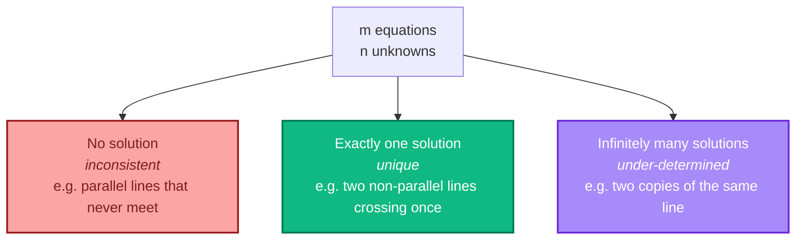
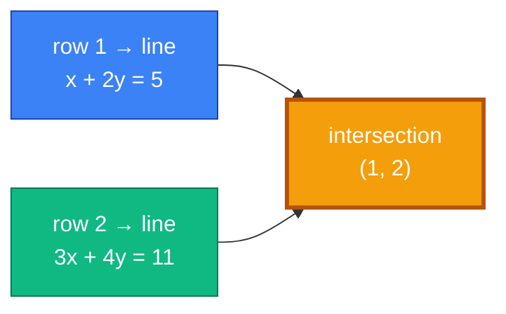
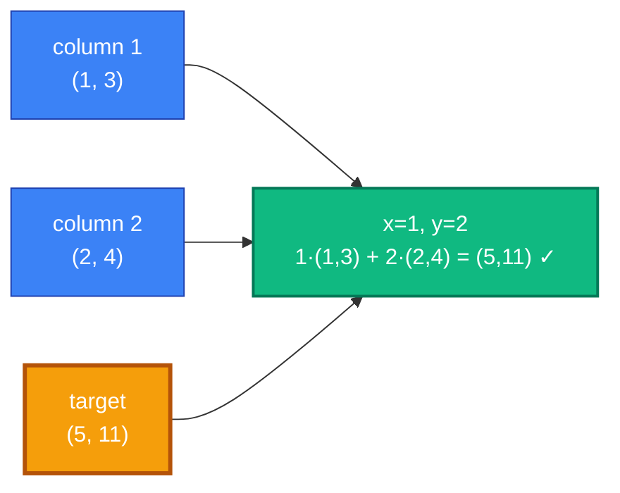
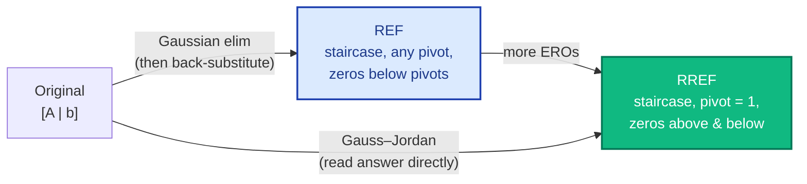
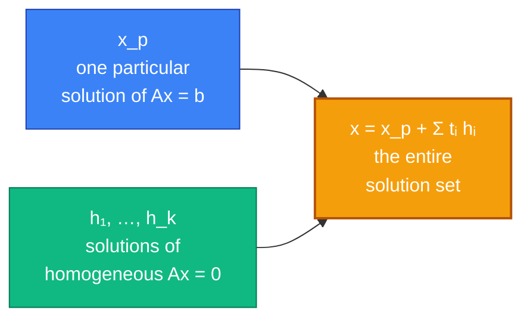
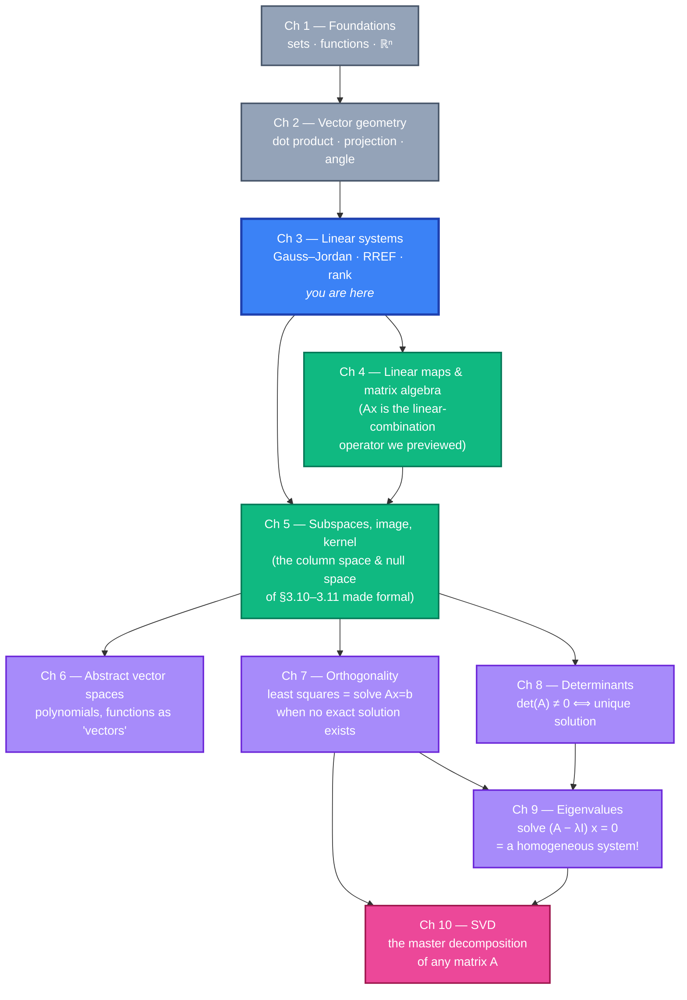

# Chapter 3 — Linear Systems and Gauss–Jordan Elimination

> *"Eliminate, don't substitute."* — every numerical analyst, ever.

## 3.0 A problem to anchor everything else

Before any algorithm, here's a concrete question you might have actually faced:

> *A small coffee roaster sells three blends — Morning, Afternoon, and Evening. Each blend is mixed from the same three single-origin beans (Brazil, Ethiopia, Colombia). The daily inventory is 30 kg Brazil, 25 kg Ethiopia, and 20 kg Colombia. The recipes are:*
>
> | Blend | Brazil | Ethiopia | Colombia |
> |---|---|---|---|
> | Morning   | 0.5 kg | 0.3 kg | 0.2 kg |
> | Afternoon | 0.4 kg | 0.4 kg | 0.2 kg |
> | Evening   | 0.3 kg | 0.3 kg | 0.4 kg |
>
> *How many bags of each blend can the roaster produce so that all three beans are used up exactly, with nothing left over?*

Let `x = `(bags of Morning)`, y = `(bags of Afternoon)`, `z = `(bags of Evening). The "use everything" constraint becomes:

```
   0.5 x  +  0.4 y  +  0.3 z  =  30        (Brazil)
   0.3 x  +  0.4 y  +  0.3 z  =  25        (Ethiopia)
   0.2 x  +  0.2 y  +  0.4 z  =  20        (Colombia)
```

Three equations, three unknowns — a **linear system**. The whole chapter is about one industrial-strength algorithm for solving systems like this (and *much* bigger ones), called **Gauss–Jordan elimination**.

But the chapter also asks bigger questions:

- What if the system has *no* solution? What if it has *infinitely many*? How can we *tell*, just from the numbers?
- What's the *shape* of the solution set when there are many?
- What does "row picture" vs "column picture" mean, and why does the column picture quietly become the foundation of everything later (matrices, image, kernel, rank)?

Linear systems sit at the literal centre of linear algebra. Almost every problem you'll meet — least squares, eigenvectors, change of basis, linear regression — eventually reduces to "solve `Ax = b`." So we'll learn to do it carefully, by hand, and understand *why* the algorithm works.

**Why this chapter, right after vector geometry?** Ch 1 told us *what* a vector is. Ch 2 gave us *measurement*. Ch 3 asks the first computational question: *given a list of linear constraints, what vectors satisfy all of them at once?*

---

## 3.1 Quick recap and notation

From Chapters 1–2:

- A **vector** in ℝⁿ is an n-tuple `(x₁, x₂, …, xₙ)`.
- A **linear combination** is `c₁ v₁ + c₂ v₂ + … + cₖ vₖ`. (Memorize this phrase. The whole chapter is about expressing a target vector as a linear combination, or proving you can't.)
- A **scalar** is a real number used as a coefficient.

New language for this chapter:

| Notation / term | Meaning |
|---|---|
| **Linear equation** | `a₁ x₁ + a₂ x₂ + … + aₙ xₙ = b` — sum of coefficient × variable, equals a constant. |
| **System** | A collection of linear equations sharing the same variables. |
| **Solution** | A tuple `(x₁, …, xₙ)` that makes *every* equation in the system true at once. |
| **Coefficient matrix `A`** | The grid of `aᵢⱼ` (one row per equation, one column per variable). |
| **Augmented matrix `[A \| b]`** | Coefficient matrix with the right-hand sides glued on as one extra column. |
| **Pivot** | The first nonzero entry in a row (after we've done elimination). Marks a "leading variable." |
| **RREF** | **Reduced row echelon form** — the unique tidy shape we drive every matrix into. |
| **Rank** | Number of pivots in the RREF. The "true" number of independent equations. |
| **Free variable** | A variable with *no* pivot in its column — we can choose it freely; the others are determined by it. |

> **Logic primer reminder.** "A solution exists" means `∃` (there exists) at least one tuple. "*The* solution" means there is exactly one, i.e. `∃!` (existence and uniqueness). The chapter's main theorem is precisely a sharp test for which of `∄`, `∃!`, or `∃ ∞-many` holds.

---

## 3.2 What is a linear equation, really?

Strip back assumptions. The equation

```
   3 x  +  2 y  −  z  =  7
```

says: *"find a triple `(x, y, z)` such that `3x + 2y − z` evaluates to 7."* The left side is a **linear** function of the variables — meaning every term is a constant times a single variable to the first power. No `x²`, no `xy`, no `sin(x)`, no `1/y`.

> **Definition.** A **linear equation** in variables `x₁, …, xₙ` is one of the form
>
> ```
>    a₁ x₁  +  a₂ x₂  +  …  +  aₙ xₙ  =  b
> ```
>
> where `a₁, …, aₙ, b` are fixed real numbers.

The equation `3x + 2y − z = 7` has `(a₁, a₂, a₃) = (3, 2, −1)` and `b = 7`.

**Geometric picture.**

| n (variables) | A single linear equation defines… |
|---|---|
| 1 | a single **point** on the number line |
| 2 | a **line** in ℝ² |
| 3 | a **plane** in ℝ³ |
| ≥ 4 | a **hyperplane** in ℝⁿ — an `(n−1)`-dimensional flat object you can't picture, but the algebra works the same |

In every case it's a "flat" object of one dimension less than the ambient space. The set of solutions to one linear equation in ℝⁿ is always an `(n−1)`-flat (assuming the equation is non-degenerate, i.e. some `aᵢ ≠ 0`).

> **Saveliev §1.1 (pp. 7–11)** opens with exactly this geometric picture for n = 2 (lines in the plane).

---

## 3.3 A system of equations — three possible outcomes

Stack `m` linear equations together (same variables `x₁, …, xₙ`):

```
   a₁₁ x₁  +  a₁₂ x₂  +  …  +  a₁ₙ xₙ  =  b₁
   a₂₁ x₁  +  a₂₂ x₂  +  …  +  a₂ₙ xₙ  =  b₂
       ⋮                                     ⋮
   aₘ₁ x₁  +  aₘ₂ x₂  +  …  +  aₘₙ xₙ  =  bₘ
```

This is an `m × n` **system** (m equations, n unknowns). A **solution** is a tuple `(x₁, …, xₙ)` satisfying *every* equation simultaneously.

Geometrically: each equation is a hyperplane. A solution is a point lying on *all* of them at once — the intersection.

There are exactly three possibilities:



A linear system **cannot** have, say, exactly two solutions, or any finite number bigger than one. If it has more than one, it has infinitely many — because the solution set is a flat (line, plane, …) and flats have infinitely many points.

> **A picture in ℝ²:** Each equation is a line. Two lines meet in either one point (unique), no points (parallel and distinct → inconsistent), or every point (same line → infinitely many). No other option.

This three-outcome theorem is the heart of the chapter. The Gauss–Jordan algorithm is the tool that reveals which case you're in.

---

## 3.4 Two pictures: row picture vs column picture

A linear system can be read in two completely different — and equally important — geometric ways. Strang famously calls them the **row picture** and the **column picture**.

Take the tiny system:

```
   x  +  2y  =  5
   3x  +  4y  =  11
```

### 3.4.1 Row picture: intersecting lines

Each row is one equation, one line in the (x, y) plane. The solution is the **intersection point** — here, `(1, 2)`.



Reading row-wise feels natural ("each row is one equation, draw it, intersect them") but generalizes badly: in ℝ¹⁰⁰ you can't picture a hyperplane.

### 3.4.2 Column picture: a linear combination of columns

Rewrite the system as one **vector** equation:

```
   x · (1, 3)  +  y · (2, 4)  =  (5, 11)
```

That is: *which scalars `x, y` make a linear combination of the column vectors `(1, 3)` and `(2, 4)` equal the right-hand side `(5, 11)`?*

Same algebra, totally different picture: we're asking whether `(5, 11)` lies in the **span** of the two columns, and if so, with what coefficients.



**Why the column picture matters.** Once we get to image, kernel, basis, dimension (Ch 5) and onward, *every* concept is phrased in terms of column vectors. "Does `Ax = b` have a solution?" becomes "Is `b` in the column space of A?" The column picture *is* the language of linear algebra past Ch 4. Get used to it now.

> **3Blue1Brown's "Essence of Linear Algebra" Ch 7** has gorgeous animations of both pictures side by side. Worth 12 minutes.

---

## 3.5 Augmented matrix and elementary row operations

We don't want to keep writing the variables `x, y, z, …` over and over. Strip them out — they're just placeholders.

The system

```
   x  +  2y  +    z  =  5
   2x  +  5y  +  3z  =  13
   x  +    y  −    z  =  0
```

becomes the **augmented matrix**

```
   ⎡ 1   2   1 │  5 ⎤
   ⎢ 2   5   3 │ 13 ⎥
   ⎣ 1   1  −1 │  0 ⎦
```

The vertical bar separates the **coefficient matrix `A`** (left, 3×3) from the **right-hand-side vector `b`** (right, one column). Notation: `[A | b]`.

We're allowed three operations on this matrix that **do not change the solution set**:

> **Elementary row operations (EROs):**
>
> 1. **Swap** two rows.
> 2. **Scale** a row by a nonzero constant.
> 3. **Add** a multiple of one row to another row.

Each of these is a relabeling of the same system — the equations look different but the same `(x, y, z)` triples satisfy them. *Why* are they safe? Because each is reversible, and a reversible transformation of equations preserves their common solutions. (You'll formalize this in Ch 4 as multiplication by an invertible "elementary matrix.")

The art of solving is: apply EROs cleverly until the system becomes obvious.

---

## 3.6 Gauss–Jordan elimination — the algorithm

Goal: drive `[A | b]` into a *standard tidy form* using only EROs, then read off the solution.

Two related forms appear in textbooks:

- **Row echelon form (REF)** — staircase shape, pivots may be any nonzero number, entries *above* pivots can be anything. This is what plain "Gaussian elimination" stops at; you'd then **back-substitute** to find variables.
- **Reduced row echelon form (RREF)** — same staircase, but every pivot is exactly `1`, and entries *both above and below* every pivot are `0`. **Gauss–Jordan elimination** drives all the way to RREF; then the answer is read directly with no back-substitution.

We'll use **RREF and Gauss–Jordan** because (a) the answer falls out for free at the end, and (b) the RREF of a matrix is **unique** — a fact we'll lean on later.

### 3.6.1 The procedure (stated once, then walked)

```
1. Find the leftmost column that has a nonzero entry. Call it the pivot column.
2. If the top-left of that column is zero, swap rows so it isn't.
3. Scale the top row to make the pivot equal 1.
4. Add multiples of the top row to every OTHER row (above and below) to zero
   out the rest of the pivot column.
5. "Cover" the top row and the pivot column. Recurse on the smaller matrix
   underneath and to the right.
6. Stop when no nonzero rows remain to process.
```

That's it. Six steps. Every linear system you'll ever see — 3×3 or 1000×1000 — yields to this procedure. (Numerically you'd add a "partial pivoting" tweak for stability, which we'll ignore; for hand-work the simple version is fine.)

### 3.6.2 A worked walkthrough

Let's solve the augmented matrix above by hand.

**Start.**
```
   ⎡ 1   2   1 │  5 ⎤
   ⎢ 2   5   3 │ 13 ⎥
   ⎣ 1   1  −1 │  0 ⎦
```

**Step 1.** Pivot column is column 1. Pivot is already `1` in row 1 (no scaling needed). Zero out the rest of column 1.

```
   R2 ← R2 − 2·R1     (kill the 2 in row 2)
   R3 ← R3 − 1·R1     (kill the 1 in row 3)

   ⎡ 1   2    1 │  5 ⎤
   ⎢ 0   1    1 │  3 ⎥
   ⎣ 0  −1   −2 │ −5 ⎦
```

**Step 2.** Cover row 1 and column 1. Sub-matrix:
```
   ⎡  1    1 │  3 ⎤
   ⎣ −1   −2 │ −5 ⎦
```
Pivot column is its column 1 (overall column 2). Pivot is already `1` in its top row. Zero out the rest:

```
   R3 ← R3 + R2

   ⎡ 1   2    1 │  5 ⎤
   ⎢ 0   1    1 │  3 ⎥
   ⎣ 0   0   −1 │ −2 ⎦
```

**Step 3.** Cover the top two rows / first two columns. Sub-matrix:
```
   ⎡ −1 │ −2 ⎦
```
Scale to get pivot `= 1`:

```
   R3 ← (−1)·R3

   ⎡ 1   2    1 │  5 ⎤
   ⎢ 0   1    1 │  3 ⎥
   ⎣ 0   0    1 │  2 ⎦
```

This is **REF** (row echelon form). Plain Gaussian elimination stops here and back-substitutes.

**Continue to RREF.** Zero out *above* each pivot, working bottom-up.

```
   R2 ← R2 − R3            R1 ← R1 − R3

   ⎡ 1   2    0 │  3 ⎤
   ⎢ 0   1    0 │  1 ⎥
   ⎣ 0   0    1 │  2 ⎦

   R1 ← R1 − 2·R2

   ⎡ 1   0    0 │  1 ⎤
   ⎢ 0   1    0 │  1 ⎥
   ⎣ 0   0    1 │  2 ⎦
```

This is **RREF**. Reading rows: `x = 1`, `y = 1`, `z = 2`. **Done.**

Verify: `1 + 2 + 2 = 5` ✓, `2 + 5 + 6 = 13` ✓, `1 + 1 − 2 = 0` ✓.

> **Pedagogy note.** Most students lose marks not because the algorithm is hard, but from arithmetic slips during step 4. Work in fractions if you must, double-check by substituting at the end, and — for sanity — use the SageMath notebook for this chapter to verify your by-hand answers.

---

## 3.7 Reduced row echelon form (RREF) — the destination

Formally:

> **Definition.** A matrix is in **reduced row echelon form (RREF)** if all four hold:
>
> 1. Any all-zero rows are at the *bottom*.
> 2. The first nonzero entry of every nonzero row (the **pivot**) is `1`.
> 3. Each pivot is strictly to the right of the pivot in the row above it (staircase).
> 4. Every entry in a pivot's *column* — both above and below — is `0`.

A matrix in REF satisfies (1) and (3); RREF strengthens to also require (2) and (4).



> **Theorem (uniqueness of RREF).** Every matrix has *exactly one* RREF, regardless of the order in which you apply the EROs.
>
> Different routes can lead through different intermediate REFs, but Gauss–Jordan always lands on the same final RREF. We'll take this on faith for now — it's proved cleanly in Ch 5 with the dimension theorem.

The uniqueness is what makes "the rank of A" and "the free variables of `Ax = b`" well-defined.

---

## 3.8 The three outcomes — read directly from RREF

Drive `[A | b]` to RREF. Inspect the result. The shape of the answer tells you which of the three outcomes you got.

### 3.8.1 Outcome 1 — unique solution

Every column of A has a pivot, and there's no all-zero-row-of-A with a nonzero `b`. The RREF looks like

```
   ⎡ 1   0   0 │ 1 ⎤
   ⎢ 0   1   0 │ 1 ⎥
   ⎣ 0   0   1 │ 2 ⎦
```

Read off `x = 1, y = 1, z = 2`. Done. (This was our worked example.)

### 3.8.2 Outcome 2 — no solution (inconsistent)

A pivot lands in the **last column** (the augmented `b` side). That row reads

```
   0 · x  +  0 · y  +  0 · z  =  (something nonzero)
```

i.e. `0 = 5` or similar. There's no triple satisfying that. The system is **inconsistent**. Example RREF:

```
   ⎡ 1   2   0 │  3 ⎤
   ⎢ 0   0   1 │  1 ⎥
   ⎣ 0   0   0 │  4 ⎦      ← contradiction!
```

### 3.8.3 Outcome 3 — infinitely many solutions (under-determined)

No contradiction row, but **at least one column of A has no pivot**. Each pivot-less column corresponds to a **free variable** — a parameter we can set to any real number, with the rest determined.

Example. Suppose RREF of `[A | b]` is

```
   ⎡ 1   2   0 │  3 ⎤
   ⎢ 0   0   1 │  1 ⎥
   ⎣ 0   0   0 │  0 ⎦
```

Variables: `x₁, x₂, x₃`. Pivots are in columns 1 and 3, so `x₁` and `x₃` are **leading** (a.k.a. **basic**) variables. Column 2 has no pivot, so `x₂` is **free**. Read the equations:

```
   x₁  +  2 x₂        =  3       →   x₁ = 3 − 2 x₂
                x₃    =  1       →   x₃ = 1
```

Let `x₂ = t` (the parameter). The general solution is

```
   (x₁, x₂, x₃)  =  (3 − 2t, t, 1)  =  (3, 0, 1)  +  t · (−2, 1, 0)
```

A **line** in ℝ³. Notice the form: a *particular solution* `(3, 0, 1)` plus a parameter times a *direction vector* `(−2, 1, 0)`. That direction vector is a solution of the **homogeneous system** `Ax = 0` (set `b = 0` and re-solve). This **particular + homogeneous** structure is the punchline of the chapter — and reappears verbatim for differential equations, recursion, signal processing, and every other linear theory.

> **Saveliev §1.1, pp. 9–11** tracks the parametric picture for the 2-variable case.

---

## 3.9 Free variables and the parametric form of the solution set

Every "infinitely many" answer can be written as

> ```
>    x  =  x_p  +  t₁ · h₁  +  t₂ · h₂  +  …  +  t_k · h_k
> ```

where:

- `x_p` is **any one particular** solution of `Ax = b` (often: set every free variable to 0 and read the rest).
- `h₁, …, h_k` are solutions of the **homogeneous** system `Ax = 0`, one per free variable.
- `t₁, …, t_k` are real parameters (one per free variable, ranging freely).

The number `k` of free variables is determined by the RREF and is the same regardless of which particular solution you picked.



> **Key idea.** The full solution set is `x_p` plus the entire span of the homogeneous solutions — an **affine subspace** of ℝⁿ. Compare §2.4: an affine combination is the right framework for sets that don't pass through the origin. The solution set of `Ax = b` is exactly such a thing (unless `b = 0`, in which case it passes through the origin and is a true subspace — Ch 5 material).

---

## 3.10 Rank — counting the real equations

Define:

> **Rank of A** (notation: `rank(A)` or `r`) = the **number of pivots in the RREF of A**.

(We're using `A` alone, not `[A | b]`, here.) The rank counts the **independent equations** — how many constraints the system *really* imposes, after redundancy is squeezed out.

For an `m × n` system:

| `rank(A)` and `rank([A|b])` | Outcome |
|---|---|
| `rank(A) < rank([A|b])` | **Inconsistent.** A pivot snuck into the last column → contradiction row. |
| `rank(A) = rank([A|b]) = n` | **Unique solution.** Every unknown has a pivot. |
| `rank(A) = rank([A|b]) < n` | **Infinitely many solutions.** Number of free variables = `n − rank(A)`. |

This is the **Rouché–Capelli theorem**. It packages the three outcomes into a numerical test — no need to draw pictures, just compare two numbers.

A consequence worth remembering:

> If `m < n` (more unknowns than equations), then `rank(A) ≤ m < n`. So a consistent under-determined system is *always* under-determined: at least `n − m` free variables. *Fewer equations than unknowns can never give a unique answer.*

---

## 3.11 Matrix–vector form `Ax = b` (preview)

A single equation captures the whole system:

> ```
>    A · x  =  b
> ```

where:

- `A` is the `m × n` **coefficient matrix**,
- `x` is the column vector of unknowns,
- `b` is the column vector of right-hand sides.

The product `Ax` will be defined formally in Ch 4. For now, take it as shorthand:

> `Ax` is the **linear combination of A's columns** with the entries of `x` as coefficients.

That is, if `A`'s columns are `a₁, …, aₙ` and `x = (x₁, …, xₙ)`, then

```
   A · x  =  x₁ · a₁  +  x₂ · a₂  +  …  +  xₙ · aₙ.
```

**`Ax = b` ⟺ `b` is a linear combination of A's columns.** That's the column picture of §3.4 in one line.

This notation is so compact that the entire rest of the course is written in it — eigenvalues `Av = λv`, projections `proj = A(AᵀA)⁻¹Aᵀ b`, even differential equations `x' = Ax`. Get comfortable with `A · x` as "weight A's columns by x's entries." We'll re-derive it carefully in Ch 4.

---

## 3.12 The big picture — where this leads



Three things from this chapter feed *every* later chapter:

1. **Column picture.** "Span of A's columns" = image (Ch 5). "Solutions of `Ax = 0`" = kernel (Ch 5). Both came up here — formalized later.
2. **Rank.** Used to detect consistency, count free variables, and (later) measure the dimension of the column space / kernel. Ch 5's main theorem (rank–nullity) is a direct continuation.
3. **`Ax = b`.** The notation that the rest of the course speaks. Eigenvectors, least squares, diagonalization, SVD — all are special-shaped instances of `Ax = b`.

---

## Summary checklist

After this chapter you should be able to, without hesitation:

- [ ] Translate a word problem into a linear system, identify its size (`m × n`).
- [ ] Build the augmented matrix `[A | b]` and apply the three EROs cleanly.
- [ ] Drive any matrix to **RREF** by Gauss–Jordan, by hand, on a 3×3 example.
- [ ] Identify pivots, leading variables, and free variables from an RREF.
- [ ] Recognize the three outcomes (unique / inconsistent / infinitely many) directly from the RREF.
- [ ] Write the **parametric form** `x = x_p + t₁ h₁ + … + t_k h_k` of a multi-solution system.
- [ ] State and apply the **Rouché–Capelli** rank test (compare `rank(A)` and `rank([A|b])`).
- [ ] Switch fluidly between the **row picture** (intersecting hyperplanes) and the **column picture** (linear combinations).
- [ ] Read `Ax = b` aloud as: *"`b` is a linear combination of A's columns, with weights x."*
- [ ] Explain in one sentence why "more unknowns than equations" cannot give a unique solution.
