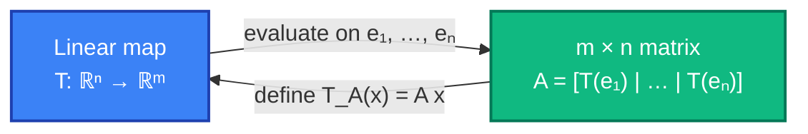
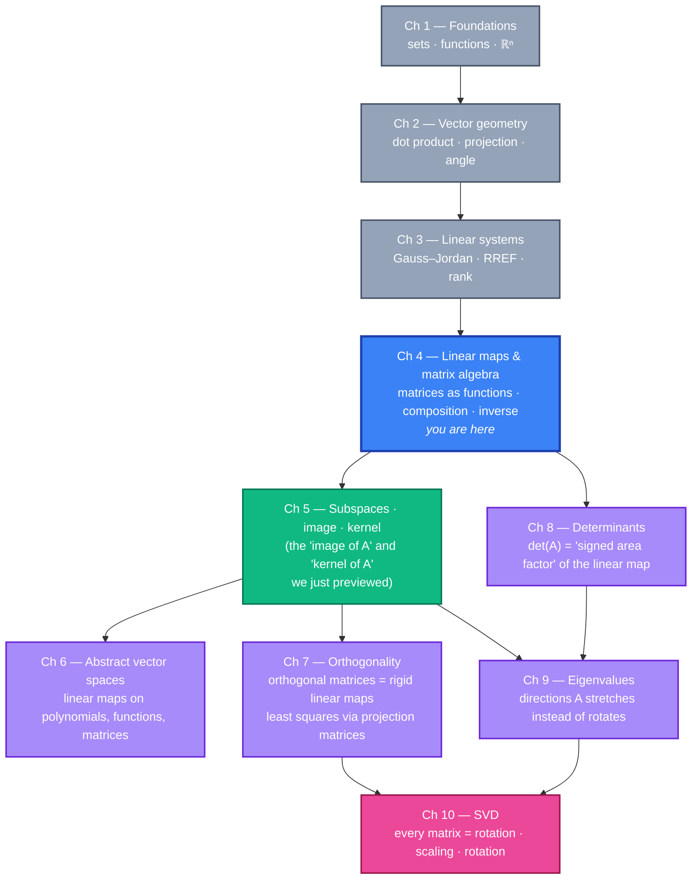

# Chapter 4 — Linear Transformations and Matrix Algebra

> *"A matrix is a function. It just looks like a grid of numbers."* — the single sentence every student wishes had been said on day one.

## 4.0 A problem to anchor everything else

Before any definitions, here's a concrete job:

> *You are writing the rendering loop for a small 2D game. Your hero is a triangle with vertices at `P₁ = (1, 0)`, `P₂ = (3, 0)`, `P₃ = (2, 2)`. Every frame you want to spin it 30° anticlockwise around the origin. Write a function `rotate(p)` that takes any point `(x, y)` and returns its new location after that rotation. Bonus: your engine will eventually want to do the rotation thousands of times per second for a whole mesh — make it cheap.*

One way: write trigonometry out by hand.

```
   x' = x · cos 30° − y · sin 30°
   y' = x · sin 30° + y · cos 30°
```

That works. But look at the shape of it — two linear expressions in `x, y`, no `x²`, no `sin(xy)`, nothing nonlinear. You can package the recipe as a grid of four numbers:

```
   ⎡ cos 30°   − sin 30° ⎤       ⎡ x ⎤        ⎡ x' ⎤
   ⎢                      ⎥  ·   ⎢   ⎥   =    ⎢    ⎥
   ⎣ sin 30°     cos 30° ⎦       ⎣ y ⎦        ⎣ y' ⎦
```

That grid *is* the rotation — stored as 4 numbers, applied by a tiny arithmetic rule to any input. And here's the bigger surprise: **every** "nicely behaved" geometric operation on ℝⁿ — rotations, reflections, scalings, shears, projections, even the "rotate-then-reflect-then-scale" combination — turns out to be exactly this: *multiplication by a matrix*. And stitching two such operations together ("do A, then do B") turns out to be exactly *matrix multiplication*.

This chapter makes that precise. It answers four closely linked questions:

1. Which functions `T: ℝⁿ → ℝᵐ` deserve to be called **linear**?
2. How is every linear function secretly a **matrix**?
3. What does it *mean* to multiply two matrices — and why is the rule so strange-looking?
4. When can we *undo* a linear transformation — i.e. invert a matrix?

**Why this chapter, right after linear systems?** Chapter 3 promised a compact shorthand `Ax = b` and a "column picture" view of systems. This chapter formalizes the machinery: `A` is a function, `x` is its input, `Ax` is its output. Once that's clear, matrix multiplication, inverses, and geometry all drop out for free.

---

## 4.1 Quick recap and notation

From Chapters 1–3:

- A **vector** in ℝⁿ is an n-tuple `(x₁, …, xₙ)` — we think of it as a column.
- A **linear combination** is `c₁ v₁ + … + cₖ vₖ`.
- The **standard basis** of ℝⁿ consists of `e₁ = (1, 0, …, 0), e₂ = (0, 1, 0, …, 0), …, eₙ = (0, …, 0, 1)` — the columns of the identity matrix.

New language for this chapter:

| Notation / term | Meaning |
|---|---|
| **Function** `T: X → Y` | A rule assigning to every input `x ∈ X` exactly one output `T(x) ∈ Y`. |
| **Domain**, **codomain** | The input set `X`, the output set `Y`. |
| **Image** of `T` | The set `{T(x) : x ∈ X}` — everything `T` actually hits. |
| **Linear transformation** | A function `T: ℝⁿ → ℝᵐ` satisfying additivity and homogeneity (§4.3). Also called a **linear map**. |
| **Matrix** `A` of size `m × n` | Rectangular array with `m` rows and `n` columns; entry in row `i`, column `j` is `aᵢⱼ`. |
| **Standard matrix** of `T` | The unique matrix whose columns are `T(e₁), T(e₂), …, T(eₙ)`. |
| **Matrix product** `A B` | The matrix of the composition: `(A B) x = A(B x)`. |
| **Identity matrix** `Iₙ` | The `n × n` matrix with 1's on the diagonal, 0's elsewhere. `Iₙ x = x` for every `x`. |
| **Inverse** `A⁻¹` | A square matrix with `A A⁻¹ = A⁻¹ A = I`. Exists iff `A` is invertible. |

> **Convention.** Vectors are columns. When we write `(x, y)` in running text we still mean the column `⎡x⎤` over `⎣y⎦`. An `m × n` matrix maps ℝⁿ → ℝᵐ: **n** is how many numbers go in, **m** is how many come out.

---

## 4.2 Functions on ℝⁿ — the broader context

Before narrowing to *linear* functions, notice that the idea of a **function from ℝⁿ to ℝᵐ** is very general. Any rule at all:

- `T(x, y) = (x², y³)` — a function ℝ² → ℝ², but not linear (has powers).
- `T(x, y) = (x + 1, y − 2)` — shifts, a **translation**; also not linear (more on this below).
- `T(x, y, z) = (2x, 2y, 2z)` — doubles every vector; *this one is* linear.
- `T(x, y) = (cos x, sin y)` — bounded, periodic, wild; not linear.

"Function" on its own is almost too flexible to say anything useful. Linear algebra pins down a specific, enormously important subclass — the **linear** ones — because they're exactly the functions that interact cleanly with the two operations vectors already support (`+` and scalar `·`).

---

## 4.3 Linearity — the definition

> **Definition.** A function `T: ℝⁿ → ℝᵐ` is a **linear transformation** (or **linear map**) if for every `u, v ∈ ℝⁿ` and every scalar `c ∈ ℝ`:
>
> 1. **Additivity:** `T(u + v) = T(u) + T(v)`.
> 2. **Homogeneity:** `T(c · u) = c · T(u)`.

The two properties together are often packaged as a single slogan:

> **T preserves linear combinations:** for any scalars `a, b` and vectors `u, v`,
>
> ```
>    T(a u + b v)  =  a T(u) + b T(v).
> ```

Both formulations are equivalent — you can derive either from the other. In practice, to check linearity, you verify both (1) and (2).

### 4.3.1 A first consequence

Plug `c = 0` into homogeneity:

```
   T(0 · u)  =  0 · T(u)  =  0.
```

So **every linear transformation sends `0` to `0`**. Conversely, any map that doesn't fix the origin *cannot* be linear.

That's why `T(x, y) = (x + 1, y − 2)` is **not** linear — it sends `(0, 0)` to `(1, −2)`. A shift (translation) moves the origin, which no linear map can do. Linear maps are "things you can do while keeping the origin nailed down."

### 4.3.2 Testing linearity — a 2D example

Is `T(x, y) = (2x + 3y, x − y)` linear?

**Additivity.** Let `u = (u₁, u₂)` and `v = (v₁, v₂)`.
```
   T(u + v)  =  T(u₁ + v₁, u₂ + v₂)
             =  (2(u₁+v₁) + 3(u₂+v₂),  (u₁+v₁) − (u₂+v₂))
             =  (2u₁ + 3u₂, u₁ − u₂)  +  (2v₁ + 3v₂, v₁ − v₂)
             =  T(u) + T(v).      ✓
```

**Homogeneity.**
```
   T(c · u)  =  T(c u₁, c u₂)
            =  (2(c u₁) + 3(c u₂), (c u₁) − (c u₂))
            =  c · (2 u₁ + 3 u₂, u₁ − u₂)
            =  c · T(u).          ✓
```

Linear. But we can see a pattern: *every* such `T` — one whose coordinates are built from constant multiples of `x` and `y` added together, with no constant term — will pass both tests. That's a strong hint we'll soon be able to reduce the whole test to "does `T` have the form `Ax` for some matrix `A`?"

### 4.3.3 Common non-linear functions

| `T(x, y) = …` | Why not linear |
|---|---|
| `(x + 1, y − 2)` | Translates origin. `T(0) ≠ 0`. |
| `(x², y)` | Breaks homogeneity: `T(2·(1,0)) = (4, 0) ≠ 2·T(1, 0) = (2, 0)`. |
| `(xy, x)` | Breaks additivity: `T(u+v)` has a cross term `u₁v₂ + u₂v₁`. |
| `(|x|, y)` | Breaks homogeneity for negative scalars. |
| `(x + y + 3, y)` | Breaks additivity because of the `+3` constant; again `T(0) ≠ 0`. |

---

## 4.4 The heart of the chapter — every linear map is a matrix

Here's the theorem that makes linear algebra *linear algebra*.

> **Theorem (standard matrix).** Let `T: ℝⁿ → ℝᵐ` be linear. Then there is a *unique* `m × n` matrix `A` — the **standard matrix of T** — such that
>
> ```
>    T(x)  =  A · x         for every x ∈ ℝⁿ.
> ```
>
> The columns of `A` are the images of the standard basis vectors:
>
> ```
>    A  =  [ T(e₁)  |  T(e₂)  |  …  |  T(eₙ) ].
> ```

**Why does this work?** Because every vector `x ∈ ℝⁿ` is a linear combination of the standard basis:
```
   x  =  x₁ e₁ + x₂ e₂ + … + xₙ eₙ.
```
A linear `T` preserves linear combinations (§4.3), so
```
   T(x)  =  x₁ T(e₁) + x₂ T(e₂) + … + xₙ T(eₙ).
```
That is: `T(x)` is a linear combination of the vectors `T(e₁), …, T(eₙ)` with weights `x₁, …, xₙ`. Which is exactly what multiplication by the matrix `A = [T(e₁) | … | T(eₙ)]` does, by the column picture from §3.11.

### 4.4.1 Finding the standard matrix in practice

Given a linear `T`, to find its matrix, *just evaluate `T` on each standard basis vector* and stack the answers as columns.

**Example 1 — our rotation.** Let `T: ℝ² → ℝ²` rotate by angle `θ` anticlockwise. By drawing the picture (or applying the trig identities),
```
   T(e₁) = T(1, 0) = (cos θ, sin θ)
   T(e₂) = T(0, 1) = (−sin θ, cos θ)
```
So
```
   R_θ  =  ⎡ cos θ   − sin θ ⎤
          ⎣ sin θ     cos θ ⎦.
```

**Example 2 — doubling every vector.** `T(x, y) = (2x, 2y)`. Then `T(e₁) = (2, 0)` and `T(e₂) = (0, 2)`, so
```
   A  =  ⎡ 2   0 ⎤
        ⎣ 0   2 ⎦.
```

**Example 3 — projection onto the x-axis.** `T(x, y) = (x, 0)`. Then `T(e₁) = (1, 0)` and `T(e₂) = (0, 0)`, giving
```
   P  =  ⎡ 1   0 ⎤
        ⎣ 0   0 ⎦.
```

### 4.4.2 Going the other direction — matrix gives a linear map

The converse is also true: if `A` is any `m × n` matrix and we *define* `T_A(x) = A · x`, then `T_A` is linear. (Both additivity and homogeneity follow from the distributive rules of matrix arithmetic.)

So there is a perfect two-way correspondence:



From here on, **"linear map" and "matrix" are the same thing in two notations**. Use whichever is convenient: the geometric picture (rotations, projections) when you want intuition; the matrix when you want to compute.

---

## 4.5 Matrix–vector multiplication, formally

We promised this in §3.11. Here's the full definition.

> **Definition.** Let `A` be an `m × n` matrix with columns `a₁, …, aₙ` (each in ℝᵐ) and let `x = (x₁, …, xₙ) ∈ ℝⁿ`. Then
>
> ```
>    A · x  =  x₁ a₁ + x₂ a₂ + … + xₙ aₙ          ∈ ℝᵐ.
> ```

Two equivalent ways to compute it:

### 4.5.1 Column view (the one you should trust)

`Ax` is a linear combination of `A`'s columns — weight column `j` by `xⱼ`, add them up. This is the picture that generalizes to every later concept (image = span of columns, etc.).

### 4.5.2 Row view (the one you were probably taught first)

Entry `i` of `Ax` is the dot product of row `i` of `A` with `x`:
```
   (A x)_i  =  aᵢ₁ x₁ + aᵢ₂ x₂ + … + aᵢₙ xₙ.
```
Good for hand computation; less insightful than the column view.

Both views give exactly the same answer — the same number falls out of both recipes. But when you later see "column space = image of A," it's the column view you'll be thinking in.

**Shape check.** `A` is `m × n`, `x` is `n × 1`, `Ax` is `m × 1`. The "inner dimensions" (both `n`) must match; the "outer dimensions" give the result's shape. This matters doubly for matrix–matrix products.

---

## 4.6 The 2D geometric catalog

The single most valuable table in this chapter. Memorize it — every standard 2D transformation has a tidy `2 × 2` matrix. Derive each one by computing `T(e₁)` and `T(e₂)`.

| Transformation | Matrix | `T(e₁)` | `T(e₂)` | Geometric note |
|---|---|---|---|---|
| **Identity** (do nothing) | `⎡1 0⎤` / `⎣0 1⎦` | `(1, 0)` | `(0, 1)` | Every vector is fixed. |
| **Scaling by k** | `⎡k 0⎤` / `⎣0 k⎦` | `(k, 0)` | `(0, k)` | Uniform zoom. |
| **Non-uniform scaling** `(k₁, k₂)` | `⎡k₁ 0⎤` / `⎣0 k₂⎦` | `(k₁, 0)` | `(0, k₂)` | Stretch x and y independently. |
| **Rotation by θ (anticlockwise)** | `⎡cos θ   −sin θ⎤` / `⎣sin θ    cos θ⎦` | `(cos θ, sin θ)` | `(−sin θ, cos θ)` | Rigid; preserves lengths and angles. |
| **Reflection across x-axis** | `⎡1  0⎤` / `⎣0 −1⎦` | `(1, 0)` | `(0, −1)` | Flips y. |
| **Reflection across y-axis** | `⎡−1 0⎤` / `⎣ 0 1⎦` | `(−1, 0)` | `(0, 1)` | Flips x. |
| **Reflection across `y = x`** | `⎡0 1⎤` / `⎣1 0⎦` | `(0, 1)` | `(1, 0)` | Swaps coordinates. |
| **Horizontal shear** by `k` | `⎡1 k⎤` / `⎣0 1⎦` | `(1, 0)` | `(k, 1)` | Slides x proportionally to y. |
| **Vertical shear** by `k` | `⎡1 0⎤` / `⎣k 1⎦` | `(1, 0)` | `(0, 1)` — wait | `T(e₂) = (0, 1)`, `T(e₁) = (1, k)`. Slides y proportionally to x. |
| **Projection onto x-axis** | `⎡1 0⎤` / `⎣0 0⎦` | `(1, 0)` | `(0, 0)` | Collapses plane onto x-axis. Loses info. |
| **Projection onto y-axis** | `⎡0 0⎤` / `⎣0 1⎦` | `(0, 0)` | `(0, 1)` | Collapses plane onto y-axis. Loses info. |

> **Drawing rule of thumb.** To picture what an unknown `2 × 2` matrix `A` does, plot `A e₁ = ` (first column) and `A e₂ = ` (second column). Those two output vectors are the image of the unit square's sides. Connect them with a parallelogram — that's where the unit square goes. The whole plane gets warped in the same way.

---

## 4.7 Composition of linear maps = matrix multiplication

Imagine doing two linear transformations one after the other: first `B`, then `A`. Call the composition `T(x) = A(B x)`. Is `T` linear? Yes (both components preserve linear combinations, so their composition does too). So `T` has a standard matrix. **Call it `A B`.**

> **Definition (matrix product).** If `A` is `m × k` and `B` is `k × n`, then `A B` is the unique `m × n` matrix with the property
>
> ```
>    (A B) x  =  A · (B · x)        for every x ∈ ℝⁿ.
> ```

### 4.7.1 The explicit formula

Column `j` of `A B` equals `A` applied to column `j` of `B`. In entries:
```
   (A B)ᵢⱼ  =  Σ_k  aᵢₖ · bₖⱼ     =   (row i of A) · (column j of B).
```

That is *why* the "row-times-column dot product" rule works: it's a direct consequence of "composition = do `B` to get a vector, then do `A` to that vector."

**Shape check.** `A` is `m × k`, `B` is `k × n`, product `A B` is `m × n`. The inner dimensions (`k`) must agree. If they don't, the product isn't defined.

### 4.7.2 Non-commutativity

Order matters enormously. In general
```
   A B  ≠  B A.
```
First do `B`, then `A` is a different composition from first `A` then `B`. That's geometrically obvious — "rotate then reflect" is a different operation from "reflect then rotate" — and the matrices reflect it.

**Micro-example.** Let `A = ⎡0 1⎤ / ⎣1 0⎦` (swap coordinates) and `B = ⎡1 1⎤ / ⎣0 1⎦` (shear).
```
   A B  =  ⎡0 1⎤ ⎡1 1⎤  =  ⎡0 1⎤
          ⎣1 0⎦ ⎣0 1⎦     ⎣1 1⎦

   B A  =  ⎡1 1⎤ ⎡0 1⎤  =  ⎡1 1⎤
          ⎣0 1⎦ ⎣1 0⎦     ⎣1 0⎦
```
Different. (Lesson for later: when you see `AB = BA`, it's usually a meaningful geometric or algebraic fact, not the default.)

### 4.7.3 Arithmetic rules for matrix multiplication

For matrices of compatible sizes:

| Rule | Notes |
|---|---|
| `A (B C) = (A B) C` | **Associative** — parenthesize freely. |
| `A (B + C) = A B + A C` | **Distributive** (from the left). |
| `(A + B) C = A C + B C` | Distributive from the right. |
| `c (A B) = (c A) B = A (c B)` | Scalars slide through. |
| `A B ≠ B A` | Generally! Not commutative. |
| `Aᵀ (x · y) …` | Transposes + products: `(A B)ᵀ = Bᵀ Aᵀ` (order flips). |
| `I A = A I = A` | Identity is a multiplicative neutral. |

---

## 4.8 The identity and the inverse

> **Identity matrix `Iₙ`.** The `n × n` matrix with `1`'s on the diagonal and `0`'s off-diagonal. It's the standard matrix of the identity transformation `T(x) = x`. For every matrix `A` of matching size, `A Iₙ = A` and `Iₙ A = A`.

**Inverse.** For a function to be invertible, you need a function `f⁻¹` satisfying `f ∘ f⁻¹ = f⁻¹ ∘ f = id`. Translating to matrices:

> **Definition.** An `n × n` matrix `A` is **invertible** (or **non-singular**) if there exists an `n × n` matrix `A⁻¹` with
>
> ```
>    A · A⁻¹  =  A⁻¹ · A  =  Iₙ.
> ```
>
> The matrix `A⁻¹`, when it exists, is **unique**.

Two crucial properties:

- **Only square matrices can have inverses.** (You can't have a function ℝⁿ → ℝᵐ with `m ≠ n` that is both injective and surjective.)
- **Not every square matrix is invertible.** E.g. the projection `P = ⎡1 0⎤ / ⎣0 0⎦` collapses the plane onto the x-axis — two inputs get sent to the same output, so no inverse can exist.

### 4.8.1 The invertibility criterion (first version)

> **Theorem.** For an `n × n` matrix `A`, the following are equivalent:
>
> 1. `A` is invertible.
> 2. The only solution of `A x = 0` is `x = 0`.
> 3. For every `b ∈ ℝⁿ`, `A x = b` has a *unique* solution.
> 4. The RREF of `A` is `Iₙ`.
> 5. `A` has `n` pivots (i.e. rank `n`).

Each item is a different lens on the same fact. You'll add *more* equivalent conditions to this list in every later chapter — it'll eventually be called the **invertible matrix theorem** and hold 10+ clauses. (Ch 8 adds "`det(A) ≠ 0`." Ch 5 adds "columns are linearly independent." Ch 9 adds "0 is not an eigenvalue.")

### 4.8.2 The `2 × 2` inverse formula

For `A = ⎡a b⎤ / ⎣c d⎦`, define `det A = ad − bc`. If `det A ≠ 0`, then
```
   A⁻¹  =  (1 / (ad − bc)) · ⎡  d   −b ⎤
                             ⎣ −c    a ⎦.
```

*Sketch of why.* Multiply `A` by that candidate matrix; the off-diagonal entries give `ad − bc` (two copies), and the diagonals give `0`. Scale by `1 / (ad − bc)` to land on `I`. The formula only works when that scalar is defined — i.e. when `ad − bc ≠ 0`.

If `ad − bc = 0`, the matrix is *not* invertible; the rows (and columns) are proportional, so the map collapses onto a line.

### 4.8.3 General inverse via Gauss–Jordan

For an `n × n` matrix with `n > 2`, hand-computing the inverse by guessing is hopeless. Instead, **augment `A` with `I`, run Gauss–Jordan, read off `A⁻¹`**:

```
   [ A | I ]   →   Gauss–Jordan   →   [ I | A⁻¹ ].
```

That is: apply EROs to drive the left block to `I`; whatever the right block becomes is `A⁻¹`. If you *can't* drive the left block to `I` (some row becomes all zeros), then `A` is not invertible.

**Why does this work?** Each ERO is multiplication on the left by an **elementary matrix** `E`. Applying a sequence `E₁, E₂, …, E_r` of EROs to `[A | I]` gives
```
   [ E_r … E₁ A  |  E_r … E₁ I ]  =  [ (E_r … E₁) A  |  E_r … E₁ ].
```
If the left block ended up as `I`, then `E_r … E₁` is precisely the matrix that undoes `A` — i.e. `A⁻¹`. That's what sits in the right block.

### 4.8.4 Inverse of a product

```
   (A B)⁻¹  =  B⁻¹ A⁻¹.
```

The order **reverses**. Intuition: to undo "first `B`, then `A`," you undo `A` first (getting back to the mid-state), then undo `B`. Like taking off socks and shoes: remove shoes first, then socks.

---

## 4.9 Worked walkthrough — building and inverting a shear

Let `S = ⎡1  2⎤ / ⎣0  1⎦` (a horizontal shear by factor 2).

**What does `S` do?** `S e₁ = (1, 0)` (unchanged), `S e₂ = (2, 1)`. The unit square gets sheared into a parallelogram with base (1,0) and side (2,1).

**Is it invertible?** `det S = 1·1 − 2·0 = 1 ≠ 0`, so yes.

**What's `S⁻¹`?** By the `2 × 2` formula:
```
   S⁻¹  =  (1/1) · ⎡ 1   −2 ⎤   =   ⎡ 1   −2 ⎤
                  ⎣ 0    1 ⎦        ⎣ 0    1 ⎦.
```

That's a *reverse* shear — which makes sense: the undo of shearing right by 2 is shearing left by 2.

**Sanity check.**
```
   S · S⁻¹  =  ⎡1 2⎤ ⎡ 1 −2⎤  =  ⎡1·1+2·0   1·(−2)+2·1⎤  =  ⎡1 0⎤  =  I ✓
               ⎣0 1⎦ ⎣ 0  1⎦     ⎣0·1+1·0   0·(−2)+1·1⎦     ⎣0 1⎦
```

**Apply `S⁻¹` to a rotated triangle.** If the rotation `R₃₀°` has already been applied and we want to un-shear after it, the complete undo is `S⁻¹ R₃₀°⁻¹`. (Remember: inverses of products reverse.)

---

## 4.10 Preview — image and kernel

Two subsets of ℝⁿ / ℝᵐ will haunt us from Ch 5 onward:

- The **image** of `A` (a.k.a. **column space**): `{A x : x ∈ ℝⁿ}` = all possible outputs = the span of `A`'s columns. Subset of ℝᵐ.
- The **kernel** of `A` (a.k.a. **null space**): `{x ∈ ℝⁿ : A x = 0}` = everything squashed to zero. Subset of ℝⁿ.

They'll be our tools for answering:

- "Does `A x = b` have a solution?" → "Is `b` in the image of `A`?"
- "Is the solution unique?" → "Is the kernel just {0}?"
- "How big is the solution set when there are many?" → "How big is the kernel?"

Rank–nullity, the **dimension theorem**, is a single equation tying these together. We'll do it properly in Ch 5. For now, just know they exist and that they sharpen the rank discussion of §3.10.

---

## 4.11 The big picture — where this leads



Three ideas from this chapter power everything that follows:

1. **Every linear function ↔ a matrix.** This lets us switch fluidly between the geometric picture (rotate, reflect, project) and the algebraic one (multiply by a matrix).
2. **Composition ↔ multiplication.** The weird-looking matrix multiplication rule is just "do one map, then the other." That's why it's associative but not commutative.
3. **Invertibility has many faces.** `A⁻¹` exists iff `Ax = b` has a unique solution iff `Ax = 0` has only `x = 0` iff `A` has `n` pivots iff (later) `det A ≠ 0` iff (much later) `0` is not an eigenvalue. Each chapter adds a new clause.

---

## Summary checklist

After this chapter you should be able to, without hesitation:

- [ ] State the two defining properties of a **linear transformation** and check them on a candidate `T: ℝⁿ → ℝᵐ`.
- [ ] Explain why every linear `T` must satisfy `T(0) = 0`, and use that as a quick rejection test.
- [ ] Given a linear `T`, build its **standard matrix** `A = [T(e₁) | … | T(eₙ)]`.
- [ ] Given a matrix `A`, describe geometrically what `T_A(x) = Ax` does to the unit square.
- [ ] Write down from memory the matrix of: identity, scaling, non-uniform scaling, rotation by `θ`, reflection across `x`/`y`/`y=x`, horizontal and vertical shears, projection onto an axis.
- [ ] Compute a **matrix–vector product** both as a linear combination of columns *and* as row-by-column dot products, and know they agree.
- [ ] Compute a **matrix–matrix product** and respect the `m × k, k × n → m × n` shape rule.
- [ ] State why matrix multiplication is **associative** but **not commutative**, with a 2 × 2 example of the latter.
- [ ] Use the formula for the inverse of a `2 × 2` matrix and explain the `det = ad − bc` condition.
- [ ] Invert a general `n × n` matrix by augmenting with `I` and running Gauss–Jordan.
- [ ] Justify the rule `(AB)⁻¹ = B⁻¹ A⁻¹` in one sentence (socks and shoes).
- [ ] List at least four equivalent conditions for `A` being invertible (rank, RREF, `Ax = 0`, `Ax = b`).
