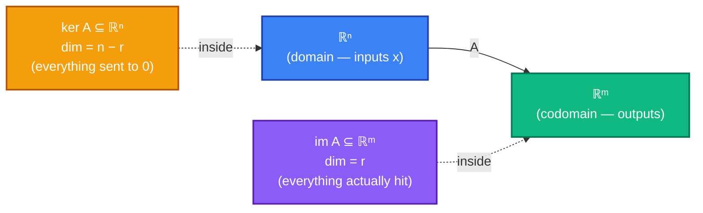

# Chapter 5 — Subspaces, Image, Kernel, Basis, Dimension

> *"A basis is a minimal address book: every vector in the room has exactly one address, and every address points to exactly one vector."*

## 5.0 A problem to anchor everything else

In Chapter 3 you learned to solve `Ax = b` with row reduction. Every time you ran RREF, one of three things happened: a unique solution, infinitely many solutions, or no solution at all. In Chapter 4 you learned to read `A` as a *function* — the linear map `T(x) = Ax`. Two natural questions were left hanging:

> *Given only the matrix `A`, can we describe — in one shot — **all** the right-hand sides `b` for which `Ax = b` has a solution? And, when `Ax = 0` has more than one solution, what does the **set** of all solutions look like?*

Concrete example. Let

```
         ⎡ 1   2   3 ⎤
   A  =  ⎢ 2   4   6 ⎥ .
         ⎣ 1   1   2 ⎦
```

RREF shows the rank is 2, not 3. So:

- **Which `b`'s are reachable?** Not all of ℝ³ — only a 2D "slab" through the origin (a plane). *Why* a plane? And which plane?
- **Which `x`'s make `Ax = 0`?** Not just `x = 0` — there's a whole 1D line of solutions through the origin. Which line?

These two sets — the reachable outputs and the flattened inputs — turn out to be everywhere. They have names (**image** and **kernel**), a shape (both are *subspaces*), a size (their **dimension**), and a rigid relationship (the **rank–nullity theorem**). Once you have the vocabulary, every matrix tells its whole story in four numbers: `m`, `n`, `rank A`, `dim ker A`.

This chapter answers five closely linked questions:

1. What is a **subspace** of ℝⁿ, and how do you recognize one?
2. What are the **image** and **kernel** of a matrix, and how do you compute them?
3. How do you recognize when vectors are **linearly independent**, and how do you extract a minimal spanning set — a **basis**?
4. What is the **dimension** of a subspace, and why is the **rank–nullity theorem** true?
5. How do you write a vector in **coordinates** relative to a non-standard basis — and convert between bases?

**Why this chapter, right after linear transformations?** Chapter 4 gave us the map `T(x) = Ax`. This chapter gives us the *anatomy* of any such map: what it can produce, what it destroys, and how to measure both.

---

## 5.1 Quick recap and notation

From Chapters 1–4:

- A **vector** in ℝⁿ is a column of `n` real numbers. Vectors add componentwise and scale by real numbers.
- **Span** of vectors `v₁, …, vₖ` is the set of all their linear combinations `c₁ v₁ + ⋯ + cₖ vₖ` with `cᵢ ∈ ℝ`.
- **Standard basis** of ℝⁿ: `e₁, e₂, …, eₙ` — the columns of `Iₙ`.
- **RREF** of a matrix: unique reduced row-echelon form; **rank** = number of pivots.
- **Linear map** `T: ℝⁿ → ℝᵐ` ↔ `m × n` matrix `A` with `T(x) = Ax`.

New vocabulary for this chapter:

| Notation / term | Meaning |
|---|---|
| **Subspace** `V ⊆ ℝⁿ` | A nonempty subset closed under `+` and scalar `·`. Always contains `0`. |
| **Image** of `T` (or **column space** of `A`), written `im T` or `col A` | `{Ax : x ∈ ℝⁿ}` — everything `A` actually produces. Lives in ℝᵐ. |
| **Kernel** of `T` (or **null space** of `A`), written `ker T` or `null A` | `{x ∈ ℝⁿ : Ax = 0}` — everything `A` flattens to zero. Lives in ℝⁿ. |
| **Linearly independent** | `c₁ v₁ + ⋯ + cₖ vₖ = 0` forces all `cᵢ = 0`. No redundancy. |
| **Spanning set** for `V` | Vectors `v₁, …, vₖ` whose linear combinations fill `V`. |
| **Basis** of `V` | A spanning set that's also linearly independent — minimal "address book". |
| **Dimension** `dim V` | The number of vectors in any basis of `V`. (It doesn't depend on which basis.) |
| **Rank** of `A` | `rank A = dim(im A)` = number of pivots in RREF. |
| **Nullity** of `A` | `nullity A = dim(ker A)` = number of free variables in RREF. |
| **Coordinates** `[x]_𝓑` | The unique coefficient vector expressing `x` in a chosen basis `𝓑`. |
| **Change-of-basis matrix** `S` | The matrix converting coordinates between two bases. |

> **Convention.** Subspaces are always through the origin. A "line" in this chapter always means a line through `0`; a "plane" always means a plane through `0`. Anything not through `0` is not a subspace — it's an **affine** set (and those show up in Ch 6).

---

## 5.2 Subspaces of ℝⁿ

### 5.2.1 Definition

> **Definition.** A **subspace** of ℝⁿ is a subset `V ⊆ ℝⁿ` satisfying three properties:
>
> 1. **Contains zero:** `0 ∈ V`.
> 2. **Closed under addition:** if `u, v ∈ V`, then `u + v ∈ V`.
> 3. **Closed under scalar multiplication:** if `u ∈ V` and `c ∈ ℝ`, then `c u ∈ V`.

Properties (2) and (3) together say: **linear combinations of elements of `V` stay in `V`**.

Property (1) actually follows from (3) (take `c = 0`), *provided `V` is nonempty*. So a common equivalent statement is: *`V` is nonempty and closed under linear combinations.*

### 5.2.2 How to read the definition geometrically

A subspace of ℝⁿ is always one of these shapes:

- `{0}` — just the origin (dim 0)
- A **line through the origin** (dim 1)
- A **plane through the origin** (dim 2)
- A **3-flat through the origin** (dim 3)
- … all the way up to ℝⁿ itself (dim `n`)

No curves. No translated planes. No disconnected pieces. Subspaces are *flat, through the origin, and unbounded in every direction they go*.

### 5.2.3 Examples and non-examples

**Examples (all subspaces):**

- `V = {0} ⊆ ℝⁿ`. The trivial subspace.
- `V = ℝⁿ` itself.
- `V = {(x, 2x) : x ∈ ℝ}` — a line in ℝ² through the origin with slope 2.
- `V = {(x, y, 0) : x, y ∈ ℝ}` — the `xy`-plane in ℝ³.
- `V = {(x, y, z) : x + y + z = 0}` — a plane through `0` in ℝ³ (normal `(1,1,1)`).

**Non-examples (not subspaces), with the reason:**

| Set | Not a subspace because |
|---|---|
| `{(x, y) : y = 2x + 1}` | Doesn't contain `0`: when `x = 0`, `y = 1`. |
| `{(x, y) : x ≥ 0}` | Not closed under scalar mult.: `(1, 0) · (−1) = (−1, 0)` leaves the set. |
| `{(x, y) : x² + y² ≤ 1}` | Not closed under scalar mult.: `(1, 0) · 2 = (2, 0)` leaves the set. |
| `{(x, y) : xy = 0}` (the two axes) | Not closed under addition: `(1, 0) + (0, 1) = (1, 1)` isn't on an axis. |
| `{(x, y, z) : x + y + z = 1}` | Doesn't contain `0`: `0 + 0 + 0 = 0 ≠ 1`. |

### 5.2.4 The fastest subspace test

To prove `V ⊆ ℝⁿ` is a subspace, check *three things in order*:

1. Is `0 ∈ V`?  (Fastest eliminator — if `0 ∉ V`, you're done.)
2. Pick generic `u, v ∈ V`. Is `u + v ∈ V`?
3. Pick generic `u ∈ V`, `c ∈ ℝ`. Is `c u ∈ V`?

If all three pass, `V` is a subspace. If any one fails (with a concrete counterexample), `V` is not.

---

## 5.3 Span and the image of a matrix

### 5.3.1 Span

> **Definition.** Given vectors `v₁, …, vₖ ∈ ℝⁿ`, their **span** is
>
> ```
>    span(v₁, …, vₖ)  =  { c₁ v₁ + c₂ v₂ + ⋯ + cₖ vₖ  :  cᵢ ∈ ℝ }.
> ```

**Proposition.** `span(v₁, …, vₖ)` is *always* a subspace of ℝⁿ.

*Proof sketch.* `0 = 0·v₁ + ⋯ + 0·vₖ` is in the span. Sums of linear combinations are linear combinations. Scalar multiples of linear combinations are linear combinations. All three axioms pass.  ∎

This is the easiest way to **produce** subspaces: write down any vectors you like and take their span. Every subspace arises this way (we'll prove it once we have bases).

### 5.3.2 Image of a matrix (column space)

> **Definition.** For an `m × n` matrix `A`, the **image** (or **column space**) of `A` is
>
> ```
>    im A  =  { Ax  :  x ∈ ℝⁿ }   ⊆   ℝᵐ.
> ```

In words: all the vectors you can reach as outputs of the map `T(x) = Ax`.

**Why the other name?** Write `A` with columns `a₁, …, aₙ`. Then `Ax = x₁ a₁ + x₂ a₂ + ⋯ + xₙ aₙ` (from the column view of Chapter 4). So

> **The image is the span of the columns:**  `im A = span(a₁, …, aₙ)`.

This makes it a subspace automatically (by 5.3.1). And it gives an immediate computational recipe:

- To decide whether `b ∈ im A`, solve `Ax = b`. Consistent ⇒ `b ∈ im A`. Inconsistent ⇒ `b ∉ im A`.
- To describe `im A`, the columns already span it — but they may be redundant. Reducing to a basis is §5.6.

### 5.3.3 Back to the motivating example

```
         ⎡ 1   2   3 ⎤
   A  =  ⎢ 2   4   6 ⎥     columns  a₁, a₂, a₃.
         ⎣ 1   1   2 ⎦
```

Notice `a₂ = 2 a₁` — column 2 is a scalar multiple of column 1. And `a₃ = a₁ + a₂ = 3 a₁`? Check: `a₁ = (1,2,1)`, `a₂ = (2,4,1)` … wait, `a₂ = (2, 4, 1)` not `(2, 4, 2)`. Let me recompute honestly:

- `a₁ = (1, 2, 1)`, `a₂ = (2, 4, 1)`, `a₃ = (3, 6, 2)`.
- Is `a₃ = a₁ + a₂`? `(1+2, 2+4, 1+1) = (3, 6, 2)`. ✓
- Is `a₂ = 2 a₁`? `(2, 4, 2)` vs actual `(2, 4, 1)`. ✗

So `a₂` is *not* redundant, but `a₃ = a₁ + a₂` is. The image is `span(a₁, a₂)` — a **plane** in ℝ³. That plane is the answer to "which `b`'s are reachable?" (We'll make this picture rigorous in §5.6.)

---

## 5.4 Kernel of a matrix (null space)

### 5.4.1 Definition

> **Definition.** For an `m × n` matrix `A`, the **kernel** (or **null space**) of `A` is
>
> ```
>    ker A  =  { x ∈ ℝⁿ  :  Ax = 0 }   ⊆   ℝⁿ.
> ```

In words: everything `A` sends to `0`. (It always contains `0 ∈ ℝⁿ` itself — "trivially in the kernel.")

### 5.4.2 Why it's a subspace

Verify directly:

1. `A · 0 = 0`, so `0 ∈ ker A`.
2. If `Au = 0` and `Av = 0`, then `A(u + v) = Au + Av = 0`. Sum stays in.
3. If `Au = 0`, then `A(c u) = c Au = 0`. Scalar multiples stay in.

So `ker A` is a subspace of ℝⁿ — the **domain**, not the codomain.

### 5.4.3 Computing `ker A` via RREF

`ker A = {solutions to Ax = 0}`, a homogeneous system. Row-reduce `A` to RREF, read off pivot and free variables, write the solution in parametric vector form. The vectors multiplying the free parameters are exactly a spanning set for `ker A` (and, as we'll see, a basis).

**Example (motivating matrix continued).** RREF of `A` is

```
         ⎡ 1   0   1 ⎤
         ⎢ 0   1   1 ⎥
         ⎣ 0   0   0 ⎦
```

Pivots in columns 1, 2; column 3 is free. Let `x₃ = t`. Then `x₁ + t = 0` and `x₂ + t = 0`, so `x = t · (−1, −1, 1)`.

> **`ker A = span((−1, −1, 1))`** — a line through the origin in ℝ³.

This is the "1D line of solutions" we saw in §5.0. And it encodes a genuine fact about `A`: **column 3 equals column 1 plus column 2**, because `A · (−1, −1, 1) = −a₁ − a₂ + a₃ = 0`. The kernel records redundancies among the columns.

### 5.4.4 Connection to uniqueness

> **Fact.** `Ax = b` has at most one solution ⇔ `ker A = {0}`.

*Proof sketch.* If `Au = Av = b`, then `A(u − v) = 0`, so `u − v ∈ ker A`. If the kernel is trivial, `u = v`. Conversely, if `ker A` contains a nonzero `w`, then `A(u + w) = Au = b` gives a second solution.  ∎

This is why kernels matter: they govern when systems have unique solutions, when inverses exist, and (much later) when eigenvectors exist.

---

## 5.5 Linear independence

### 5.5.1 Definition

> **Definition.** Vectors `v₁, …, vₖ ∈ ℝⁿ` are **linearly independent** if the only solution to
>
> ```
>    c₁ v₁ + c₂ v₂ + ⋯ + cₖ vₖ  =  0
> ```
> is `c₁ = c₂ = ⋯ = cₖ = 0`. Otherwise they're **linearly dependent**.

Equivalent phrasing: **no vector in the list is a linear combination of the others.** (If `vⱼ = Σ_{i≠j} cᵢ vᵢ`, rearrange to get a dependency with `cⱼ = −1 ≠ 0`.)

### 5.5.2 Geometric meaning in ℝⁿ

- **One vector** `v` is independent iff `v ≠ 0`.
- **Two vectors** are independent iff neither is a scalar multiple of the other (they span a genuine plane, not a line).
- **Three vectors** in ℝ³ are independent iff they don't all lie in a common plane.

### 5.5.3 How to test — build a matrix, check the kernel

Stack the vectors as columns of a matrix `M = [v₁ | v₂ | ⋯ | vₖ]`. Then

```
   c₁ v₁ + ⋯ + cₖ vₖ  =  M c
```

where `c = (c₁, …, cₖ)`. So the definition becomes:

> **`v₁, …, vₖ` are linearly independent ⇔ `ker M = {0}` ⇔ `M c = 0` has only the trivial solution ⇔ RREF of `M` has a pivot in every column.**

This turns an abstract-sounding question ("are they independent?") into a concrete algorithm: row-reduce `M`, count pivots.

### 5.5.4 Worked check

Are `v₁ = (1, 2, 1)`, `v₂ = (2, 4, 1)`, `v₃ = (3, 6, 2)` independent?

Stack as `M`:

```
         ⎡ 1   2   3 ⎤
   M  =  ⎢ 2   4   6 ⎥ .
         ⎣ 1   1   2 ⎦
```

That's our motivating matrix `A`! RREF has pivots only in columns 1 and 2. Column 3 is free. **Dependent.** And we already found the dependency: `a₃ = a₁ + a₂`.

### 5.5.5 A useful corollary

> **Fact.** Any list of `k > n` vectors in ℝⁿ is linearly dependent.

*Why?* Stacking them gives an `n × k` matrix with more columns than rows. At most `n` pivots in `n` rows, so at least `k − n` free columns, so a nontrivial kernel.

In particular: *you cannot have 4 independent vectors in ℝ³, or 3 in ℝ², or 2 in ℝ*. This is the dimension boundary at work — see §5.7.

---

## 5.6 Basis

### 5.6.1 Definition

> **Definition.** A **basis** for a subspace `V ⊆ ℝⁿ` is a list `𝓑 = (v₁, …, vₖ)` of vectors in `V` that is:
>
> 1. **Spanning:** `span(v₁, …, vₖ) = V`.
> 2. **Linearly independent.**

So a basis is a *minimal* set of vectors that fills `V` — enough to reach every point, with no redundancy.

### 5.6.2 The standard basis of ℝⁿ

The vectors `e₁, e₂, …, eₙ` (columns of `Iₙ`) form a basis of ℝⁿ. They span (every `x = x₁ e₁ + ⋯ + xₙ eₙ`) and they're independent (setting that sum to `0` forces every `xᵢ = 0`).

### 5.6.3 The fundamental property — unique coordinates

> **Theorem (uniqueness of basis coordinates).** Let `𝓑 = (v₁, …, vₖ)` be a basis of `V`. Then every `x ∈ V` has **exactly one** expansion
>
> ```
>    x  =  c₁ v₁  +  c₂ v₂  +  ⋯  +  cₖ vₖ.
> ```

*Proof.* Existence: `𝓑` spans, so *some* expansion exists. Uniqueness: suppose `x = Σ cᵢ vᵢ = Σ dᵢ vᵢ`. Subtracting, `Σ (cᵢ − dᵢ) vᵢ = 0`. Independence of `𝓑` forces `cᵢ − dᵢ = 0` for every `i`.  ∎

This is the "address book" property from the epigraph. The `k`-tuple `(c₁, …, cₖ)` is the **coordinates** of `x` in basis `𝓑`, written `[x]_𝓑`. §5.9 develops this.

### 5.6.4 How to extract a basis from a spanning set

Suppose `V = span(w₁, …, wₘ)`, but the `wᵢ`'s may be dependent. To find a basis:

1. Form the matrix `M = [w₁ | w₂ | ⋯ | wₘ]` (columns = the `wᵢ`'s).
2. Compute RREF of `M`.
3. The **columns of `M`** (the original vectors, not the RREF columns!) that correspond to **pivot columns** of RREF form a basis of `V`.

> **Why the original columns, not RREF's columns?** Row operations change `col M` in general. But they preserve *linear dependencies among columns*. So if RREF's pivot columns are independent in RREF, the corresponding *original* columns are independent in `M`. And the non-pivot columns of `M` are linear combinations of the pivot ones (witnessed by the kernel vectors). So the pivot columns both span and are independent.

**Example.** For our matrix `A` with columns `a₁, a₂, a₃` and RREF having pivots in columns 1, 2:

> **A basis of `im A` is `(a₁, a₂) = ((1, 2, 1), (2, 4, 1))`.**

This is the 2D "plane of reachable `b`'s" promised in §5.0, now with a concrete basis.

### 5.6.5 How to extract a basis of the kernel

Row-reduce `A` to RREF. For each free variable `xⱼ`, set `xⱼ = 1` and the other free variables to `0`; solve the pivot equations. The resulting vector is a basis vector of `ker A`. Doing this for all free variables gives a basis.

**Example (kernel of our `A`).** One free variable `x₃`. Setting `x₃ = 1`: `x₁ = −1`, `x₂ = −1`. Basis vector `(−1, −1, 1)`. So **`ker A` has basis `((−1, −1, 1))`, dimension 1.**

---

## 5.7 Dimension

### 5.7.1 The dimension theorem

> **Theorem.** Any two bases of the same subspace `V ⊆ ℝⁿ` have the same number of vectors. This common size is called the **dimension** of `V`, written `dim V`.

*Proof idea (exchange lemma, sketched).* If `𝓑 = (v₁, …, vₖ)` and `𝓒 = (w₁, …, wₗ)` are both bases of `V` and, say, `k < l`, then the `l` vectors of `𝓒` are expressible as combinations of the `k` vectors of `𝓑`. Stacking coefficients in a `k × l` matrix gives a system with more unknowns than equations, so the `wⱼ`'s are dependent — contradicting that `𝓒` is a basis.  ∎

**Consequences.**

- `dim ℝⁿ = n` (the standard basis has `n` vectors).
- `dim {0} = 0` (by convention; the empty list is a basis).
- A line through `0` has dimension 1. A plane through `0` has dimension 2. A "3-flat" has dimension 3.
- `dim V ≤ n` whenever `V ⊆ ℝⁿ`.

### 5.7.2 Dimension of image and kernel

Given `m × n` matrix `A`, let `r = rank A` = number of pivots in RREF.

- **`dim(im A) = r`**, because §5.6.4 says the pivot columns form a basis of `im A` — and there are `r` of them.
- **`dim(ker A) = n − r`**, because §5.6.5 extracts one basis vector per *free* variable — and there are `n − r` free columns.

> **Definitions.** `rank A := dim(im A)`. `nullity A := dim(ker A)`.

### 5.7.3 The rank–nullity theorem

Adding the two dimension counts:

> **Theorem (rank–nullity).** For any `m × n` matrix `A`,
>
> ```
>    rank A  +  nullity A  =  n.
> ```

In words: **(dimension of what `A` produces) + (dimension of what `A` destroys) = (dimension of the input space)**.

*Proof.* Every column of `A` is either a pivot column (contributing to `im A`) or a free column (contributing to `ker A`). There are `r` pivot columns and `n − r` free columns, and the counts are exactly `dim im A` and `dim ker A`. Total: `n`.  ∎

This is one of the most useful accounting identities in linear algebra. It says matrices can't create or lose dimension in weird ways — every "free" direction in the input either gets mapped to a linearly independent output or collapsed to zero.

### 5.7.4 Back to the motivating matrix

`A` is `3 × 3`, rank `2`. Rank–nullity: `2 + nullity = 3`, so `nullity = 1`. Matches what we computed.

---

## 5.8 The invertible matrix theorem — extended

In Chapter 4 we listed several equivalent conditions for a square matrix `A` to be invertible. With subspaces we can add more. For an `n × n` matrix `A`, the following are **all equivalent**:

| # | Condition |
|---|---|
| 1 | `A` is invertible. |
| 2 | RREF of `A` is `Iₙ`. |
| 3 | `rank A = n`. |
| 4 | `ker A = {0}`. |
| 5 | `im A = ℝⁿ`. |
| 6 | The columns of `A` are linearly independent. |
| 7 | The columns of `A` span ℝⁿ. |
| 8 | The columns of `A` form a basis of ℝⁿ. |
| 9 | `Ax = b` has a unique solution for every `b`. |
| 10 | `Ax = 0` has only the trivial solution. |

All 10 say the same thing from different angles. In practice you check whichever is cheapest given what you already know.

---

## 5.9 Coordinates relative to a basis

### 5.9.1 Setup

Let `𝓑 = (v₁, …, vₖ)` be a basis of `V ⊆ ℝⁿ`. By §5.6.3, every `x ∈ V` has a unique expansion

```
   x  =  c₁ v₁  +  c₂ v₂  +  ⋯  +  cₖ vₖ.
```

> **Definition.** The **𝓑-coordinates** of `x` are the column vector
>
> ```
>    [x]_𝓑  =  (c₁, c₂, …, cₖ)ᵀ  ∈ ℝᵏ.
> ```

So `𝓑` sets up a one-to-one correspondence between `V` and ℝᵏ (where `k = dim V`). Two things to notice:

- `[x]_𝓑` is a *different* vector from `x` — it's a recipe *in the basis `𝓑`*, not the original coordinates in ℝⁿ.
- The map `x ↦ [x]_𝓑` is linear: `[αu + βv]_𝓑 = α [u]_𝓑 + β [v]_𝓑`. (Proof: plug into the unique expansion.)

### 5.9.2 Tiny example

In ℝ², take the (non-standard) basis

```
   𝓑 = (v₁, v₂) = ((1, 1), (1, −1)).
```

To find the coordinates of `x = (3, 1)` in `𝓑`, solve `c₁ v₁ + c₂ v₂ = x`:

```
   c₁ · (1, 1)  +  c₂ · (1, −1)  =  (3, 1)
   ⇒   c₁ + c₂ = 3,   c₁ − c₂ = 1
   ⇒   c₁ = 2,   c₂ = 1.
```

So `[x]_𝓑 = (2, 1)`. In plain English: "to reach `(3, 1)` using `v₁` and `v₂`, use 2 parts `v₁` and 1 part `v₂`."

### 5.9.3 The basis matrix

Package the basis into an `n × k` matrix with the basis vectors as columns:

```
   S  =  [v₁ | v₂ | ⋯ | vₖ].
```

Then `x = S · [x]_𝓑`. That is:

> **`S` converts 𝓑-coordinates to standard coordinates.**

And (when `𝓑` is a basis of all of ℝⁿ, so `S` is square and invertible) `S⁻¹` goes the other way:

> **`S⁻¹` converts standard coordinates to 𝓑-coordinates: `[x]_𝓑 = S⁻¹ x`.**

In the tiny example:

```
         ⎡ 1   1 ⎤                         ⎛1/2   1/2 ⎞
   S  =  ⎣ 1  −1 ⎦ ,      S⁻¹  =  ⎜           ⎟.
                                   ⎝1/2  −1/2 ⎠
```

Check: `S⁻¹ · (3, 1) = ((3 + 1)/2, (3 − 1)/2) = (2, 1) = [x]_𝓑`. ✓

---

## 5.10 Change of basis

### 5.10.1 Two bases, one vector

Now suppose we have **two** bases of ℝⁿ: `𝓑 = (v₁, …, vₙ)` and `𝓒 = (w₁, …, wₙ)`. A single vector `x ∈ ℝⁿ` has *two* coordinate representations: `[x]_𝓑` and `[x]_𝓒`. How do we convert?

Let `S_𝓑 = [v₁ | ⋯ | vₙ]` and `S_𝓒 = [w₁ | ⋯ | wₙ]` be the two basis matrices. From §5.9.3:

```
   x = S_𝓑 · [x]_𝓑  =  S_𝓒 · [x]_𝓒.
```

Solving for `[x]_𝓒`:

> ```
>    [x]_𝓒  =  S_𝓒⁻¹  S_𝓑  [x]_𝓑.
> ```

The matrix `P = S_𝓒⁻¹ S_𝓑` is the **change-of-basis matrix from `𝓑` to `𝓒`**. Its columns are `[v₁]_𝓒, [v₂]_𝓒, …, [vₙ]_𝓒` — the 𝓒-coordinates of the 𝓑 basis vectors.

### 5.10.2 Quick example

In ℝ²:

```
   𝓑 = ((1, 1), (1, −1)),      𝓒 = ((1, 0), (1, 2)).
```

Basis matrices:

```
            ⎡ 1   1 ⎤                ⎡ 1   1 ⎤
   S_𝓑 =   ⎢       ⎥ ,      S_𝓒 =  ⎢       ⎥ .
            ⎣ 1  −1 ⎦                ⎣ 0   2 ⎦
```

Compute `S_𝓒⁻¹ = (1/2) · ⎡ 2  −1 ⎤ / ⎣ 0   1 ⎦` — actually writing it out:

```
               ⎛  1   −1/2 ⎞
   S_𝓒⁻¹  =   ⎜             ⎟.
               ⎝  0    1/2  ⎠
```

Then

```
                        ⎛  1   −1/2 ⎞ ⎡ 1   1 ⎤    ⎛  1/2    3/2 ⎞
   P  =  S_𝓒⁻¹ S_𝓑  =  ⎜             ⎟⎢       ⎥ = ⎜              ⎟.
                        ⎝  0    1/2  ⎠⎣ 1  −1 ⎦    ⎝  1/2   −1/2 ⎠
```

So if `[x]_𝓑 = (2, 1)`, then `[x]_𝓒 = P · (2, 1) = (1/2 · 2 + 3/2 · 1, 1/2 · 2 − 1/2 · 1) = (5/2, 1/2)`. Double-check by rebuilding `x`: `5/2 · (1, 0) + 1/2 · (1, 2) = (5/2 + 1/2, 0 + 1) = (3, 1) ✓`.

### 5.10.3 Linear maps in a new basis

Change of basis will come roaring back in Chapter 9: if `T: ℝⁿ → ℝⁿ` has standard matrix `A`, its matrix *in basis 𝓑* is `B = S⁻¹ A S`, where `S = S_𝓑`. Certain bases (eigenbases!) make `B` diagonal, turning complicated maps into scalings along chosen axes. That's diagonalization.

---

## 5.11 Visual summary — the four shapes

For any `m × n` matrix `A`:



Four numbers capture the whole story: `m`, `n`, `r = rank A`, `n − r = nullity A`. Everything else in the chapter flows from these.

---

## 5.12 Preview of Chapter 6

Everything we did took place inside ℝⁿ. But the definitions — subspace, linear combination, independence, basis, dimension — never actually used the fact that vectors were tuples of real numbers. They used only that vectors could be **added** and **scaled**.

Chapter 6 takes that observation and runs with it. "Vectors" will include:

- Polynomials of degree ≤ `n` (a space with basis `1, x, x², …, xⁿ`).
- Matrices of fixed size (a space with basis `E_{ij}` — the matrix with a 1 in position `(i,j)`, else 0).
- Continuous functions on an interval (an infinite-dimensional space).
- Solutions to a linear differential equation (a subspace of the function space).

All the same theorems — span, independence, basis, dimension, coordinates, change of basis — still hold. Linear algebra *is* the theory of these structures. Chapter 6 makes that abstraction explicit.

---

## 5.13 Big-picture roadmap


Chapter 5 is the hinge. Before it: matrices as recipes. After it: matrices as maps between well-understood geometric objects — and that geometric understanding is what unlocks every remaining chapter.

---

## 5.14 Summary checklist

You should now be able to:

- [ ] State the three axioms of a subspace, and use them to accept or reject a candidate subset.
- [ ] Define the image (column space) and kernel (null space) of a matrix, and prove each is a subspace.
- [ ] Compute `im A` and `ker A` from the RREF of `A`.
- [ ] Test a list of vectors for linear independence by stacking them into a matrix and counting pivots.
- [ ] Extract a basis from a spanning set using RREF (pivot columns of the original matrix).
- [ ] Define a basis; state and apply the uniqueness-of-coordinates theorem.
- [ ] Compute the dimension of a subspace.
- [ ] State and apply the rank–nullity theorem: `rank A + nullity A = n`.
- [ ] Extend the invertible matrix theorem to include rank, image, kernel, and basis conditions.
- [ ] Compute the coordinates `[x]_𝓑` of a vector `x` in a non-standard basis `𝓑`.
- [ ] Build the change-of-basis matrix between two bases of ℝⁿ and convert coordinates both directions.
- [ ] Predict what's about to happen in Chapter 6 (vector spaces without ℝⁿ).
