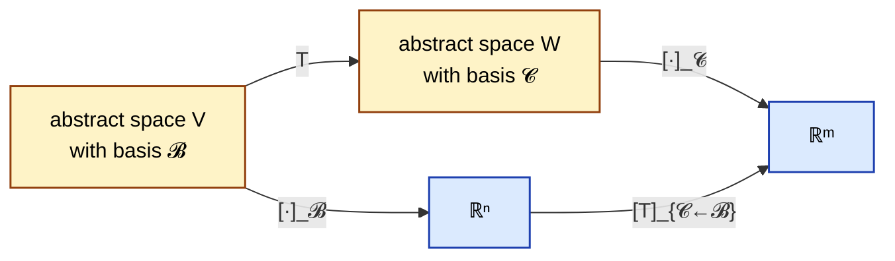
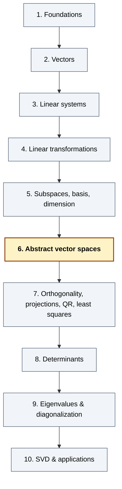

# Chapter 6 — Abstract Linear (Vector) Spaces

> *"A vector is whatever adds and scales like a vector. Once you spot the pattern, the machine you built for ℝⁿ runs on polynomials, matrices, and functions without a single line of new code."*

## 6.0 A problem to anchor everything else

In Chapters 1–5 we worked with lists of `n` real numbers — elements of ℝⁿ. Every picture (arrows), every computation (RREF, kernel, basis, coordinates, rank–nullity), every theorem (invertible matrix, dimension) was about those lists.

But look at three innocent objects from high-school mathematics:

- **Polynomials.** `p(x) = 3x² + 2x + 1` and `q(x) = x² − 5x + 4`. Their sum `p + q = 4x² − 3x + 5` is another polynomial; scaling `p` by `7` gives `7p = 21x² + 14x + 7`, also a polynomial.
- **Matrices.** `A = [[1, 2], [3, 4]]` and `B = [[0, −1], [1, 0]]`. `A + B`, `7A` — still 2×2 matrices.
- **Functions.** `f(x) = sin x`, `g(x) = e^x`. `f + g` is still a function; `7f` is still a function.

All three objects **add** and **scale by real numbers**, and the addition is commutative, associative, has a zero, has negatives, distributes over scalars — the whole suite of rules you've been using for ℝⁿ vectors. So a natural question:

> *If a set behaves algebraically like ℝⁿ — addition and scalar multiplication satisfying the familiar rules — can we reuse the entire Ch 1–5 machine on it? Bases, dimension, kernels, rank–nullity?*

The answer is **yes**, and it's one of the high-leverage moves in mathematics. Here's the punchline we'll build toward:

> **Take the derivative of a degree-≤ 3 polynomial by multiplying a 3×4 matrix by a 4-vector.**

The derivative `D: P₃ → P₂` sending `a₀ + a₁ x + a₂ x² + a₃ x³` to `a₁ + 2 a₂ x + 3 a₃ x²` turns out to be a **linear transformation**, and once we pick a basis on each side, it's represented *exactly* by the matrix

```
          ⎡ 0   1   0   0 ⎤
   [D] =  ⎢ 0   0   2   0 ⎥ .
          ⎣ 0   0   0   3 ⎦
```

Calculus by matrix multiplication. This is the first hint of a theme that runs through the rest of the book: **whenever you see a set that adds and scales, you're allowed to import everything from ℝⁿ.** That import is what Chapter 6 makes precise.

This chapter answers five closely linked questions:

1. What is a **vector space** (or **linear space**) in full generality?
2. Which familiar objects — polynomials, matrices, functions, solution spaces of ODEs — fit the definition?
3. What does **basis**, **dimension**, and **coordinates** mean in an abstract space?
4. What is a **linear transformation** between two abstract spaces, and when are two spaces "the same" (**isomorphic**)?
5. Given a linear transformation, how do we build its **matrix** relative to chosen bases — turning abstract questions into concrete ℝⁿ computations?

**Why this chapter, right after subspaces?** Chapter 5 gave us the anatomy of a linear map on ℝⁿ. Chapter 6 reveals that *everything we learned was about the algebraic structure, not about "arrows"*. The same structure lives in many places.

---

## 6.1 Quick recap and notation

From Chapter 5:

- A **subspace** of ℝⁿ is a subset closed under addition and scalar multiplication (and thus containing `0`).
- A **basis** is a linearly independent spanning set; every vector has a **unique** expansion in a basis.
- **Dimension** = size of any basis. `dim ℝⁿ = n`.
- **Coordinates** `[x]_𝓑 ∈ ℝⁿ` encode `x` as the `n`-tuple of its basis coefficients.
- A **linear transformation** `T: ℝⁿ → ℝᵐ` is one that preserves `+` and scalar `·`; it's always of the form `T(x) = Ax` for some matrix `A`.

New vocabulary for this chapter:

| Notation / term | Meaning |
|---|---|
| **Vector space** `V` (over ℝ) | A set with `+` and scalar `·` satisfying eight axioms (§6.2). |
| `Pₙ` | Polynomials with real coefficients of degree **at most** `n`. Dimension `n + 1`. |
| `P` | All polynomials, any degree. Infinite-dimensional. |
| `M_{m×n}` (or `ℝ^{m×n}`) | All `m × n` real matrices. Dimension `mn`. |
| `F(S, ℝ)` | All functions `S → ℝ`. Infinite-dimensional if `S` is infinite. |
| `C(ℝ)`, `C¹(ℝ)`, `C^∞(ℝ)` | Continuous / continuously differentiable / smooth functions ℝ → ℝ. |
| **Isomorphism** | A linear bijection `T: V → W`. If one exists, `V ≅ W`. |
| `[T]_{𝓒←𝓑}` | Matrix of `T: V → W` in bases `𝓑` of `V` and `𝓒` of `W`. |
| `[T]_𝓑` | Shorthand for `[T]_{𝓑←𝓑}` when `V = W`. |

> **Convention.** "Vector space" and "linear space" mean the same thing; Bretscher prefers "linear space" to avoid the impression that vectors have to be arrows. We use **vector space** throughout, but elements of an abstract `V` are called **vectors** even when they're polynomials or functions.

> **Scalars.** We always use **ℝ** as the scalar field in this chapter. Everything we do works with ℂ or any other field (that's the definition of "field"), and Ch 9 will use ℂ briefly for eigenvalues. For now: real scalars.

---

## 6.2 The eight axioms of a vector space

### 6.2.1 The definition

> **Definition.** A **vector space over ℝ** is a set `V` equipped with two operations,
>
> - **addition**  `+ : V × V → V`, and
> - **scalar multiplication**  `· : ℝ × V → V`,
>
> satisfying the following eight axioms. For all `u, v, w ∈ V` and all `c, d ∈ ℝ`:
>
> **Additive structure:**
>
> 1. **Associativity of `+`:**  `(u + v) + w = u + (v + w)`.
> 2. **Commutativity of `+`:**  `u + v = v + u`.
> 3. **Zero element:**  there exists `0 ∈ V` with `v + 0 = v` for all `v`.
> 4. **Additive inverse:**  for every `v ∈ V` there exists `−v ∈ V` with `v + (−v) = 0`.
>
> **Scalar multiplication structure:**
>
> 5. **Compatibility with scalar `·`:**  `c (d v) = (cd) v`.
> 6. **Identity scalar:**  `1 · v = v`.
> 7. **Distributivity over vector sum:**  `c (u + v) = c u + c v`.
> 8. **Distributivity over scalar sum:**  `(c + d) v = c v + d v`.

That's it — eight axioms, nothing more. Every structural theorem about ℝⁿ that we proved in Chapters 1–5 used only these eight axioms (plus the statement `dim = n`). So any set satisfying them inherits the full machinery.

### 6.2.2 How to read the axioms

Axioms **1–4** say `(V, +)` is a **commutative group**: addition behaves like addition of numbers. Axiom 3 names a distinguished element `0` (not the real number 0, but a vector also called zero); axiom 4 gives subtraction.

Axioms **5–8** say scalar multiplication is **compatible** with addition and with scalar arithmetic. Axiom 6 is the one you'd miss if you weren't careful: without it, `c · v = 0` for all `c, v` would satisfy the other seven.

> **Note.** Axioms 7 and 8 are *both* called "distributivity" but are distinct: axiom 7 distributes a scalar across a vector sum; axiom 8 distributes a scalar sum across a vector.

### 6.2.3 Consequences you don't have to re-prove

From the eight axioms alone (no "coordinates" needed) one can prove:

- `0 · v = 0` (the scalar zero times any vector is the zero vector).
- `(−1) · v = −v` (so `−v` can be computed by scaling by `−1`).
- `c · 0 = 0` for every scalar `c`.
- The zero vector is unique, and each `v` has a unique additive inverse.

These aren't new facts — they're the same ones you use on ℝⁿ without thinking. But in an abstract space, you derive them from the axioms instead of from "componentwise arithmetic." The point: the axioms are genuinely enough.

### 6.2.4 What the axioms don't say

- There's no "multiplication of two vectors" in a vector space. (Matrix product or dot product are *extra structure*, not part of the definition.)
- There's no notion of "length" or "angle". Those come later, in Chapter 7, via an **inner product**.
- There's no natural notion of *positivity* or *order*.

A vector space is pure linear structure — addition and scaling. Everything else is optional.

---

## 6.3 Examples of vector spaces

This is the part where the world gets much bigger. We give enough examples to convince you that the definition covers a lot of ground.

### 6.3.1 Example 1 — ℝⁿ

`V = ℝⁿ` with componentwise addition and componentwise scalar multiplication. Every axiom is inherited from ℝ's arithmetic. This is the example Ch 1–5 built up.

### 6.3.2 Example 2 — Polynomials `Pₙ`

`V = Pₙ` = `{a₀ + a₁ x + a₂ x² + ⋯ + aₙ xⁿ : aᵢ ∈ ℝ}`: polynomials of degree at most `n`.

- **Addition:** add coefficient-by-coefficient.
- **Scalar multiplication:** multiply every coefficient by `c`.
- **Zero:** the zero polynomial (all coefficients `0`).
- **Inverse:** `−p` negates every coefficient.

All eight axioms follow from ℝ's arithmetic applied coefficient-by-coefficient. `Pₙ` is a vector space.

> **Dimension preview.** The monomials `1, x, x², …, xⁿ` form a basis (independent because two polynomials are equal iff their coefficients match; spanning by definition). So `dim Pₙ = n + 1`.

### 6.3.3 Example 3 — Matrices `M_{m×n}`

`V = M_{m×n}` = the set of `m × n` real matrices.

- **Addition:** entrywise.
- **Scalar multiplication:** entrywise.
- **Zero:** the `m × n` zero matrix.

Eight axioms inherited entrywise. `M_{m×n}` is a vector space.

> **Dimension.** The `mn` matrices `Eᵢⱼ` (a `1` in position `(i, j)`, zeros elsewhere) are a basis. So `dim M_{m×n} = mn`.

**Careful:** when we treat matrices as *elements of a vector space*, their "multiplication" is not part of the vector-space structure — it's extra. Here we're only using their `+` and scalar `·`.

### 6.3.4 Example 4 — Functions `F(S, ℝ)`

Fix a set `S` (e.g. `S = ℝ` or `S = [0, 1]`). Let `F(S, ℝ)` be the set of all functions `f: S → ℝ`.

- **Addition:** `(f + g)(x) := f(x) + g(x)` for each `x ∈ S`. (Pointwise.)
- **Scalar multiplication:** `(c · f)(x) := c · f(x)`.
- **Zero:** the function identically zero.
- **Inverse:** `(−f)(x) = −f(x)`.

Pointwise arithmetic inherits every axiom from ℝ. `F(S, ℝ)` is a vector space.

**This one is huge.** If `S` is infinite (say `S = ℝ`), `F(S, ℝ)` is *infinite-dimensional*: no finite list of functions spans all functions. Most of the later "function-space" examples are subspaces of this giant.

### 6.3.5 Example 5 — Continuous / smooth functions `C(ℝ)`, `C^∞(ℝ)`

- `C(ℝ)` = continuous functions ℝ → ℝ. Subspace of `F(ℝ, ℝ)` (sum of continuous is continuous, scalar multiple is continuous, `0` is continuous).
- `C^∞(ℝ)` = infinitely differentiable functions. Subspace of `C(ℝ)`.

Both are vector spaces. Both are infinite-dimensional.

### 6.3.6 Example 6 — Solution space of a linear homogeneous ODE

Consider the differential equation `y'' + y = 0` (simple harmonic oscillator). Its solution set

```
   V  =  {y ∈ C^∞(ℝ)  :  y''(t) + y(t) = 0  for all t}
```

is a **subspace** of `C^∞(ℝ)`:

- `0'' + 0 = 0`. ✓
- If `y₁'' + y₁ = 0` and `y₂'' + y₂ = 0`, then `(y₁ + y₂)'' + (y₁ + y₂) = 0 + 0 = 0`. ✓
- If `y'' + y = 0` and `c ∈ ℝ`, then `(cy)'' + cy = c(y'' + y) = 0`. ✓

From ODE theory you may know `V` is spanned by `cos t` and `sin t` and they're independent, so `dim V = 2`. This is the first hint that linear algebra is the language of linear differential equations — a theme developed in Ch 9.

### 6.3.7 Non-examples (sets that are *not* vector spaces)

> **Non-example A.** `V = {polynomials of degree exactly n}` (not "at most"). The zero polynomial isn't in `V` (it has no degree, or degree `−∞`). Also, `xⁿ + (−xⁿ) = 0` isn't in `V`. Axiom 3 or 4 fails.

> **Non-example B.** `V = ℝ²` with "addition" defined by `(a, b) ⊕ (c, d) := (ac, bd)` (componentwise *multiplication*). Then `(0, 0) ⊕ (1, 1) = (0, 0)`, not `(1, 1)`. The candidate for the zero element is `(1, 1)` (since `(a, b) ⊕ (1, 1) = (a, b)`). But then axiom 4 asks: what's the "inverse" of `(0, 5)`? We'd need `(0, 5) ⊕ (x, y) = (1, 1)`, i.e. `0 · x = 1`. Impossible. **Axiom 4 fails.**

> **Non-example C.** `V =` positive reals `ℝ_{>0}` with *usual* addition and scalar multiplication. `1 + 2 = 3 > 0` OK, but `(−1) · 2 = −2 ∉ V`. **Closure under scalar `·` fails.**

These non-examples illustrate the axioms aren't automatic. You have to check.

### 6.3.8 Table of canonical examples with dimensions

| Space | Elements | Typical basis | `dim` |
|---|---|---|---|
| ℝⁿ | Columns of `n` reals | Standard `e₁, …, eₙ` | `n` |
| `Pₙ` | Polynomials of degree ≤ `n` | `1, x, x², …, xⁿ` | `n + 1` |
| `M_{m×n}` | `m × n` real matrices | `Eᵢⱼ` (`mn` of them) | `mn` |
| `P` | All polynomials | `1, x, x², x³, …` (countable) | ∞ |
| `C(ℝ)` | Continuous functions | (no countable basis!) | ∞ |
| Solutions of `y'' + y = 0` | Smooth `y` with `y'' = −y` | `cos t`, `sin t` | 2 |
| Solutions of `Ax = 0`, `A ∈ ℝ^{m×n}` | `x ∈ ℝⁿ` with `Ax = 0` | (basis of `ker A`) | `n − rank A` |

The bottom row is our Ch 5 kernel in disguise: **the solution space of a homogeneous linear system is a finite-dimensional vector space**.

---

## 6.4 Subspaces of a general vector space

> **Definition.** A **subspace** of a vector space `V` is a subset `W ⊆ V` such that
>
> 1. `0 ∈ W`,
> 2. `W` is closed under `+`,
> 3. `W` is closed under scalar `·`.

This is the *same* definition as Ch 5.2, now in any `V`. Any subspace is itself a vector space (the axioms are inherited from `V`). The three-step subspace test (§5.2.4) still works.

### 6.4.1 Examples in `P` (polynomials)

- `Pₙ` is a subspace of `P` for every `n`. (Sum of deg-≤ `n` polynomials is deg-≤ `n`.)
- `{p ∈ P₃ : p(1) = 0}` — polynomials of degree ≤ 3 that vanish at `1`. Sum of two such is still 0 at 1; scalar multiple still. Contains 0. Subspace.
- `{p ∈ P₃ : p(1) = 1}` — *not* a subspace. Doesn't contain 0. (It's an **affine** set.)
- `{p ∈ P : deg p ≤ 2  or  p = 0}` — same as `P₂`, a subspace.

### 6.4.2 Examples in `F(ℝ, ℝ)` (all functions)

- **Even functions** `{f : f(−x) = f(x)}` — subspace.
- **Odd functions** `{f : f(−x) = −f(x)}` — subspace.
- **Periodic with period 1** `{f : f(x + 1) = f(x)}` — subspace.
- **Functions with `f(0) = 1`** — *not* a subspace (no zero).

### 6.4.3 Examples in `M_{n×n}` (square matrices)

- **Symmetric matrices** `{A : Aᵀ = A}` — subspace (sum and scalar multiple preserve symmetry). Dimension `n(n+1)/2`.
- **Antisymmetric (skew)** `{A : Aᵀ = −A}` — subspace. Dimension `n(n−1)/2`.
- **Upper-triangular** — subspace. Dimension `n(n+1)/2`.
- **Trace zero** `{A : tr A = 0}` — subspace. Dimension `n² − 1`.
- **Invertible matrices** — *not* a subspace. Zero matrix isn't invertible.

These examples start to show the payoff: subspaces of abstract spaces are often the "things satisfying a linear condition", and their dimensions are often easy to count.

---

## 6.5 Linear independence, span, basis, dimension — abstract

Every definition from Ch 5 transplants word-for-word to an abstract `V`.

### 6.5.1 Definitions (restated)

> **Span.** For `v₁, …, vₖ ∈ V`, `span(v₁, …, vₖ) := {c₁ v₁ + ⋯ + cₖ vₖ : cᵢ ∈ ℝ}`. Always a subspace.

> **Linearly independent.** `c₁ v₁ + ⋯ + cₖ vₖ = 0` forces `c₁ = ⋯ = cₖ = 0`.

> **Basis.** A linearly independent spanning set.

> **Dimension.** The size of any basis — when one exists and is finite, `V` is **finite-dimensional** and `dim V` is that size. Otherwise, **infinite-dimensional**.

### 6.5.2 The `0` in the independence equation is the vector zero

This is a subtle point that confuses students once. In `P₃`, the equation

```
   c₀ · 1  +  c₁ · x  +  c₂ · x²  +  c₃ · x³  =  0
```

reads as: *"the polynomial `c₀ + c₁ x + c₂ x² + c₃ x³` is the zero polynomial"*. Two polynomials are equal iff all coefficients agree, so this forces `c₀ = c₁ = c₂ = c₃ = 0`. Hence `{1, x, x², x³}` is linearly independent in `P₃`.

**General rule for independence in abstract spaces:** translate the equation `Σ cᵢ vᵢ = 0` into ℝⁿ coordinates (§6.6 below), then check kernel. That's *always* the move.

### 6.5.3 Standard bases of our running examples

| `V` | Standard basis |
|---|---|
| ℝⁿ | `e₁, e₂, …, eₙ` |
| `Pₙ` | `1, x, x², …, xⁿ` |
| `M_{m×n}` | `E₁₁, E₁₂, …, Eₘₙ` (one `1`, rest `0`) |
| Symmetric `n×n` | `Eᵢᵢ` and `Eᵢⱼ + Eⱼᵢ` for `i < j` |
| Upper-triangular `n×n` | `Eᵢⱼ` for `i ≤ j` |

### 6.5.4 Same uniqueness-of-coordinates theorem

> **Theorem.** If `𝓑 = (v₁, …, vₙ)` is a basis of `V`, every `v ∈ V` has a **unique** expansion `v = c₁ v₁ + ⋯ + cₙ vₙ`.

Same proof as §5.6.3. This is what lets us define coordinates in abstract spaces.

---

## 6.6 Coordinates — the bridge to ℝⁿ

This is the core technical move of Ch 6.

### 6.6.1 Definition

> **Definition.** Let `V` be a finite-dimensional vector space with basis `𝓑 = (v₁, …, vₙ)`. For `v ∈ V`, the unique coefficients `(c₁, …, cₙ)` in `v = c₁ v₁ + ⋯ + cₙ vₙ` are the **coordinates of `v` relative to `𝓑`**, written
>
> ```
>    [v]_𝓑  :=  (c₁, c₂, …, cₙ)  ∈  ℝⁿ.
> ```

### 6.6.2 Coordinates are linear

> **Proposition.** The map `φ_𝓑: V → ℝⁿ` sending `v → [v]_𝓑` satisfies
>
> - `[u + v]_𝓑 = [u]_𝓑 + [v]_𝓑`,
> - `[c v]_𝓑 = c · [v]_𝓑`.
>
> It's a **bijection** (by uniqueness and existence of expansions in a basis).

*Proof sketch.* If `u = Σ aᵢ vᵢ` and `v = Σ bᵢ vᵢ`, then `u + v = Σ(aᵢ + bᵢ) vᵢ`, and uniqueness says the coordinates of `u + v` are `(aᵢ + bᵢ)`.  ∎

### 6.6.3 Worked example — `P₂`

Basis `𝓑 = (1, x, x²)`. Then `[3 + 2x + x²]_𝓑 = (3, 2, 1)`.

Another basis: `𝓒 = (1, x − 1, (x − 1)²)`. To find `[3 + 2x + x²]_𝓒`: write `3 + 2x + x² = a · 1 + b (x − 1) + c (x − 1)²`. Expanding the right-hand side: `a + b(x − 1) + c(x² − 2x + 1) = (a − b + c) + (b − 2c) x + c x²`. Matching coefficients: `c = 1`, `b − 2 = 2` so `b = 4`, `a − 4 + 1 = 3` so `a = 6`. **`[3 + 2x + x²]_𝓒 = (6, 4, 1)`**.

Same polynomial, two bases, two different ℝ³ addresses.

### 6.6.4 Abstract questions become ℝⁿ questions

Because coordinates are a linear bijection, **every question about `V` transfers to ℝⁿ**:

| Question in `V` | ⇔ Question in ℝⁿ |
|---|---|
| Are `v₁, …, vₖ ∈ V` independent? | Are `[v₁]_𝓑, …, [vₖ]_𝓑 ∈ ℝⁿ` independent? |
| Do they span `V`? | Do their coordinates span ℝⁿ? |
| Is `{w₁, w₂, …}` a basis of `V`? | Are coordinates a basis of ℝⁿ? |
| Is `u ∈ span(v₁, …, vₖ)`? | Is `[u]_𝓑` in the column space of the matrix of coordinates? |
| `dim W` of a subspace `W ⊆ V`? | Rank of the matrix of coordinates of generators. |

This is why the Ch 1–5 machine keeps working: we run it on coordinates.

### 6.6.5 Worked example — independence in `P₃`

Are `p₁ = 1 + x`, `p₂ = x + x²`, `p₃ = 1 + x²` independent in `P₃`?

Take coordinates in `𝓑 = (1, x, x², x³)`:

```
   [p₁]_𝓑 = (1, 1, 0, 0),   [p₂]_𝓑 = (0, 1, 1, 0),   [p₃]_𝓑 = (1, 0, 1, 0).
```

Stack as a 4 × 3 matrix:

```
         ⎡ 1   0   1 ⎤
   M  =  ⎢ 1   1   0 ⎥ .
         ⎢ 0   1   1 ⎥
         ⎣ 0   0   0 ⎦
```

The top 3×3 block has determinant `1·(1·1 − 0·1) − 0·(⋯) + 1·(1·0 − 1·1) = 1 + (−1) = … `. Let's redo: cofactor expansion along the first row of `[[1,0,1],[1,1,0],[0,1,1]]`:

```
   1 · det([[1, 0], [1, 1]])  −  0  +  1 · det([[1, 1], [0, 1]])
       =  1·1   +   1·1   =   2.
```

Nonzero — so the three columns are independent in ℝ⁴, hence `p₁, p₂, p₃` **are independent** in `P₃`.

(Lesson: the *method* — coordinate, then RREF or determinant — is foolproof; do the arithmetic slowly.)

---

## 6.7 Linear transformations between vector spaces

### 6.7.1 Definition

> **Definition.** Let `V`, `W` be vector spaces over ℝ. A function `T: V → W` is a **linear transformation** (or **linear map**) if for all `u, v ∈ V` and `c ∈ ℝ`,
>
> - `T(u + v) = T(u) + T(v)`,
> - `T(c u) = c · T(u)`.
>
> Equivalently (and more compactly): `T(c u + d v) = c T(u) + d T(v)` for all `u, v, c, d`.

Same definition as Ch 4 for the case `V = ℝⁿ`, `W = ℝᵐ`. The only difference is the domain and codomain can be any vector spaces.

### 6.7.2 Examples

**Differentiation `D: P₃ → P₂`.** `D(p) = p'`. Linearity: `(p + q)' = p' + q'` and `(cp)' = c p'` — standard calculus.

**Multiplication-by-`x` `M_x: P₂ → P₃`.** `M_x(p) = x · p(x)`. Linearity: `x(p + q) = xp + xq`, `x(cp) = c(xp)`. Note `M_x` raises degree by 1.

**Evaluation-at-`a` `eval_a: P → ℝ`.** `eval_a(p) = p(a)`. Linearity: `(p + q)(a) = p(a) + q(a)` — just how function addition works.

**Transpose `T: M_{m×n} → M_{n×m}`.** `T(A) = Aᵀ`. Linearity: `(A + B)ᵀ = Aᵀ + Bᵀ` and `(cA)ᵀ = c Aᵀ`.

**Trace `tr: M_{n×n} → ℝ`.** `tr(A) = sum of diagonal entries`. Linear.

**Integration `I: C([0, 1]) → ℝ`.** `I(f) = ∫₀¹ f(x) dx`. Linear.

**Identity and zero.** `id_V: V → V`, `0: V → W` sending everything to 0. Both linear (trivially).

### 6.7.3 Kernel and image of an abstract linear transformation

Same definitions as Ch 5:

- `ker T := {v ∈ V : T(v) = 0_W}` — a subspace of `V`.
- `im T := {T(v) : v ∈ V}` — a subspace of `W`.

Same proofs: the subspace axioms fall out of linearity. And the same structural role: `ker T` measures what `T` destroys, `im T` measures what `T` produces.

**Example.** `D: P₃ → P₂`, the derivative. `ker D = {p : p' = 0}` = constants = `P₀`. Dimension 1. `im D = P₂` (every degree-≤ 2 polynomial is the derivative of some degree-≤ 3 polynomial). Dimension 3. And the rank–nullity check: `dim P₃ = 4 = dim(im D) + dim(ker D) = 3 + 1`. ✓

> **Theorem (rank–nullity, abstract version).** For any linear `T: V → W` with `V` finite-dimensional,
>
> ```
>    dim(im T)  +  dim(ker T)  =  dim V.
> ```

*Proof sketch.* Pick a basis `(k₁, …, kᵣ)` of `ker T`. Extend to a basis `(k₁, …, kᵣ, u₁, …, uₛ)` of `V` (possible by the basis-extension theorem from Ch 5). Then `(T(u₁), …, T(uₛ))` is a basis of `im T`: it spans (since `T` kills the `kᵢ`'s) and it's independent (by linearity and independence of `uⱼ`'s). So `dim(im T) = s`, `dim(ker T) = r`, `dim V = r + s`.  ∎

### 6.7.4 Isomorphisms

> **Definition.** A linear transformation `T: V → W` is an **isomorphism** if it's **bijective** (one-to-one and onto). If there exists an isomorphism `V → W`, we say `V` and `W` are **isomorphic**, written `V ≅ W`.

Isomorphic spaces are "the same" as far as their linear structure is concerned — any statement about basis, dimension, linear independence, kernels, etc. transfers across an isomorphism.

**Examples.**

- `Pₙ ≅ ℝ^{n+1}` via `a₀ + a₁ x + ⋯ + aₙ xⁿ  ↔  (a₀, a₁, …, aₙ)`. (This is just the coordinate map in the standard basis.)
- `M_{m×n} ≅ ℝ^{mn}` via flattening to one column.
- `ℂ ≅ ℝ²` (as real vector spaces) via `a + bi ↔ (a, b)`.
- `P ≇ P₃` (they have different dimensions — one is infinite, one is 4).

### 6.7.5 The classification theorem for finite-dimensional spaces

> **Theorem.** Two finite-dimensional real vector spaces `V` and `W` are isomorphic if and only if `dim V = dim W`. In particular, **every `n`-dimensional real vector space is isomorphic to ℝⁿ.**

*Proof.* **(⇒)** Isomorphisms send bases to bases (they preserve independence and spanning, and they're bijections), so they preserve dimension. **(⇐)** If `dim V = dim W = n`, pick bases `(v₁, …, vₙ)` of `V` and `(w₁, …, wₙ)` of `W`. Define `T: V → W` on the basis by `T(vᵢ) = wᵢ` and extend linearly. Then `T` is linear, onto (the `wᵢ`'s are hit), and one-to-one (`ker T = {0}` since the `vᵢ`'s are independent and map to independent `wᵢ`'s).  ∎

**Punchline.** Once you know `V` is `n`-dimensional, you know `V ≅ ℝⁿ`. Choose a basis and you *have* an explicit isomorphism — the coordinate map `[·]_𝓑`. From ℝⁿ's perspective, `V` brings nothing new. From `V`'s perspective, ℝⁿ brings concrete computability.

> **Caution.** Two spaces can be isomorphic without a *natural* isomorphism. `P₃` and ℝ⁴ are isomorphic, but the isomorphism depends on a basis choice. Different choices give different isomorphisms. Being isomorphic is a property; being "*canonically* isomorphic" is a stronger thing (and not always available).

---

## 6.8 The matrix of a linear transformation

We've reached the theorem that makes abstract linear algebra computable.

### 6.8.1 The setup

Let `T: V → W` be linear. Choose:

- a basis `𝓑 = (v₁, …, vₙ)` of `V`,
- a basis `𝓒 = (w₁, …, wₘ)` of `W`.

For each `j`, expand `T(vⱼ)` in the `𝓒`-basis:

```
   T(vⱼ)  =  a₁ⱼ w₁  +  a₂ⱼ w₂  +  ⋯  +  aₘⱼ wₘ ,
```

giving coefficients `aᵢⱼ`. Pack them into an `m × n` matrix.

> **Definition.** The **matrix of `T` relative to `𝓑` and `𝓒`** is the `m × n` matrix whose `j`-th column is `[T(vⱼ)]_𝓒`:
>
> ```
>    [T]_{𝓒 ← 𝓑}  :=  [ [T(v₁)]_𝓒  |  [T(v₂)]_𝓒  |  ⋯  |  [T(vₙ)]_𝓒 ].
> ```

### 6.8.2 Why this matrix does the job

> **Theorem.** For every `v ∈ V`,
>
> ```
>    [T(v)]_𝓒  =  [T]_{𝓒 ← 𝓑}  ·  [v]_𝓑.
> ```

In other words, once you've chosen bases, `T` becomes *ordinary matrix multiplication* — the `m × n` matrix `[T]_{𝓒 ← 𝓑}` times the `n`-vector `[v]_𝓑` gives the `m`-vector `[T(v)]_𝓒`.

*Proof.* Write `v = Σⱼ cⱼ vⱼ` (so `[v]_𝓑 = (c₁, …, cₙ)`). By linearity, `T(v) = Σⱼ cⱼ T(vⱼ)`. Taking `𝓒`-coordinates and using linearity of the coordinate map (§6.6.2),

```
   [T(v)]_𝓒  =  Σⱼ cⱼ [T(vⱼ)]_𝓒  =  (matrix whose columns are [T(vⱼ)]_𝓒) · (c₁, …, cₙ)ᵀ.
```

That's the definition of `[T]_{𝓒 ← 𝓑}` times `[v]_𝓑`.  ∎

### 6.8.3 Worked example — derivative `D: P₃ → P₂`

Bases: `𝓑 = (1, x, x², x³)` of `P₃`; `𝓒 = (1, x, x²)` of `P₂`.

Compute `D` on each `𝓑`-basis vector and express in `𝓒`:

- `D(1) = 0 = 0·1 + 0·x + 0·x²`, coords `(0, 0, 0)`.
- `D(x) = 1 = 1·1 + 0·x + 0·x²`, coords `(1, 0, 0)`.
- `D(x²) = 2x = 0·1 + 2·x + 0·x²`, coords `(0, 2, 0)`.
- `D(x³) = 3x² = 0·1 + 0·x + 3·x²`, coords `(0, 0, 3)`.

Pack as columns:

```
                ⎡ 0   1   0   0 ⎤
   [D]_{𝓒←𝓑} =  ⎢ 0   0   2   0 ⎥ .
                ⎣ 0   0   0   3 ⎦
```

**Sanity check.** `p(x) = 3x³ − x + 2`. Then `[p]_𝓑 = (2, −1, 0, 3)`. Multiply:

```
   ⎡ 0 1 0 0 ⎤   ⎡  2 ⎤     ⎡ −1 ⎤
   ⎢ 0 0 2 0 ⎥ · ⎢ −1 ⎥  =  ⎢  0 ⎥ .
   ⎣ 0 0 0 3 ⎦   ⎢  0 ⎥     ⎣  9 ⎦
                 ⎣  3 ⎦
```

So `[D(p)]_𝓒 = (−1, 0, 9)`, meaning `D(p) = −1 + 0·x + 9 x² = 9 x² − 1`. Check by hand: `p'(x) = 9 x² − 1`. ✓

> **That's the punchline from §6.0.** Differentiation of a degree-≤ 3 polynomial is matrix multiplication.

### 6.8.4 Composition = matrix multiplication

If `S: V → W` and `T: W → U` are linear and we pick bases `𝓑` of `V`, `𝓒` of `W`, `𝓓` of `U`, then

```
   [T ∘ S]_{𝓓 ← 𝓑}  =  [T]_{𝓓 ← 𝓒}  ·  [S]_{𝓒 ← 𝓑}.
```

This is the same fact you proved for matrices in Chapter 4. It's why matrix multiplication was *defined* the way it was: to make composition of linear maps = product of matrices.

### 6.8.5 Kernel and image via the matrix

Using coordinates, kernel and image of `T` match kernel and image of its matrix:

- `v ∈ ker T ⇔ [v]_𝓑 ∈ ker [T]_{𝓒 ← 𝓑}`.
- `T(v) ∈ im T ⇔ [T(v)]_𝓒 ∈ im [T]_{𝓒 ← 𝓑}`.

So **to find the kernel of an abstract linear map, write down its matrix in any bases and find the kernel of the matrix**. Same for the image. This reduces every abstract problem to Ch 3 / Ch 5 matrix computations.

**Example.** `ker D` in the basis `𝓑 = (1, x, x², x³)`. Kernel of

```
   ⎡ 0 1 0 0 ⎤
   ⎢ 0 0 2 0 ⎥
   ⎣ 0 0 0 3 ⎦
```

is `span((1, 0, 0, 0))` = coordinates of the polynomial `1`. So `ker D = span(1) = P₀`, the constants — matching what we said earlier.

---

## 6.9 Change of basis for a linear transformation

Suppose `T: V → V` and we have two bases `𝓑` and `𝓑'` of `V`. What's the relationship between `[T]_𝓑 := [T]_{𝓑 ← 𝓑}` and `[T]_{𝓑' ← 𝓑'}`?

Let `P := [id]_{𝓑' ← 𝓑}` (the change-of-basis matrix: `[v]_{𝓑'} = P [v]_𝓑`). Then:

> **Formula.**  `[T]_{𝓑' ← 𝓑'} = P · [T]_𝓑 · P⁻¹`.

*Proof.* For any `v`, `[T(v)]_{𝓑'} = P [T(v)]_𝓑 = P [T]_𝓑 [v]_𝓑 = P [T]_𝓑 P⁻¹ [v]_{𝓑'}`. Since this holds for all `v`, the matrix sending `[v]_{𝓑'}` to `[T(v)]_{𝓑'}` must equal `P [T]_𝓑 P⁻¹`.  ∎

Matrices related by `B = P A P⁻¹` are **similar**. Two matrices represent the same abstract linear map (in different bases) iff they're similar. This is the entry point to diagonalization in Ch 9: we'll ask *"which linear maps have a particularly simple matrix representation — ideally diagonal — in the right basis?"*

**Worked sketch.** `T: ℝ² → ℝ²` with `T(x, y) = (2x + y, x + 2y)`. Standard basis gives `A = [[2, 1], [1, 2]]`. In the basis `𝓑' = ((1, 1), (1, −1))` (eigenvectors of `A` with eigenvalues `3` and `1` respectively), we'll see in Ch 9 that `[T]_{𝓑'} = diag(3, 1)`. The abstract map `T` has many matrix avatars; they're all related by similarity.

---

## 6.10 Putting it together — the Ch 6 machine

Let me restate the whole chapter as a procedure. Given any linear-algebra problem about an abstract vector space:

1. **Verify it's a vector space** (when the space is new). Check the 8 axioms, or recognize it as a subspace of a known space.
2. **Pick a basis `𝓑`**. (Standard basis when one exists.)
3. **Compute coordinates** of the relevant vectors — now you have a problem in ℝⁿ.
4. **Run the Ch 1–5 machine**: RREF, kernel, basis, dimension, rank–nullity.
5. **Translate back** to `V`.

For a linear transformation `T: V → W`:

6. Also pick a basis `𝓒` of `W`.
7. **Build `[T]_{𝓒 ← 𝓑}`** column by column: apply `T` to each basis vector of `V`, coordinatize in `𝓒`.
8. `T` acts by matrix multiplication on coordinates.

Once this procedure is second nature, the whole infinite zoo of abstract spaces becomes just `ℝⁿ` with different labels.



This commutative diagram is the whole chapter in one picture: **apply `T` in `V`, or coordinatize then multiply by the matrix — same answer.**

---

## 6.11 What's next

Chapter 7 will introduce **inner products and orthogonality** — the extra structure that makes "length" and "angle" work in a vector space (still abstract!). Then Ch 8 (determinants), Ch 9 (eigenvalues and diagonalization — the Ch 6 machinery shines here, because diagonalization is precisely the question "in which basis is `[T]_𝓑` diagonal?"), and Ch 10 (SVD and applications).



---

## 6.12 Summary checklist

You're done with Chapter 6 when you can, from memory:

- [ ] State the eight axioms of a vector space.
- [ ] Give at least five examples of vector spaces beyond ℝⁿ.
- [ ] Decide whether a given subset of `P`, `M_{m×n}`, `F(ℝ, ℝ)` is a subspace.
- [ ] Check linear independence in `Pₙ` or `M_{m×n}` via coordinates + RREF.
- [ ] Compute `dim V` for a given subspace by finding a basis.
- [ ] Write the coordinate vector `[v]_𝓑` in a given basis `𝓑`.
- [ ] Check that a given map is a linear transformation (two axioms).
- [ ] Recognize when two spaces are isomorphic (and when not).
- [ ] Build the matrix `[T]_{𝓒 ← 𝓑}` of a linear transformation in chosen bases.
- [ ] Multiply a coordinate vector by `[T]_{𝓒 ← 𝓑}` to compute `T(v)` — verify with a direct computation.
- [ ] Apply rank–nullity to an abstract linear transformation (e.g. derivative on `Pₙ`).
- [ ] Change basis for a linear transformation (similarity: `[T]_{𝓑'} = P [T]_𝓑 P⁻¹`).
