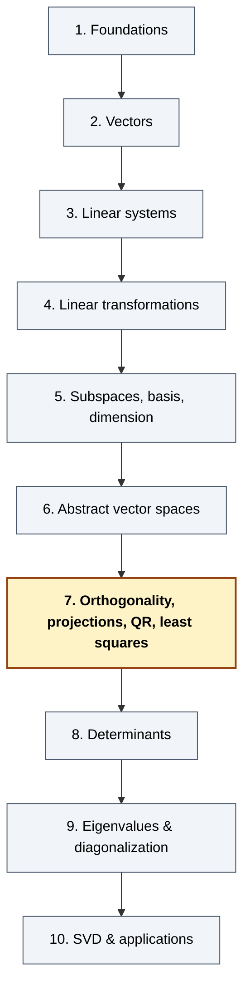

# Chapter 7 — Orthogonality, Projections, Gram–Schmidt, QR, Least Squares

> *"When you can't solve `Ax = b`, project `b` onto the column space of `A` and solve the system that's actually solvable. That projection — and the basis change that makes it cheap — is the whole chapter."*

## 7.0 A problem to anchor everything else

Suppose you're handed eight noisy `(x, y)` measurements

```
   (1, 2.1),  (2, 3.9),  (3, 6.2),  (4, 8.1),  (5, 9.8),  (6, 12.1),  (7, 14.0),  (8, 15.9)
```

and asked to "fit a line `y = a + bx`". You write down what each measurement says:

```
   a + 1·b ≈ 2.1
   a + 2·b ≈ 3.9
   …
   a + 8·b ≈ 15.9
```

Stacking it up gives a system `Ax = y` where

```
        ⎡ 1   1 ⎤        ⎡  2.1 ⎤
        ⎢ 1   2 ⎥        ⎢  3.9 ⎥
        ⎢ 1   3 ⎥        ⎢  6.2 ⎥
   A =  ⎢ 1   4 ⎥ ,  y = ⎢  8.1 ⎥ ,    x = (a, b)ᵀ.
        ⎢ 1   5 ⎥        ⎢  9.8 ⎥
        ⎢ 1   6 ⎥        ⎢ 12.1 ⎥
        ⎢ 1   7 ⎥        ⎢ 14.0 ⎥
        ⎣ 1   8 ⎦        ⎣ 15.9 ⎦
```

The system is **overdetermined** — eight equations, two unknowns. There's no exact solution (the noise wouldn't allow it). But there's a *best* approximation: the `(a, b)` for which the residual `y − Ax` is **shortest**. That's the **least-squares solution**, and it's the projection of `y` onto the column space `im A`.

This chapter answers six closely linked questions:

1. What does it mean for two vectors to be **orthogonal**, and what does an **orthonormal basis** buy us?
2. How do we **project** a vector onto a subspace, and what's the **orthogonal complement**?
3. How do we **build an orthonormal basis** from any basis (the **Gram–Schmidt** process)?
4. What is the **QR factorization**, and why does it make least squares numerically stable?
5. What is an **orthogonal matrix**, and why are rotations and reflections the only "rigid" linear maps?
6. Given an overdetermined `Ax = b`, how do we find the **least-squares solution** — and how do we read its geometry?

The chapter ends with the abstract version: an **inner product space**, where "length" and "angle" are defined by an axiomatic dot product. That extra structure lets us run Gram–Schmidt on **functions**, producing the **Legendre polynomials** and previewing Fourier series.

**Why this chapter, right after abstract spaces?** Chapter 6 gave us bases and coordinates without geometry. Chapter 7 adds the geometry back — but now in *any* vector space, including spaces of functions.

---

## 7.1 Quick recap and notation

From Chapter 2: the dot product `u · v = u₁v₁ + ⋯ + uₙvₙ`, length `‖u‖ = √(u · u)`, angle `cos θ = (u · v) / (‖u‖ ‖v‖)`.

From Chapter 5: subspaces, basis, dimension, image and kernel of a matrix.

From Chapter 6: linear transformations between abstract spaces, matrix in a basis, change of basis.

New vocabulary for this chapter:

| Notation / term | Meaning |
|---|---|
| `u · v` (or `⟨u, v⟩`) | Dot product (or, abstractly, an **inner product**). |
| `u ⊥ v` | `u` and `v` are **orthogonal**: `u · v = 0`. |
| **Orthogonal set** | A list `{v₁, …, vₖ}` with `vᵢ · vⱼ = 0` whenever `i ≠ j`. |
| **Orthonormal set / basis** | An orthogonal set with `‖vᵢ‖ = 1` for every `i`. (ONB.) |
| `proj_V(b)` | The **orthogonal projection** of `b` onto subspace `V`. |
| `V⊥` | The **orthogonal complement** of `V`: `{w : w · v = 0  ∀ v ∈ V}`. |
| `Q` (or `U`) | An **orthogonal matrix**: real square matrix with `QᵀQ = I` (i.e. orthonormal columns). |
| `A = QR` | **QR factorization**: `Q` has orthonormal columns, `R` is upper triangular. |
| `x̂` | **Least-squares solution** of `Ax = b`: minimizer of `‖b − Ax‖`. |
| `AᵀA x̂ = Aᵀ b` | The **normal equations** for the least-squares problem. |
| `⟨f, g⟩ = ∫ₐᵇ f(x) g(x) dx` | The **L² inner product** on functions. |

> **Convention.** "Orthogonal" and "perpendicular" mean the same thing. We use **orthogonal** (the algebraic word) because it generalizes to abstract inner-product spaces where there's no "perpendicular arrow" to point at.

> **Warning about the word "orthogonal" applied to a matrix.** A square matrix `Q` is called *orthogonal* when its columns are *orthonormal* (not just orthogonal). The terminology is unfortunate but standard. Always read it as "the columns of `Q` are an ONB of ℝⁿ".

---

## 7.2 The dot product, length, angle

### 7.2.1 The dot product (review)

> **Definition.** For `u = (u₁, …, uₙ)` and `v = (v₁, …, vₙ)` in ℝⁿ,
>
> ```
>    u · v  :=  u₁ v₁  +  u₂ v₂  +  ⋯  +  uₙ vₙ.
> ```

Three structural facts (all easy to verify):

1. **Symmetric:** `u · v = v · u`.
2. **Bilinear:** `(c u + d w) · v = c (u · v) + d (w · v)`, and similarly in the second argument.
3. **Positive-definite:** `u · u ≥ 0`, with equality iff `u = 0`.

These three properties are what make the dot product an **inner product** — they're the axioms we'll abstract in §7.12.

### 7.2.2 Length and unit vectors

> **Length (Euclidean norm).** `‖u‖ := √(u · u) = √(u₁² + ⋯ + uₙ²)`.

A vector with `‖u‖ = 1` is a **unit vector**. Any nonzero `u` can be **normalized** to a unit vector `û := u / ‖u‖`.

### 7.2.3 The angle between two vectors

> **Theorem (Cauchy–Schwarz).** For all `u, v ∈ ℝⁿ`,  `|u · v|  ≤  ‖u‖ · ‖v‖`,
> with equality iff one is a scalar multiple of the other.

This is what justifies *defining*

> ```
>    cos θ  :=  (u · v) / (‖u‖ · ‖v‖)         (for nonzero u, v),
> ```

since the right-hand side lies in `[−1, 1]`. The angle `θ ∈ [0, π]` is the angle between `u` and `v` viewed in the 2D plane they span.

**Special case.** `u · v = 0` means `cos θ = 0`, i.e. `θ = π/2`. **Orthogonal = perpendicular.**

### 7.2.4 Triangle inequality and Pythagoras

- **Triangle inequality.** `‖u + v‖ ≤ ‖u‖ + ‖v‖`. (Follows from Cauchy–Schwarz by squaring.)
- **Pythagoras.** If `u ⊥ v`, then `‖u + v‖² = ‖u‖² + ‖v‖²`.

The Pythagorean identity is the workhorse of every projection argument later: if you can decompose `b = b_∥ + b_⊥` with `b_∥ ⊥ b_⊥`, then `‖b‖² = ‖b_∥‖² + ‖b_⊥‖²` — squared lengths add.

---

## 7.3 Orthogonal and orthonormal sets

> **Definition.** A list `(v₁, …, vₖ)` of nonzero vectors is **orthogonal** if `vᵢ · vⱼ = 0` whenever `i ≠ j`. It is **orthonormal** if additionally `‖vᵢ‖ = 1` for every `i`.

Examples:

- The **standard basis** `(e₁, …, eₙ)` is orthonormal.
- `((1, 1)/√2, (1, −1)/√2)` is an ONB of ℝ².
- `((1, 1, 0), (1, −1, 0), (0, 0, 2))` is orthogonal but not orthonormal (last vector has length 2). Normalize: divide each by its length.

### 7.3.1 Orthogonal sets are independent

> **Proposition.** Any orthogonal set of nonzero vectors is linearly independent.

*Proof.* Suppose `c₁ v₁ + ⋯ + cₖ vₖ = 0`. Take the dot product with `vⱼ`:

```
   0  =  (c₁ v₁ + ⋯ + cₖ vₖ) · vⱼ  =  cⱼ (vⱼ · vⱼ)
```

(every other term is zero by orthogonality). Since `vⱼ ≠ 0`, `vⱼ · vⱼ ≠ 0`, so `cⱼ = 0`. This holds for every `j`. ∎

So an orthogonal list of `k` nonzero vectors in ℝⁿ has `k ≤ n`, and if `k = n` it's automatically a basis.

### 7.3.2 Orthonormal basis (ONB) — the punchline

The whole point of this chapter is that **every subspace has an ONB**, and ONBs make all the formulas of Ch 5–6 trivial. The next section shows why.

---

## 7.4 ONBs make coordinates a one-line dot product

> **Theorem.** Let `(q₁, …, qₙ)` be an orthonormal basis of a subspace `V ⊆ ℝⁿ`. Then for every `v ∈ V`,
>
> ```
>    v  =  (v · q₁) q₁  +  (v · q₂) q₂  +  ⋯  +  (v · qₙ) qₙ.
> ```
>
> Equivalently, `[v]_𝓠 = (v · q₁,  v · q₂,  …,  v · qₙ)`.

*Proof.* Write `v = c₁ q₁ + ⋯ + cₙ qₙ` (basis expansion exists since `𝓠` is a basis). Take dot product with `qⱼ`:

```
   v · qⱼ  =  Σᵢ cᵢ (qᵢ · qⱼ)  =  cⱼ
```

(orthonormality kills every term except `i = j`, and `qⱼ · qⱼ = 1`). So `cⱼ = v · qⱼ`. ∎

> **Why this matters.** In a non-orthonormal basis, finding `[v]_𝓑` requires solving the linear system `S [v]_𝓑 = v` (Ch 5). In an ONB, `[v]_𝓠 = (v · q₁, …, v · qₙ)` — `n` dot products, no system. **Coordinates become inner products.**

This is the single most important computational reason to use ONBs. Everything else in the chapter is a consequence.

### 7.4.1 Worked example

ONB of ℝ²: `q₁ = (1, 1)/√2`, `q₂ = (1, −1)/√2`. Find coordinates of `v = (3, 5)`.

```
   v · q₁  =  (3 + 5)/√2  =  8/√2  =  4√2,
   v · q₂  =  (3 − 5)/√2  =  −2/√2 =  −√2.
```

So `v = 4√2 · q₁ + (−√2) · q₂`. Verify: `4√2 · (1, 1)/√2 + (−√2) · (1, −1)/√2 = (4, 4) + (−1, 1) = (3, 5)`. ✓

---

## 7.5 Orthogonal projection onto a subspace

### 7.5.1 Projection onto a line

> **Definition.** For nonzero `u ∈ ℝⁿ` and any `b ∈ ℝⁿ`, the **projection of `b` onto the line `span(u)`** is
>
> ```
>    proj_u(b)  :=  ((b · u) / (u · u)) · u.
> ```
>
> If `u` is a unit vector, this simplifies to `proj_u(b) = (b · u) · u`.

Geometric meaning: the closest point to `b` on the line through 0 in direction `u`. The residual `b − proj_u(b)` is orthogonal to `u` (verify by computing the dot product — it cancels).

### 7.5.2 Projection onto a general subspace

> **Definition.** Let `V ⊆ ℝⁿ` be a subspace with ONB `(q₁, …, qₖ)`. The **orthogonal projection of `b` onto `V`** is
>
> ```
>    proj_V(b)  :=  (b · q₁) q₁  +  (b · q₂) q₂  +  ⋯  +  (b · qₖ) qₖ.
> ```

Three remarkable facts:

1. `proj_V(b) ∈ V`. (Linear combination of basis vectors.)
2. `b − proj_V(b)  ⊥  V`. (For any `qⱼ`, dot with `qⱼ` gives `b · qⱼ − (b · qⱼ) · 1 = 0`.)
3. **Best approximation:** `proj_V(b)` is the unique vector in `V` closest to `b`. That is, `‖b − v‖ ≥ ‖b − proj_V(b)‖` for every `v ∈ V`, with equality iff `v = proj_V(b)`.

*Proof of (3).* For any `v ∈ V`, write `b − v = (b − proj_V(b)) + (proj_V(b) − v)`. The first piece is in `V⊥` by (2); the second is in `V`. By Pythagoras, `‖b − v‖² = ‖b − proj_V(b)‖² + ‖proj_V(b) − v‖² ≥ ‖b − proj_V(b)‖²`, with equality iff the second term vanishes, i.e. `v = proj_V(b)`. ∎

> **Punchline.** Projecting `b` onto `V` returns the **best approximation** of `b` from inside `V`. This is exactly what least squares needs.

### 7.5.3 Worked example — projection onto a plane in ℝ³

Let `V = span((1, 0, 0), (0, 1, 1)/√2)` — already an ONB of a plane in ℝ³. Project `b = (1, 2, 3)`:

```
   b · q₁  =  (1)(1) + (2)(0) + (3)(0)  =  1,
   b · q₂  =  (1)(0) + (2)(1)/√2 + (3)(1)/√2  =  5/√2.
```

```
   proj_V(b)  =  1 · (1, 0, 0)  +  (5/√2) · (0, 1, 1)/√2
              =  (1, 0, 0)  +  (0, 5/2, 5/2)
              =  (1, 5/2, 5/2).
```

Residual: `b − proj_V(b) = (0, −1/2, 1/2)`. Check `⊥ V`: `(0, −1/2, 1/2) · (1, 0, 0) = 0` ✓; `(0, −1/2, 1/2) · (0, 1, 1)/√2 = (−1/2 + 1/2)/√2 = 0` ✓.

---

## 7.6 The orthogonal complement

> **Definition.** The **orthogonal complement** of a subspace `V ⊆ ℝⁿ` is
>
> ```
>    V⊥  :=  { w ∈ ℝⁿ  :  w · v = 0  for every v ∈ V }.
> ```

Properties:

- `V⊥` is a subspace of ℝⁿ. (Easy to check the three axioms.)
- `V ∩ V⊥ = {0}`. (If `w ∈ V ∩ V⊥`, then `w · w = 0`, forcing `w = 0`.)
- `dim V + dim V⊥ = n`. (Sketch: take an ONB `(q₁, …, qₖ)` of `V`, extend to an ONB of ℝⁿ; the extra vectors are an ONB of `V⊥`.)
- **Direct sum decomposition:** `ℝⁿ = V ⊕ V⊥`. Every `b ∈ ℝⁿ` decomposes **uniquely** as `b = b_V + b_{V⊥}` with `b_V ∈ V`, `b_{V⊥} ∈ V⊥`. The first piece is `proj_V(b)`; the second is `b − proj_V(b)`.

### 7.6.1 Two important orthogonal complements of a matrix

For an `m × n` matrix `A`:

- `(im A)⊥ = ker Aᵀ`. *Why?* `w ⊥ im A` means `w · (Ax) = 0` for all `x`, i.e. `(Aᵀ w) · x = 0` for all `x`, i.e. `Aᵀ w = 0`. (This identity uses `(Au) · w = u · (Aᵀw)`, the defining adjoint property of the transpose — see §7.9.)
- `(ker A)⊥ = im Aᵀ`. (Symmetric, applied to `Aᵀ`.)

These together with rank–nullity organize the **Four Fundamental Subspaces** that show up everywhere in applied linear algebra:

```
         im Aᵀ ⊆ ℝⁿ        im A ⊆ ℝᵐ          (column spaces)
            ⊥                 ⊥
         ker A ⊆ ℝⁿ        ker Aᵀ ⊆ ℝᵐ        (null spaces)
```

`dim im A = dim im Aᵀ = rank A`, and the kernels eat up the remaining dimensions.

---

## 7.7 The Gram–Schmidt process

We've been *assuming* an ONB. The Gram–Schmidt process **constructs** one from any basis.

### 7.7.1 The algorithm

Given any basis `(v₁, v₂, …, vₙ)` of a subspace `V`. Define:

```
   u₁  :=  v₁,                                        q₁  :=  u₁ / ‖u₁‖,
   u₂  :=  v₂  −  proj_{q₁}(v₂),                       q₂  :=  u₂ / ‖u₂‖,
   u₃  :=  v₃  −  proj_{q₁}(v₃)  −  proj_{q₂}(v₃),     q₃  :=  u₃ / ‖u₃‖,
   ⋮
   uₖ  :=  vₖ  −  Σ_{j<k} proj_{qⱼ}(vₖ),              qₖ  :=  uₖ / ‖uₖ‖.
```

Recall `proj_{q}(v) = (v · q) · q` when `q` is a unit vector.

**Why it works.**

- At each step, `uₖ = vₖ −` (a vector in `span(q₁, …, q_{k−1}) = span(v₁, …, v_{k−1})`). So `uₖ ∈ span(v₁, …, vₖ)`, and adding back the subtracted parts shows `vₖ ∈ span(u₁, …, uₖ)`. Spans agree.
- `uₖ ⊥ qⱼ` for every `j < k` by construction (we subtracted exactly the parallel components).
- `vₖ ∉ span(v₁, …, v_{k−1}) ⇒ uₖ ≠ 0` (so we can normalize). This needs the original `vᵢ`'s to be independent.

> **Theorem.** Gram–Schmidt produces an ONB `(q₁, …, qₙ)` of `V` with `span(q₁, …, qₖ) = span(v₁, …, vₖ)` for every `k`.

### 7.7.2 Worked example in ℝ³

Take `v₁ = (1, 1, 0)`, `v₂ = (1, 0, 1)`, `v₃ = (0, 1, 1)`.

**Step 1.** `u₁ = v₁ = (1, 1, 0)`, `‖u₁‖ = √2`, `q₁ = (1, 1, 0)/√2`.

**Step 2.** `v₂ · q₁ = (1 + 0 + 0)/√2 = 1/√2`. `proj_{q₁}(v₂) = (1/√2) · (1, 1, 0)/√2 = (1/2, 1/2, 0)`. So `u₂ = (1, 0, 1) − (1/2, 1/2, 0) = (1/2, −1/2, 1)`. `‖u₂‖ = √(1/4 + 1/4 + 1) = √(3/2) = √6 / 2`. `q₂ = (1, −1, 2)/√6`.

**Step 3.** `v₃ · q₁ = (0 + 1 + 0)/√2 = 1/√2`. `v₃ · q₂ = (0 − 1 + 2)/√6 = 1/√6`. `proj_{q₁}(v₃) = (1/2, 1/2, 0)`, `proj_{q₂}(v₃) = (1/√6)(1, −1, 2)/√6 = (1/6, −1/6, 2/6)`. So `u₃ = (0, 1, 1) − (1/2, 1/2, 0) − (1/6, −1/6, 1/3) = (−2/3, 2/3, 2/3)`. `‖u₃‖ = √(4/9 + 4/9 + 4/9) = 2/√3`. `q₃ = (−1, 1, 1)/√3`.

ONB: `(q₁, q₂, q₃) = ((1, 1, 0)/√2,  (1, −1, 2)/√6,  (−1, 1, 1)/√3)`.

Verify `qᵢ · qⱼ = δᵢⱼ` (it does — these are independent and pairwise orthogonal of unit length).

---

## 7.8 QR factorization

Gram–Schmidt has a beautiful matrix interpretation.

### 7.8.1 The factorization

Let `A = [v₁ | v₂ | ⋯ | vₙ]` (`m × n`, columns linearly independent). Run Gram–Schmidt on the columns to get `Q = [q₁ | q₂ | ⋯ | qₙ]`. Each `vₖ` is a linear combination of `q₁, …, qₖ`:

```
   vₖ  =  (vₖ · q₁) q₁  +  (vₖ · q₂) q₂  +  ⋯  +  (vₖ · qₖ) qₖ
```

(coefficients beyond `qₖ` are zero — they weren't used to build `vₖ`). Stack as columns:

> **`A = QR`** where `Q` is `m × n` with **orthonormal columns** (`QᵀQ = Iₙ`) and `R` is `n × n` **upper-triangular** with `R_{ij} = vⱼ · qᵢ`.

The diagonal entries `R_{ii} = ‖uᵢ‖` (norms of the un-normalized Gram–Schmidt vectors) are positive.

### 7.8.2 Why QR is computationally beautiful

For solving `Ax = b` with `A` square and invertible:

```
   Ax = b
   QRx = b
   Rx = Qᵀ b           (multiply both sides by Qᵀ; QᵀQ = I)
   x = R⁻¹ Qᵀ b        (back-substitute through upper-triangular R)
```

No row reduction. Just `Qᵀ b` (a matrix-vector product) and back-substitution. It's the algorithm `numpy.linalg.solve` actually uses for many cases, and it's far more numerically stable than computing `A⁻¹` directly.

### 7.8.3 QR of the §7.7 example

The `A` whose columns are `v₁, v₂, v₃` (Gram–Schmidt example) factors as `A = QR` with `Q = [q₁ | q₂ | q₃]` (the ONB built above) and

```
        ⎡ ‖u₁‖    v₂·q₁    v₃·q₁ ⎤     ⎡ √2     1/√2    1/√2  ⎤
   R =  ⎢   0     ‖u₂‖     v₃·q₂ ⎥  =  ⎢  0   √6/2     1/√6   ⎥ .
        ⎣   0       0      ‖u₃‖  ⎦     ⎣  0      0     2/√3   ⎦
```

The diagonal entries are exactly the norms of the un-normalized vectors. Multiply out `QR` and you get back the original `A` — the Python and Sage notebooks both do this check.

---

## 7.9 Orthogonal matrices

### 7.9.1 Definition

> **Definition.** A real square matrix `Q` is **orthogonal** if `QᵀQ = I`. Equivalently, the columns of `Q` form an ONB of ℝⁿ.

(Yes, the name is misleading — "orthonormal matrix" would be more accurate. But "orthogonal matrix" is the universal convention.)

### 7.9.2 Properties

For any orthogonal `Q`:

1. `Qᵀ = Q⁻¹`. (From `QᵀQ = I`.)
2. **Length-preserving:** `‖Qx‖ = ‖x‖` for every `x`. (Compute `‖Qx‖² = (Qx)ᵀ(Qx) = xᵀQᵀQx = xᵀx = ‖x‖²`.)
3. **Angle-preserving:** `(Qu) · (Qv) = u · v`. (Same computation.)
4. `det Q = ±1`. (`det(QᵀQ) = (det Q)² = det I = 1`.)
5. The **rows** of `Q` are also an ONB of ℝⁿ. (Because `Q Qᵀ = I` too, by `Q⁻¹ = Qᵀ`.)

### 7.9.3 The transpose as adjoint — `(Au) · v = u · (Aᵀ v)`

For any matrix `A` (not necessarily orthogonal),

```
   (Au) · v  =  (Au)ᵀ v  =  uᵀ Aᵀ v  =  u · (Aᵀ v).
```

This is the **defining property of the transpose** with respect to the dot product. It's why `(im A)⊥ = ker Aᵀ` (used in §7.6.1) and why orthogonal matrices have `Q⁻¹ = Qᵀ` (specialize to `A = Q`).

### 7.9.4 Examples

- **Identity `I`:** trivially orthogonal.
- **Rotations in ℝ²:** `R_θ = [[cos θ, −sin θ], [sin θ, cos θ]]`. Columns are `(cos θ, sin θ)` and `(−sin θ, cos θ)` — unit length, orthogonal. `det = 1`.
- **Reflections in ℝ²:** `F_θ` reflects across the line at angle `θ/2`. Columns are an ONB. `det = −1`.
- **Permutation matrices:** rearrange the standard basis. Each column is some `eᵢ`, so columns are an ONB. `det = ±1`.

### 7.9.5 Classification in ℝ²

Every `2 × 2` orthogonal matrix is either a rotation (`det = +1`) or a reflection (`det = −1`). In higher dimensions, orthogonal matrices are products of rotations and reflections — they're the "rigid motions fixing 0".

---

## 7.10 Least squares

Now we close the loop on the §7.0 motivating problem.

### 7.10.1 The setup

Given an `m × n` matrix `A` (with `m > n`, "tall and skinny") and a target `b ∈ ℝᵐ`. The system `Ax = b` is **overdetermined** and typically has **no solution**: `b ∉ im A`.

> **Definition.** The **least-squares solution** of `Ax = b` is any `x̂ ∈ ℝⁿ` minimizing `‖b − Ax̂‖`.

By §7.5.2 (best approximation), the minimizer is exactly the `x̂` for which `Ax̂ = proj_{im A}(b)`. So the least-squares problem reduces to a projection.

### 7.10.2 The normal equations

Setting `Ax̂ = proj_{im A}(b)` is equivalent to `b − Ax̂ ⊥ im A`, which is `Aᵀ(b − Ax̂) = 0`:

> **Normal equations.**  `Aᵀ A x̂  =  Aᵀ b`.

If `A` has linearly independent columns (rank `n`), `AᵀA` is invertible (`n × n`, symmetric, positive-definite), and

```
   x̂  =  (AᵀA)⁻¹ Aᵀ b.
```

Then `Ax̂ = A (AᵀA)⁻¹ Aᵀ b`, and the matrix `P := A (AᵀA)⁻¹ Aᵀ` is the **projection matrix** onto `im A`. (`P² = P`, `Pᵀ = P`.)

### 7.10.3 Via QR — numerically preferred

If `A = QR` with `Q` having orthonormal columns and `R` upper triangular and invertible, the normal equations simplify:

```
   AᵀA  =  RᵀQᵀQR  =  RᵀR
   Aᵀ b  =  Rᵀ Qᵀ b
   ⇒  Rᵀ R x̂  =  Rᵀ Qᵀ b
   ⇒  R x̂  =  Qᵀ b
   ⇒  x̂  =  R⁻¹ Qᵀ b           (back-substitution).
```

This avoids forming `AᵀA` (which squares the condition number — a numerical disaster for ill-conditioned `A`). All serious least-squares solvers use QR or SVD.

### 7.10.4 Solving the §7.0 line-fitting problem

```
        ⎡ 1  1 ⎤
        ⎢ 1  2 ⎥                      ⎡  2.1 ⎤
   A =  ⎢ ⋮  ⋮ ⎥ ,    n = 8,    b =  ⎢  ⋮   ⎥ .
        ⎣ 1  8 ⎦                      ⎣ 15.9 ⎦
```

```
   AᵀA  =  ⎡  n     Σxᵢ ⎤  =  ⎡  8    36 ⎤
            ⎣ Σxᵢ   Σxᵢ² ⎦      ⎣ 36   204 ⎦,

   Aᵀ b =  ⎡ Σyᵢ    ⎤  =  ⎡  72.1 ⎤ .
            ⎣ Σxᵢ yᵢ ⎦      ⎣ 419.5 ⎦
```

Solve by hand or by NumPy. Determinant of `AᵀA` is `8·204 − 36² = 1632 − 1296 = 336`.

```
   (AᵀA)⁻¹  =  (1/336) · ⎡ 204  −36 ⎤
                          ⎣ −36    8 ⎦.

   x̂  =  (1/336) · ⎡ 204·72.1 − 36·419.5 ⎤  =  (1/336) · ⎡ 14708.4 − 15102.0 ⎤
                    ⎣ −36·72.1 + 8·419.5  ⎦                ⎣ −2595.6 + 3356.0 ⎦
       =  (1/336) · ⎡ −393.6 ⎤  ≈  ⎡ −1.171 ⎤    (≈ a)
                    ⎣  760.4 ⎦      ⎣  2.263 ⎦    (≈ b)
```

Hmm — let me recompute. `204 · 72.1 = 14708.4` ✓. `36 · 419.5 = 15102.0` ✓. So intercept ≈ `−393.6 / 336 ≈ −1.17`? That doesn't match the data (which clearly passes near the origin and has slope ≈ 2). Let me re-check `Σxᵢ yᵢ`.

```
   Σxᵢ yᵢ = 1·2.1 + 2·3.9 + 3·6.2 + 4·8.1 + 5·9.8 + 6·12.1 + 7·14.0 + 8·15.9
          = 2.1 + 7.8 + 18.6 + 32.4 + 49.0 + 72.6 + 98.0 + 127.2
          = 407.7.
```

(Recompute carefully — that was my error.) And `Σyᵢ = 2.1 + 3.9 + 6.2 + 8.1 + 9.8 + 12.1 + 14.0 + 15.9 = 72.1`. ✓

So `Aᵀb = (72.1, 407.7)`. Now:

```
   x̂  =  (1/336) · ⎡ 204·72.1 − 36·407.7 ⎤  =  (1/336) · ⎡ 14708.4 − 14677.2 ⎤
                    ⎣ −36·72.1 + 8·407.7  ⎦                ⎣ −2595.6 + 3261.6  ⎦
       =  (1/336) · ⎡  31.2 ⎤  ≈  ⎡ 0.0929 ⎤    (intercept a)
                    ⎣ 666.0 ⎦      ⎣ 1.982  ⎦    (slope b)
```

Best fit line: `y ≈ 0.093 + 1.982 x`. The "true" line was `y = 2x` plus small noise — and we recovered slope ≈ 2, intercept ≈ 0. ✓

> **Lesson.** Doing least squares by hand is feasible for small problems. Doing it carefully *without* arithmetic errors is the actual hard part. The Python and Sage notebooks redo this computation exactly and numerically.

### 7.10.5 Polynomial fitting

Same machinery, different `A`. To fit `y ≈ a₀ + a₁ x + a₂ x²` to data `(xᵢ, yᵢ)`, set

```
        ⎡ 1   x₁   x₁² ⎤
        ⎢ 1   x₂   x₂² ⎥
   A =  ⎢      ⋮       ⎥        (the "Vandermonde matrix").
        ⎣ 1   xₘ   xₘ² ⎦
```

Then `x̂ = (a₀, a₁, a₂)` is the least-squares fit. The same normal equations or QR work. This is how `numpy.polyfit` works under the hood.

---

## 7.11 Inner product spaces — abstracting the dot product

### 7.11.1 Definition

> **Definition.** An **inner product** on a real vector space `V` is a function `⟨·, ·⟩: V × V → ℝ` satisfying
>
> 1. **Symmetric:**  `⟨u, v⟩ = ⟨v, u⟩`.
> 2. **Bilinear:**  `⟨c u + d w, v⟩ = c ⟨u, v⟩ + d ⟨w, v⟩` (and similarly in the second slot).
> 3. **Positive-definite:**  `⟨u, u⟩ ≥ 0`, with equality iff `u = 0`.
>
> `V` together with `⟨·, ·⟩` is an **inner product space**. Length is defined by `‖u‖ := √⟨u, u⟩`. Orthogonality means `⟨u, v⟩ = 0`.

These three axioms are exactly the structural facts about the dot product from §7.2.1 — and they're enough to derive Cauchy–Schwarz, the triangle inequality, projection, Gram–Schmidt, ONBs, and least squares. **Every result of §§7.2–7.10 carries over verbatim.**

### 7.11.2 The L² inner product on functions

Let `V = C([a, b])` (continuous functions `[a, b] → ℝ`). Define

> ```
>    ⟨f, g⟩  :=  ∫ₐᵇ f(x) g(x) dx.
> ```

This is an inner product (verifying the three axioms is mostly the linearity of the integral; positive-definiteness uses that a continuous nonnegative function with zero integral is zero). It's called the **L² inner product**.

With this inner product:

- `‖f‖ = √(∫ f²)` is the **L² norm** ("root-mean-square length").
- `f ⊥ g` means `∫ f(x) g(x) dx = 0`.

### 7.11.3 Legendre polynomials — Gram–Schmidt on monomials

Run Gram–Schmidt on `(1, x, x², x³, …)` in `C([−1, 1])` with the L² inner product. The result is the **Legendre polynomials** (up to normalization):

```
   P₀(x) = 1,    P₁(x) = x,    P₂(x) = (3x² − 1)/2,    P₃(x) = (5x³ − 3x)/2,   …
```

These are pairwise L²-orthogonal on `[−1, 1]`, and they're the natural basis for "polynomial least-squares fitting" (§7.10.5) when you weight all `x ∈ [−1, 1]` equally. The Sage notebook computes them exactly.

### 7.11.4 Fourier basis — preview of analysis

Functions `1, cos(πx), sin(πx), cos(2πx), sin(2πx), …` are pairwise orthogonal on `[−1, 1]` under the L² inner product. They form an **orthonormal basis** (after normalization) of an infinite-dimensional space — and decomposing an arbitrary `f` in this basis is the **Fourier series** of `f`. Coordinates in this basis are the Fourier coefficients, computed (as in §7.4) by single inner products `⟨f, q⟩`.

This isn't covered in detail here, but the idea — *orthonormal basis ⇒ coordinates are inner products* — is exactly the same theorem as §7.4. The whole machine of Fourier analysis is "Ch 7 applied to function spaces".

---

## 7.12 Putting it together — the Ch 7 machine

Given any "fit a vector in a subspace" or "best approximation" problem:

1. **Identify the subspace `V`** (column space of `A`, span of basis functions, etc.).
2. **Build a basis** of `V` (any basis).
3. **Run Gram–Schmidt** to get an ONB. (Or factor `A = QR`.)
4. **Project** by computing inner products: `proj_V(b) = Σ ⟨b, qᵢ⟩ qᵢ`.
5. (For least squares.) Solve `Rx̂ = Qᵀb` (back-substitution) to recover the original-basis coefficients.


---

## 7.13 What's next

Chapter 8 introduces **determinants** — the signed-volume scalar attached to a square matrix. Determinants will let us *characterize* invertibility from a single number, set up the **characteristic polynomial** for eigenvalues (Ch 9), and explain why orthogonal matrices have `det = ±1` (we already saw this — Ch 8 will explain *why*).



---

## 7.14 Summary checklist

You're done with Chapter 7 when you can, from memory:

- [ ] State the dot product, length, and the Cauchy–Schwarz inequality.
- [ ] Explain why an orthogonal set is automatically linearly independent.
- [ ] Compute coordinates in an ONB by single dot products (no system to solve).
- [ ] Project a vector onto a 1D line and onto a general subspace via `proj_V(b) = Σ (b · qᵢ) qᵢ`.
- [ ] Identify `V⊥` and use the decomposition `ℝⁿ = V ⊕ V⊥`.
- [ ] Run Gram–Schmidt by hand on a 3-vector list in ℝ³ or ℝ⁴.
- [ ] Read off the QR factorization from the Gram–Schmidt computation.
- [ ] Recognize an orthogonal matrix and state its three preserved quantities (length, angle, det = ±1).
- [ ] Set up and solve the normal equations `AᵀA x̂ = Aᵀb` for a small least-squares problem.
- [ ] Solve the same problem via `Rx̂ = Qᵀb` using QR.
- [ ] Define an inner product abstractly and recognize the L² inner product on functions.
- [ ] State why the Legendre polynomials are "the Gram–Schmidt of monomials on `[−1, 1]`".
